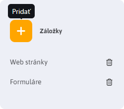
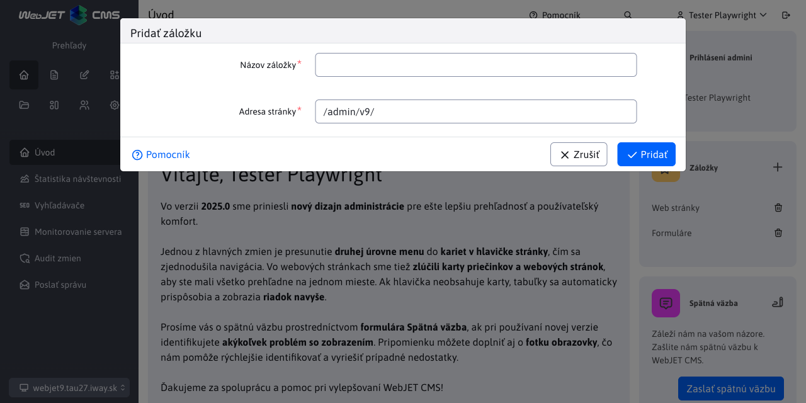
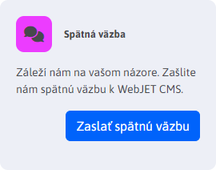
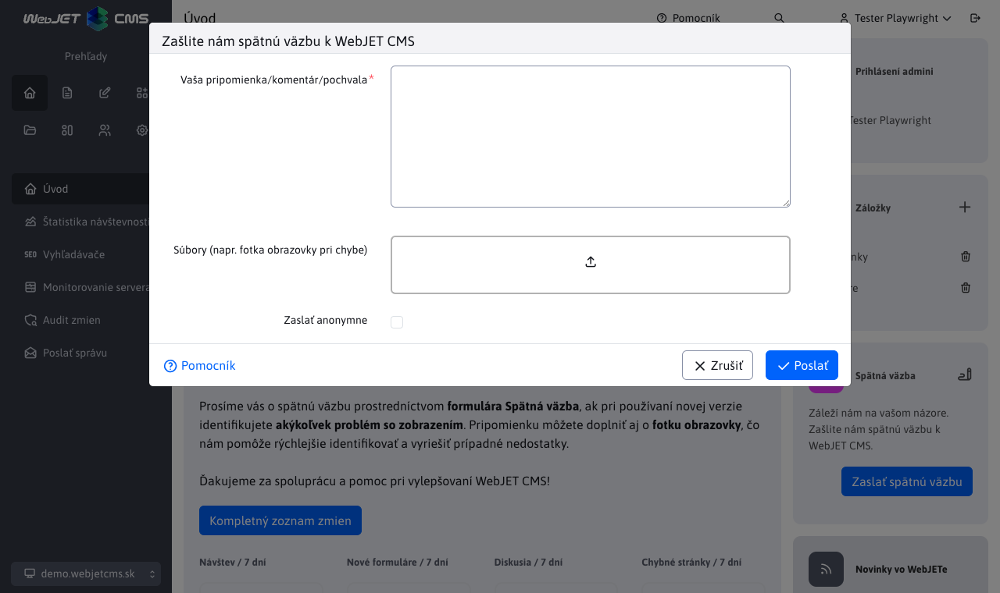

# Úvodná obrazovka

Úvodná obrazovka je osobný prehľad zložený z widgetov. Ponuka zodpovedá vašim oprávneniam; údaje sa vzťahujú na práve zvolenú doménu. Rozloženie je spoločné pre vaše konto vo všetkých doménach a prehliadačoch. Konkrétny výber formulára alebo kampane sa pamätá osobitne pre každú doménu.

## Prispôsobenie prehľadu

Tlačidlom **Pridať widget** otvoríte katalóg. Pri widgete použite menu s tromi bodkami:

- **Nastavenia widgetu**: zvoľte dostupnú veľkosť a ďalšie údaje, napríklad modul skratky, obdobie alebo formulár. Nie každý widget ponúka viac veľkostí.
- **Presunúť widget**: vyberte, pred ktorú kartu sa má presunúť, alebo zvoľte koniec. Na počítači môžete použiť aj rukoväť na ťahanie.
- **Minimalizovať**: ponechá iba stručný prehľad. Najmenšie karty sa už neminimalizujú.
- **Odstrániť widget**: odstráni kartu z vášho prehľadu. Údaje v aplikácii zostávajú zachované. Bezprostredne po odstránení je dostupné **Vrátiť späť**; po ďalšej úspešne uloženej úprave táto možnosť zanikne. Widget môžete kedykoľvek pridať znova.
- **Obnoviť údaje**: načíta čerstvé údaje danej karty.

Zmena sa prejaví po úspešnom uložení. Pri chybe sa zachová pôvodné nastavenie. Na menšej obrazovke sa karty automaticky usporiadajú pod seba pri zachovaní poradia. Prehľad môže obsahovať najviac 32 widgetov.

## Dostupné informácie

**Skratka do modulu** otvorí vybranú sekciu administrácie. **Moje posledné stránky** umožnia pokračovať v úpravách; širšia verzia zobrazí aj umiestnenie a dátum úpravy.

Ďalšie widgety zobrazujú požiadavky na schválenie, plán publikovania, odoslané formuláre, návštevnosť, najnavštevovanejšie stránky, hľadané výrazy, zdroje návštevnosti, chyby 404 a stav newslettera. Formuláre, štatistiky, newsletter a skratky môžete pridať opakovane s rôznymi nastaveniami.

Formuláre zobrazujú posledných 7, 30 alebo 90 dní vrátane dnešných odoslaní.

Štatistiky predvolene používajú posledných sedem ukončených dní; možno zvoliť aj 30 alebo 90 dní. Porovnanie používa rovnako dlhé predchádzajúce obdobie. Karta zobrazuje skutočný rozsah dátumov. Chyby 404 zobrazujú počet chybových požiadaviek, nie počet rôznych adries. Evidujú sa po týždňoch, preto sa zahrnú celé týždne zasahujúce do zvoleného obdobia; karta zobrazí skutočný rozsah. Aktuálny týždeň obsahuje údaje dostupné do tohto okamihu. Ak historické údaje nemožno oddeliť podľa domény, karta oznámi ich nedostupnosť.

Newsletter automaticky vyberá aktívnu kampaň, najbližšiu naplánovanú alebo poslednú dokončenú. Môžete zvoliť aj konkrétnu kampaň. Pri odosielaní sa údaje viditeľnej karty obnovujú každých 30 sekúnd. Počty otvorení a kliknutí predstavujú zaznamenané udalosti.

**Čo je nové** po potvrdení prečítania zmizne. Cez katalóg ho môžete zobraziť znovu; nová verzia oznámenia sa zobrazí automaticky. Systémové upozornenia zostávajú viditeľné do vyriešenia ich príčiny.

Vo widgete **Vyhľadávanie a pomoc** zvoľte **V administrácii** alebo **V dokumentácii**. Hľadanie v dokumentácii otvorí nové okno so zadaným výrazom. Kontextový Pomocník v hlavičke zostáva dostupný.

## Prihlásenia

Widget vašich prihlásení je povinnou súčasťou prehľadu. Zoznam ostatných prihlásených administrátorov je dostupný v časti **Ďalšie prehľady**, ak naň máte oprávnenie.

### Moje aktívne prihlásenia

Widget **Moje aktívne prihlásenia** zobrazuje náhľad troch relácií s prehliadačom, časom a IP adresou. Vaša aktuálna relácia je označená textom **Toto prihlásenie**. Tlačidlo **Spravovať prihlásenia** otvorí úplný zoznam a zostáva dostupné aj po minimalizovaní. Tento widget nemožno odstrániť.

Pri inej vlastnej relácii môžete zvoliť **Odhlásiť túto reláciu**. V aktuálnom uzle clustra sa ukončí okamžite; v inom uzle po synchronizácii medzi uzlami (typicky do minúty). Doména a uzol sú uvedené v pomocnom texte po podržaní kurzora nad záznamom.

Poznámka: údaje sa aktualizujú po prihlásení používateľa. Môžete nastaviť nový záznam do [úlohy na pozadí](../../admin/settings/cronjob/README.md) na častejšiu aktualizáciu údajov, kde ako názov úlohy zadáte hodnotu `sk.iway.iwcm.stat.SessionClusterService`. Interval zadajte podľa potreby, napr. každých 10 minút. Pri úlohe na pozadí sa z databázy zmažú záznamy staršie ako 60 minút. Ak nie je úloha na pozadí nastavená, záznamy sa mažú pri prihlásení používateľa, ak sú staršie ako 24 hodín.

### Prihlásení administrátori

Ak máte právo "Úvod - zobrazenie prihlásených administrátorov", zobrazí sa aj zoznam všetkých prihlásených administrátorov. Máte tak prehľad, koľko používateľov aktuálne pracuje v administrácii.

Kliknutím na ikonu <i class="ti ti-mail fs-6"></i> môžete danému administrátorovi odoslať email.

## Záložky

Pôvodné záložky sú zachované v časti **Ďalšie prehľady**. Nové odkazy odporúčame vytvárať ako widget **Skratka do modulu**, ktorého nastavenie sa ukladá na konto.

Do mini aplikácie záložky si môžete pridať odkazy na často používané sekcie v administrácii. Po prihlásení tak nemusíte hľadať danú sekciu v menu, ale priamo kliknete na odkaz v záložkách.

Kliknutím na oranžovú ikonu naľavo od textu Záložky sa otvorí dialógové okno, v ktorom zadáte názov záložky a adresu, ktorá sa má otvoriť po kliknutí na meno záložky.

Predvolene sú zobrazené záložky na zoznam web stránok a formulárov. Tieto sa zobrazia aj keď zmažete všetky záložky.

Upozornenie: zoznam záložiek sa ukladá v prehliadači, ak používate viacero prehliadačov nastavte si záložky vo všetkých.

    <iframe width="560" height="315" src="https://www.youtube.com/embed/G5Ts04jSMX8" title="YouTube video player" frameborder="0" allow="accelerometer; autoplay; clipboard-write; encrypted-media; gyroscope; picture-in-picture" allowfullscreen></iframe>

## Spätná väzba

Tlačidlo nájdete v časti **Ďalšie prehľady**, spolu s monitorovaním servera, auditom a ďalšími pôvodnými prehľadmi.

Kliknutím na tlačidlo Zaslať spätnú väzbu môžete nám, programátorom, zaslať vašu spätnú väzbu k používaniu WebJET CMS. Pripomienka sa odošle po vyplnení formuláru emailom.

Vaše pripomienky posúdime a pridáme do [mapy rozvoja](../../ROADMAP.md). Môžete tak aj vašim názorom zlepšiť fungovanie WebJET CMS.

V dialógovom okne môžete zadať text vašej pripomienky, komentár, alebo pochvalu. V prípade potreby môžete priložiť aj súbory (napr. fotku obrazovky, alebo dokument s opisom vašej požiadavky).

Ak zvolíte možnosť Zaslať anonymne nebude do odoslaného emailu zadané vaše meno a emailová adresa ako meno a email odosielateľa.
