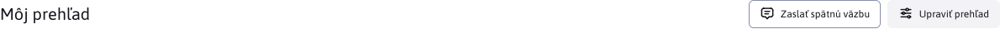
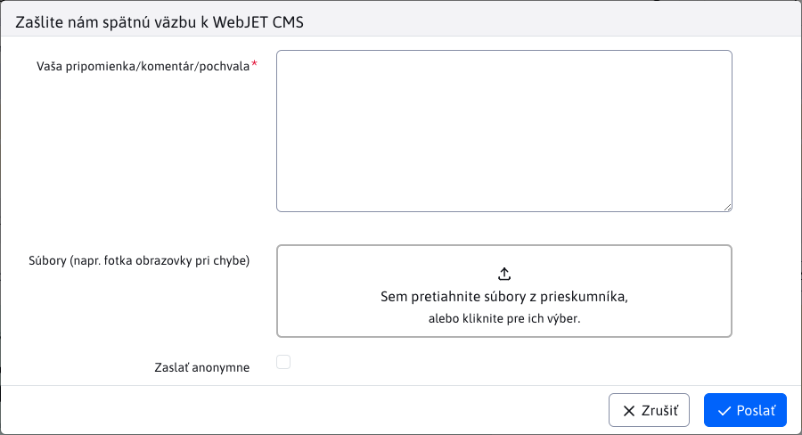

# Úvodná obrazovka

Úvodná obrazovka je osobný prehľad zložený z widgetov. Ponuka zodpovedá vašim oprávneniam; obsahové údaje sa vzťahujú na práve zvolenú doménu. Rozloženie je spoločné pre vaše konto vo všetkých doménach a prehliadačoch. Konkrétny výber formulára alebo kampane sa pamätá osobitne pre každú doménu.

Pri prvom otvorení sa zobrazia všetky dostupné typy widgetov. Širšie prehľady sú na počítači usporiadané do dvojíc, užšie zoznamy do trojice. Skratky predvolene smerujú na webové stránky a formuláre podľa vašich práv; ak tieto moduly nie sú dostupné, zobrazí sa skratka na prvý dostupný modul.

## Prispôsobenie prehľadu

Tlačidlom **Upraviť prehľad** zobrazíte možnosti **Pridať widget**, **Resetovať** a **Hotovo**. Tlačidlo **Pridať widget** otvorí katalóg. Pri widgete použite menu s tromi bodkami:

- **Nastavenia widgetu**: zvoľte dostupnú veľkosť a ďalšie údaje, napríklad modul skratky, obdobie alebo formulár. Nie každý widget ponúka viac veľkostí.
- **Presunúť widget**: vyberte, pred ktorú kartu sa má presunúť, alebo zvoľte koniec. Na počítači môžete použiť aj rukoväť na ťahanie.
- **Minimalizovať**: ponechá iba stručný prehľad. Najmenšie karty sa už neminimalizujú.
- **Odstrániť widget**: odstráni kartu z vášho prehľadu. Údaje v aplikácii zostávajú zachované. Bezprostredne po odstránení je dostupné **Vrátiť späť**; po ďalšej úspešne uloženej úprave táto možnosť zanikne. Widget môžete kedykoľvek pridať znova.
- **Obnoviť údaje**: načíta čerstvé údaje danej karty.

Zmena sa prejaví po úspešnom uložení. Potvrdenie uloženia sa zobrazí ako systémová notifikácia a automaticky zmizne po 10 sekundách. Pri chybe sa zachová pôvodné nastavenie. Na menšej obrazovke sa karty automaticky usporiadajú pod seba pri zachovaní poradia. Prehľad môže obsahovať najviac 32 widgetov.

Tlačidlo **Resetovať** nájdete v lište úprav za tlačidlom **Pridať widget**. Tooltip vysvetľuje obnovenie štandardného zobrazenia. Po potvrdení v štandardnom systémovom dialógu sa obnovia všetky dostupné widgety, ich veľkosti, poradie a nastavenia. Vymažú sa aj filtre widgetov vo všetkých doménach a potvrdenie prečítania noviniek. Ostatné nastavenia účtu a pôvodné záložky zostanú zachované. Existujúce osobné rozloženie sa bez resetu nemení.

## Dostupné informácie

**Skratka do modulu** otvorí vybranú sekciu administrácie. **Moje posledné stránky** umožnia pokračovať v úpravách; širšia verzia zobrazí aj umiestnenie a dátum úpravy.

Ďalšie widgety zobrazujú požiadavky na schválenie, plán publikovania, odoslané formuláre, návštevnosť, najnavštevovanejšie stránky, hľadané výrazy, zdroje návštevnosti, chyby 404 a stav newslettera. Formuláre, štatistiky, newsletter a skratky môžete pridať opakovane s rôznymi nastaveniami.

Formuláre zobrazujú posledných 7, 30 alebo 90 dní vrátane dnešných odoslaní.

Štatistiky predvolene používajú posledných sedem ukončených dní; možno zvoliť aj 30 alebo 90 dní. Porovnanie používa rovnako dlhé predchádzajúce obdobie. Karta zobrazuje skutočný rozsah dátumov. Chyby 404 zobrazujú počet chybových požiadaviek, nie počet rôznych adries. Evidujú sa po týždňoch, preto sa zahrnú celé týždne zasahujúce do zvoleného obdobia; karta zobrazí skutočný rozsah. Aktuálny týždeň obsahuje údaje dostupné do tohto okamihu. Ak historické údaje nemožno oddeliť podľa domény, karta oznámi ich nedostupnosť.

Graf návštevnosti porovnáva aktuálne a predchádzajúce obdobie; graf zdrojov návštevnosti zobrazuje počty podľa zdroja. Presné hodnoty sú dostupné aj v rozbaliteľnej časti **Údaje grafu**.

Newsletter automaticky vyberá aktívnu kampaň, najbližšiu naplánovanú alebo poslednú dokončenú. Môžete zvoliť aj konkrétnu kampaň. Pri odosielaní sa údaje viditeľnej karty obnovujú každých 30 sekúnd. Počty otvorení a kliknutí predstavujú zaznamenané udalosti.

**Čo je nové** po potvrdení prečítania zmizne. Cez katalóg ho môžete zobraziť znovu; nová verzia oznámenia sa zobrazí automaticky. Systémové upozornenia zostávajú viditeľné do vyriešenia ich príčiny.

Vo widgete **Vyhľadávanie a pomoc** zvoľte **V administrácii** alebo **V dokumentácii**. Hľadanie v dokumentácii otvorí nové okno so zadaným výrazom. Kontextový Pomocník v hlavičke zostáva dostupný.

## Prihlásenia

Vaše aktívne prihlásenia zostávajú v hornej časti prehľadu. Zoznam ostatných prihlásených administrátorov je samostatný widget **Prihlásení admini**, dostupný podľa oprávnení.

### Moje aktívne prihlásenia

Widget **Moje aktívne prihlásenia** zobrazuje náhľad troch relácií s prehliadačom, časom a IP adresou. Vaša aktuálna relácia je označená textom **Toto prihlásenie**. Tlačidlo **Spravovať prihlásenia** otvorí úplný zoznam a zostáva dostupné aj po minimalizovaní. Tento widget nemožno odstrániť.

Pri inej vlastnej relácii môžete zvoliť **Odhlásiť túto reláciu**. V aktuálnom uzle clustra sa ukončí okamžite; v inom uzle po synchronizácii medzi uzlami (typicky do minúty). Doména a uzol sú uvedené v pomocnom texte po podržaní kurzora nad záznamom.

Poznámka: údaje sa aktualizujú po prihlásení používateľa. Môžete nastaviť nový záznam do [úlohy na pozadí](../../admin/settings/cronjob/README.md) na častejšiu aktualizáciu údajov, kde ako názov úlohy zadáte hodnotu `sk.iway.iwcm.stat.SessionClusterService`. Interval zadajte podľa potreby, napr. každých 10 minút. Pri úlohe na pozadí sa z databázy zmažú záznamy staršie ako 60 minút. Ak nie je úloha na pozadí nastavená, záznamy sa mažú pri prihlásení používateľa, ak sú staršie ako 24 hodín.

### Prihlásení administrátori

Ak máte právo "Úvod - zobrazenie prihlásených administrátorov", zobrazí sa aj zoznam všetkých prihlásených administrátorov. Máte tak prehľad, koľko používateľov aktuálne pracuje v administrácii.

Kliknutím na ikonu <i class="ti ti-mail fs-6"></i> môžete danému administrátorovi odoslať email.

## Vaše skratky

Pás **Vaše skratky** nahrádza pôvodné záložky. Tlačidlom **Pridať skratku** vyberiete dostupný modul administrácie alebo zadáte vlastnú URL a názov. Skratky sa ukladajú na vaše konto a sú dostupné vo všetkých prehliadačoch.

Predvolene smerujú na webové stránky a formuláre podľa vašich oprávnení. Staré záložky uložené iba v prehliadači sa automaticky neprenášajú; vlastné odkazy pridajte cez **Pridať skratku**.

## Zmenené stránky, audit a monitorovanie

Pôvodná sekcia **Ďalšie prehľady** bola odstránená. Jej informácie sú dostupné ako samostatné widgety **Zmenené stránky**, **Audit**, **Prihlásení admini**, **Obsadenosť pamäte** a **Zaťaženie CPU**. Pri prvom otvorení alebo po resete sa dostupné widgety pridajú na koniec predvoleného rozloženia. Do existujúceho rozloženia ich môžete pridať cez katalóg.

**Zmenené stránky** zobrazujú posledné úpravy dostupných stránok v aktuálnej doméne aj s autorom zmeny. **Audit** zobrazuje posledné udalosti auditu. Grafy pamäte a CPU majú farebne odlíšené pozadie a predvolenú veľkosť **3×3**, aby boli lepšie čitateľné. V nastaveniach widgetu môžete zvoliť aj kompaktnejšiu veľkosť **3×2**. Grafy aj číselné hodnoty viditeľného widgetu sa aktualizujú každých 5 sekúnd; číselné údaje sa obnovujú aj v minimalizovanom zobrazení. Živé vzorky sa zbierajú od otvorenia widgetu, aj keď je ukladanie historického monitorovania vypnuté. Pri skrytí karty prehliadača alebo widgetu sa pravidelné načítavanie pozastaví. Úplný prehľad otvoríte cez názov widgetu. Audit, prihlásení administrátori a monitorovanie zobrazujú údaje celého servera podľa príslušných oprávnení.

## Spätná väzba

Tlačidlo **Zaslať spätnú väzbu** nájdete v hornej lište úvodného prehľadu.

Kliknutím na tlačidlo Zaslať spätnú väzbu môžete nám, programátorom, zaslať vašu spätnú väzbu k používaniu WebJET CMS. Pripomienka sa odošle po vyplnení formuláru emailom.

Vaše pripomienky posúdime a pridáme do [mapy rozvoja](../../ROADMAP.md). Môžete tak aj vašim názorom zlepšiť fungovanie WebJET CMS.

V dialógovom okne môžete zadať text vašej pripomienky, komentár, alebo pochvalu. V prípade potreby môžete priložiť aj súbory (napr. fotku obrazovky, alebo dokument s opisom vašej požiadavky).

Ak zvolíte možnosť Zaslať anonymne nebude do odoslaného emailu zadané vaše meno a emailová adresa ako meno a email odosielateľa.
