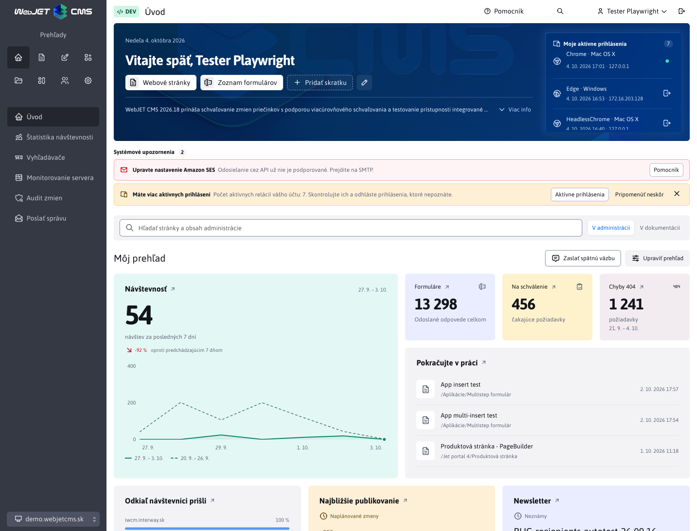
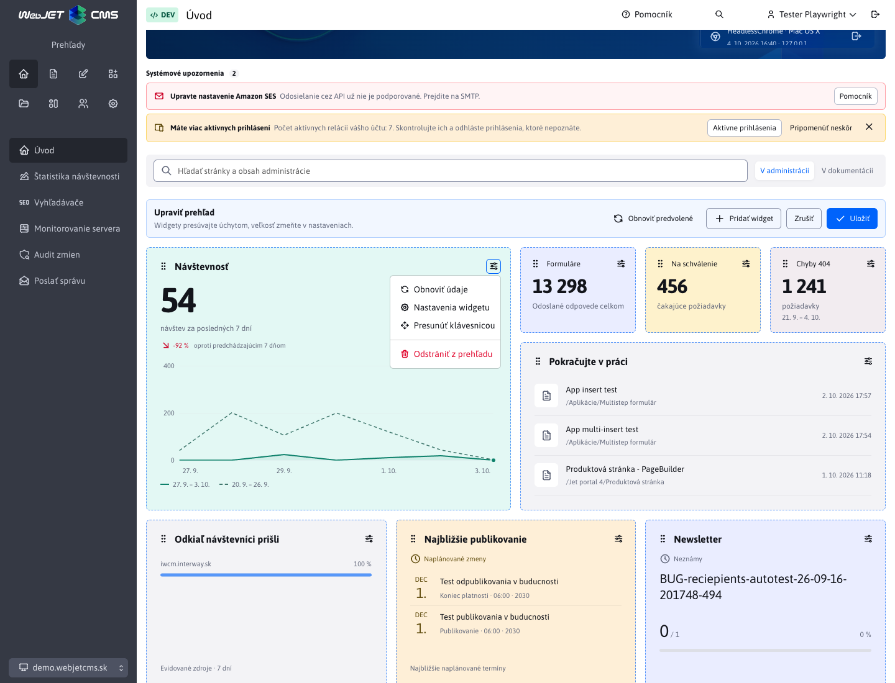
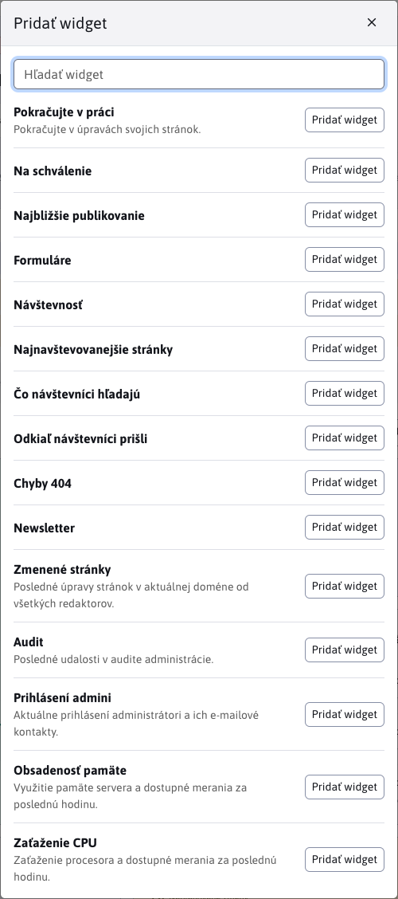
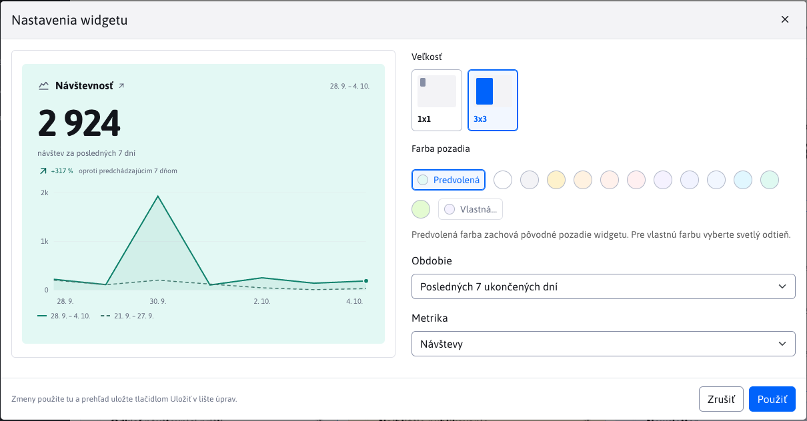
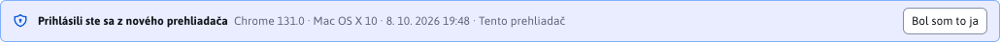
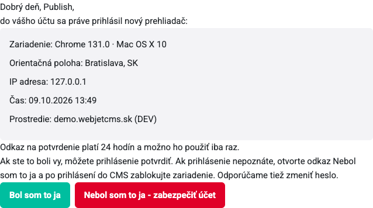
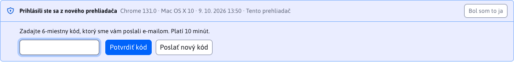
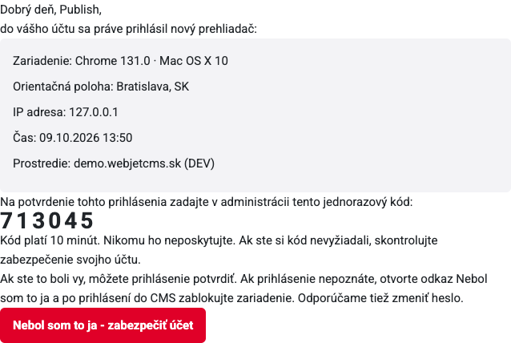
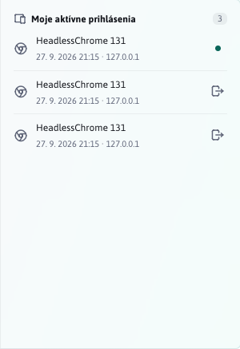
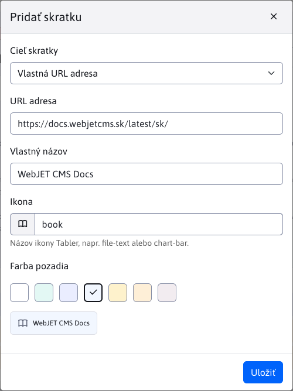

# Úvodná obrazovka

Na úvodnej obrazovke môžete rýchlo skontrolovať návštevnosť, odoslané formuláre či stránky čakajúce na schválenie a vrátiť sa k rozpracovaným stránkam.

    <iframe width="790" height="444" src="https://www.youtube.com/embed/X2GNFn8IpCI" title="YouTube video player" frameborder="0" allow="accelerometer; autoplay; clipboard-write; encrypted-media; gyroscope; picture-in-picture" allowfullscreen></iframe>

Prehľad tvoria **widgety**, teda karty s konkrétnymi údajmi, napríklad grafom návštevnosti alebo zoznamom požiadaviek na schválenie. Vyberte si tie, ktoré využívate, a usporiadajte ich podľa toho, čo chcete sledovať ako prvé. Pomocou [skratiek](#vaše-skratky) si otvoríte často používanú časť administrácie alebo konkrétny priečinok bez hľadania v menu.

Pri prvom otvorení sa podľa vašich oprávnení zobrazia predvolené widgety **Návštevnosť**, **Formuláre**, **Na schválenie**, **Chyby 404**, **Pokračujte v práci**, **Odkiaľ návštevníci prišli**, **Najbližšie publikovanie** a **Newsletter**. Ďalšie widgety si môžete sami pridať. V hornej časti je privítanie so skratkami a novinkami, aktívne prihlásenia a vyhľadávanie.

Ponuka widgetov zodpovedá vašim oprávneniam. Rozloženie sa ukladá na vaše konto a je spoločné pre všetky domény a prehliadače. Výber konkrétneho formulára alebo kampane sa pamätá osobitne pre každú doménu.

Pred názvom stránky v hlavičke celej administrácie a na prihlasovacej stránke sa zobrazuje označenie prostredia: **PROD**, **TEST**, **CIT**, **INT**, **UAT**, **DEMO**, **LOCAL** alebo **DEV**. Je aj v titulku karty prehliadača, aby ste rozlíšili otvorené prostredia. Správca môže upraviť text, ikonu, farbu, štýl a popis označenia podľa [konfigurácie prostredia](../../admin/setup/configuration/dashboard.md).

## Prispôsobenie prehľadu

Na začiatok prehľadu umiestnite widgety s údajmi, ktoré kontrolujete najčastejšie. Ak napríklad spracúvate formuláre a schvaľujete obsah, vyberte widgety **Formuláre** a **Na schválenie**. Widgety, ktoré nepotrebujete, môžete odstrániť.

Kliknite na **Upraviť prehľad**. Zobrazí sa lišta s možnosťami **Obnoviť predvolené**, **Pridať widget**, **Zrušiť** a **Uložiť**. Pri posúvaní zostáva pod hlavičkou. Widgety majú prerušovaný obrys, úchyt na presun a tlačidlo **Možnosti widgetu**. Doplnkové ikony a odkazy v hlavičkách sa počas úprav skryjú. Systémové upozornenia zostávajú aktívne.

Tlačidlom **Pridať widget** otvorte katalóg. Vyhľadajte požadovaný widget podľa názvu a pri ňom kliknite na **Pridať** alebo **Pridať ďalší**. Otvorí sa nastavenie s náhľadom. Vyberte veľkosť a ďalšie možnosti a potvrďte ich tlačidlom **Pridať widget**. Widget pribudne na koniec rozpracovaného prehľadu a dialóg sa zatvorí. Ak nastavenie zrušíte, widget sa nepridá. Pre ďalší widget znova otvorte katalóg z lišty úprav.

Pri widgete použite tlačidlo **Možnosti widgetu**:

- **Nastavenia widgetu**: v dialógovom okne zvoľte dostupnú veľkosť a ďalšie nastavenia, napríklad obdobie alebo formulár. Veľkosť vyberte kartičkou s ilustráciou rozmeru a označením, napríklad **1x1** alebo **3x3**. Nie každý widget ponúka viac veľkostí.
- **Presunúť klávesnicou**: widget sa zdvihne, šípky zmenia jeho pozíciu, **Enter** ho položí a **Esc** vráti. Rovnaký presun spustíte medzerníkom na úchyte. Pri ťahaní myšou prerušovaný cieľ označuje miesto vloženia; **Esc** presun zruší.
- **Odstrániť z prehľadu**: odstráni kartu bez potvrdenia. Údaje v aplikácii zostávajú zachované. Oznámenie ponúkne **Späť** na 8 sekúnd; pri podržaní myši alebo zameraní klávesnicou sa odpočet zastaví. **Ctrl Z** vráti poslednú úpravu aj po zmiznutí oznámenia. Widget môžete pridať znova z katalógu.
- **Obnoviť údaje**: načíta aktuálne údaje danej karty.

V dialógovom okne **Nastavenia widgetu** je vľavo náhľad widgetu so skutočnými údajmi a vpravo jeho nastavenia. Náhľad sa mení podľa zvolenej veľkosti, farby aj ďalších možností. Na menšej obrazovke sa nastavenia zobrazia pod náhľadom. Úpravy potvrďte tlačidlom **Použiť**. Zmení sa rozpracovaný prehľad. Väčšiu kartu zvoľte, keď chcete vidieť podrobnejší graf alebo zoznam. Menšia karta zaberie v prehľade menej miesta.

V časti **Farba pozadia** vyberte jemný odtieň z palety alebo **Vlastnú farbu**, ktorú môžete zadať aj kódom HEX. Vybraná farba sa hneď zobrazí v náhľade widgetu. Pri príliš tmavej vlastnej farbe vás nastavenie vyzve zvoliť svetlejší odtieň. Voľba **Predvolená** obnoví pôvodné pozadie konkrétneho widgetu; nové widgety používajú túto farbu automaticky.

Vo widgete **Návštevnosť** sa farby čiar grafu, bodov a legendy prispôsobia odtieňu pozadia automaticky. Pri bielom alebo sivom pozadí sú čiary sivé. Predchádzajúce obdobie zostáva odlíšené prerušovanou čiarou.

Po dokončení úprav kliknite na **Uložiť** v lište. Až týmto krokom sa uložia pozície, veľkosti, nastavenia aj pridanie či odstránenie widgetov. Zobrazí sa oznámenie **Prehľad bol uložený** a režim úprav sa zatvorí. Pri chybe zostanú rozpracované zmeny dostupné na opätovné uloženie.

Tlačidlo **Zrušiť** pri neuložených zmenách otvorí potvrdenie s možnosťami **Pokračovať v úpravách** a **Zahodiť zmeny**. Pri odchode zo stránky upozorní prehliadač. Skratky majú vlastný režim úprav cez ceruzku v hornom paneli a ukladajú sa samostatne.

Na menšej obrazovke sa karty automaticky usporiadajú pod seba pri zachovaní poradia. Rozloženie môže obsahovať najviac 48 položiek vrátane skratiek, prihlásení, noviniek a vyhľadávania.

Tlačidlo **Obnoviť predvolené** nájdete v lište úprav pred tlačidlom **Pridať widget**. Po potvrdení v dialógu sa pripraví predvolený výber widgetov, ich veľkosti, poradie a nastavenia. Až tlačidlom **Uložiť** sa zmena uloží a vymažú sa aj filtre widgetov vo všetkých doménach a potvrdenie prečítania noviniek. Vaše skratky a ostatné nastavenia účtu zostanú zachované.

Ak pri kliknutí na **Obnoviť predvolené** podržíte kláves **Shift**, po potvrdení sa pripraví prehľad so všetkými dostupnými widgetmi v každej podporovanej veľkosti. Nepotrebné varianty môžete odstrániť a výsledok potvrdiť tlačidlom **Uložiť**.

## Dostupné informácie

Widgety z katalógu **môžete pridať opakovane** s rôznymi veľkosťami alebo nastaveniami. Môžete tak napríklad vedľa seba **sledovať dva rôzne formuláre** alebo **návštevnosť za 7 a 30 dní**. Ich dostupnosť závisí od vašich oprávnení.

Štatistické widgety predvolene používajú posledných sedem ukončených dní, možno zvoliť aj 30 alebo 90 dní. Porovnanie používa rovnako dlhé predchádzajúce obdobie. Karta zobrazuje skutočný rozsah dátumov. Osobitné pravidlá pre obdobie formulárov a chýb 404 sú uvedené pri príslušných widgetoch.

### Skratka do modulu

Často používanú časť administrácie otvoríte bez hľadania v menu či v stromovej štruktúre priečinkov. Skratka môže smerovať aj na vlastnú URL adresu. Postup pridania a príklad odkazu na konkrétny priečinok nájdete v časti [Vaše skratky](#vaše-skratky).

### Pokračujte v práci

K rozpracovanej stránke sa vrátite bez hľadania jej priečinka. Widget zobrazuje najviac šesť vašich naposledy upravovaných stránok s náhľadom obrázka, umiestnením a dátumom úpravy. Kliknutím otvoríte editor stránky. Nadpis widgetu otvorí celý zoznam webových stránok. Pri menšej veľkosti karty môžete zoznam rolovať.

### Na schválenie

Upozorňuje na obsah, ktorý čaká na rozhodnutie schvaľovateľa. Zobrazuje požiadavky dostupné v karte **Neschválené** vo Web stránkach. Väčší variant obsahuje šesť najnovších požiadaviek na zmenu alebo zmazanie stránky či priečinka. Ikona pri názve rozlišuje stránku a priečinok.

Kliknutím na položku otvoríte jej schvaľovanie v novom okne. Pri priečinku sa otvorí príslušný priečinok vo Web stránkach spolu so schvaľovacím dialógom. Kliknutím na nadpis alebo celkový počet otvoríte celý zoznam požiadaviek.

### Najbližšie publikovanie

Skontrolujete, ktoré stránky sa majú v najbližšom čase **zverejniť alebo prestať zobrazovať**. Pri každej zmene vidíte dátum a čas plánovaného publikovania alebo ukončenia platnosti. Kliknutím na nadpis otvoríte úplný plán publikovania.

### Formuláre

Skontrolujete tu údaje o odoslaných formulároch, napríklad dopytoch alebo kontaktných správach. V nastaveniach môžete **vybrať konkrétny formulár** alebo všetky dostupné formuláre.

Pri zobrazení všetkých formulárov vidíte **celkový počet odoslaných odpovedí za celé obdobie**. Veľký widget zobrazí desať formulárov s najnovším odoslaním, zoradených od najnovšieho. Pri každom je názov a dátum posledného odoslania. Kliknutím na názov otvoríte jeho odpovede.

Pri výbere konkrétneho formulára sa vo veľkom widgete zobrazí posledných desať odoslaní **za zvolené obdobie**. Ak sa zoznam nezmestí do výšky karty, môžete ho rolovať. V stĺpci **Formulár** uvidíte meno, priezvisko a e-mail z vyplnených údajov. Ak formulár takéto polia nemá, zobrazia sa prvé tri vyplnené údaje v poradí stĺpcov formulára. Kliknutím na tieto údaje otvoríte detail konkrétneho odoslania.

### Návštevnosť

Umožňuje sledovať, ako sa mení návštevnosť webu. V nastaveniach vyberte obdobie a sledovaný údaj: počet zobrazení, návštev alebo unikátnych návštevníkov.

Graf porovnáva aktuálne a predchádzajúce obdobie. Presné hodnoty nájdete v popisoch po podržaní kurzora nad grafom. Tabuľka s údajmi je dostupná čítačkám obrazovky.

### Najnavštevovanejšie stránky

Zobrazuje najnavštevovanejšie stránky za zvolené obdobie s počtom zobrazení. Podľa návštevnosti môžete určiť, ktorému obsahu venovať pozornosť pri aktualizácii. Kliknutím na stránku otvoríte jej podrobnú štatistiku.

### Čo návštevníci hľadajú

Zobrazuje hľadané výrazy a ich počty za zvolené obdobie. Podľa výrazov môžete zistiť, o aké témy majú návštevníci záujem, a skontrolovať, či k nim máte na webe aktuálne informácie.

### Odkiaľ návštevníci prišli

Za zvolené obdobie môžete porovnať zdroje návštevnosti a zistiť, odkiaľ prichádza najviac návštevníkov.

Graf zobrazuje percentuálny podiel jednotlivých evidovaných zdrojov. Presné hodnoty nájdete v popisoch po podržaní kurzora nad grafom. Tabuľka s údajmi je dostupná čítačkám obrazovky.

### Chyby 404

Pomáha nájsť adresy, ktoré neexistujú. Podľa počtu chýb môžete určiť, ktoré odkazy alebo presmerovania treba preveriť ako prvé.

Zobrazuje počet chybových požiadaviek, nie počet rôznych adries. Chyby sa evidujú po týždňoch, preto sa zahrnú celé týždne zasahujúce do zvoleného obdobia. Karta zobrazí skutočný rozsah dátumov a aktuálny týždeň obsahuje údaje dostupné do tohto okamihu.

Ak historické údaje nemožno oddeliť podľa domény, karta oznámi ich nedostupnosť.

### Newsletter

Umožňuje sledovať priebeh odosielania hromadného emailu a zaznamenané otvorenia či kliknutia. Automaticky vyberá aktívnu kampaň, najbližšiu naplánovanú alebo poslednú dokončenú. V nastaveniach môžete zvoliť aj konkrétnu kampaň.

Pri odosielaní sa údaje viditeľnej karty obnovujú každých 30 sekúnd. Počty otvorení a kliknutí predstavujú zaznamenané udalosti.

### Čo je nové

V uvítacom paneli nájdete novinky aktuálnej verzie WebJET CMS. Tlačidlom **Zbaliť novinky** potvrdíte ich prečítanie a ponecháte stručný súhrn. Tlačidlom **Viac info** ich znova rozbalíte.

### Systémové upozornenia

V tejto časti skontrolujete problémy vyžadujúce vašu pozornosť. Upozornenie na prihlásenie z neznámeho zariadenia je vždy prvé. Ostatné upozornenia sú zoradené podľa závažnosti: chyby, varovania a informácie. Každý riadok obsahuje vysvetlenie a dostupnú akciu. Chyby zostávajú viditeľné do vyriešenia príčiny. Bežné varovanie môžete odložiť na 7 dní tlačidlom **Pripomenúť neskôr** alebo **×**.

#### Nové prihlásenie z neznámeho zariadenia

Upozornenie sa zobrazí po úspešnom prihlásení v prehliadači, ktorý WebJET CMS pre váš účet nerozpozná ako použitý počas posledných 90 dní. Súčasne vám odošle email. Pri aktuálnom prehliadači sa zobrazí informácia **Prihlásili ste sa z nového prehliadača** s časom a označením **Tento prehliadač**. Pri inom zariadení zostáva varovanie s prehliadačom, operačným systémom, IP adresou a časom prihlásenia. Skontrolujte, či údaje zodpovedajú vášmu prihláseniu.

Email **Nové prihlásenie do WebJET CMS** obsahuje údaje o prehliadači, IP adrese, čase a prostredí prihlásenia. Tlačidlami v emaile môžete prihlásenie potvrdiť alebo otvoriť jeho detail na zabezpečenie účtu.

#### Ak prihlásenie poznáte

Kliknite na **Bol som to ja**. Na váš email sa odošle šesťmiestny kód. Zadajte ho do poľa pod upozornením a kliknite na **Potvrdiť kód**.

Kód nájdete v emaile **Kód na potvrdenie prihlásenia do WebJET CMS**:

Kód platí 10 minút a umožňuje najviac 5 pokusov. Tlačidlom **Poslať nový kód** možno po minúte poslať ďalší kód, ktorý nahradí predchádzajúci. Až po overení kódu sa zariadenie potvrdí a upozornenie sa odstráni vo všetkých vašich prehliadačoch po obnovení prehľadu.

Prihlásenie môžete potvrdiť aj odkazom **Bol som to ja** v pôvodnom emaile. Odkaz platí 24 hodín, funguje iba po prihlásení do príslušného účtu a možno ho použiť raz. Nový kód tento odkaz nezruší; úspešné potvrdenie zneplatní odkaz aj kód.

#### Ak prihlásenie nepoznáte

Pri upozornení alebo pri zariadení v karte **Moje zariadenia** v okne **Aktívne prihlásenia** kliknite na **Nebol som to ja**. Zariadenie sa zablokuje a jeho známe relácie sa odhlásia. Malé okno **Zabezpečte svoj účet** zobrazí výsledok a odporúčané ďalšie kroky. Ak zablokujete prehliadač, v ktorom práve pracujete, odhlási aj vás.

Odkaz **Nebol som to ja – zabezpečiť účet** v emaile po prihlásení otvorí rovnaké malé okno, ale zariadenie ešte nezablokuje. Ak prihlásenie nepoznáte, potvrďte akciu tlačidlom **Zablokovať zariadenie**.

Po zablokovaní použite **Zmeniť heslo** a skontrolujte ostatné prihlásenia. Tlačidlo **Zapnúť 2FA** otvorí nastavenie dvojstupňového overovania, ak je pre účet dostupné a ešte nie je zapnuté. **Neskôr** iba zatvorí okno. Pri firemnom účte zmeňte heslo u poskytovateľa prihlásenia alebo kontaktujte správcu.

Pri ďalšom prihlásení zo zablokovaného zariadenia sa po zadaní správnych prihlasovacích údajov zobrazí [výzva na overenie emailovým kódom](logon.md#overenie-zablokovaného-zariadenia). Až správny kód prehliadač odblokuje.

#### Zapamätanie prehliadača a platnosť upozornenia

Po úspešnom dvojfaktorovom overení sa nezablokovaný prehliadač potvrdí automaticky. O novom zariadení dostanete informačný email s možnosťou **Nebol som to ja**, bez potreby ďalšieho potvrdzovania. Ak ste zariadenie zablokovali, kód z emailu sa vyžaduje až po 2FA. Postup opisuje [Overenie zablokovaného zariadenia](logon.md#overenie-zablokovaného-zariadenia).

Toto upozornenie nemá krížik ani možnosť odloženia. Zmizne po potvrdení **Bol som to ja**, po úspešnom zablokovaní zariadenia alebo po 7 dňoch od zaznamenania udalosti. Ďalšie prihlásenia túto sedemdňovú lehotu nepredlžujú.

Zablokované zariadenie zostáva blokované aj po odstránení upozornenia. Zistenie nového zariadenia, jeho potvrdenie (vrátane 2FA a odblokovania kódom) a zablokovanie sa zapisujú do auditu ako typ **USER_DEVICE**. Záznam obsahuje používateľa, ID zariadenia, prehliadač, operačný systém a IP adresu zariadenia.

WebJET CMS si prehliadač pamätá pomocou cookie. Každé dokončené prihlásenie predĺži jeho zapamätanie o ďalších 90 dní; bežné odhlásenie cookie neodstráni. Nové upozornenie preto môžete dostať aj po vymazaní cookies, pri použití iného profilu alebo anonymného okna. Po vymazaní alebo expirácii cookie sa neuplatní ani predchádzajúce blokovanie prehliadača. Aktualizácia prehliadača či zmena IP adresy pri zachovanej cookie nové upozornenie nevyvolá. Lehotu môže správca zmeniť v [konfigurácii](../../admin/setup/configuration/dashboard.md).

### Vyhľadávanie a pomoc

Použite ho, keď chcete nájsť stránku v administrácii alebo návod na prácu s WebJET CMS. Zvoľte **V administrácii** alebo **V dokumentácii** a zadajte hľadaný výraz. Hľadanie v dokumentácii otvorí nové okno so zadaným výrazom. Pomoc k práve otvorenej časti administrácie nájdete aj cez kontextového Pomocníka v hlavičke.

### Moje aktívne prihlásenia

Umožňuje skontrolovať vaše aktívne prihlásenia a odhlásiť sa z iného zariadenia alebo prehliadača, ktorý už nepoužívate. Pevný panel je vždy v hornej časti prehľadu a nemožno ho odstrániť. Z katalógu môžete pridať aj jeho samostatný widget do osobného prehľadu. Kliknutím na nadpis so šípkou otvoríte kartu **Moje prihlásenia**. Podrobnosti nájdete v časti [Prihlásenia](#prihlásenia).

### Prihlásení admini

Zobrazuje, ktorí administrátori práve pracujú v systéme. Môžete tak nájsť kolegu, s ktorým potrebujete dohodnúť úpravu obsahu, a odoslať mu email. Dostupnosť závisí od vašich oprávnení. Podrobnosti nájdete v časti [Prihlásení administrátori](#prihlásení-administrátori).

### Zmenené stránky

Pri kontrole práce na obsahu tu nájdete posledné úpravy dostupných stránok v aktuálnej doméne aj s autorom zmeny.

### Audit

Zobrazuje posledné udalosti auditu z celého servera podľa vašich oprávnení. Použite ho na kontrolu nedávnych operácií alebo pri zisťovaní, čo predchádzalo problému.

### Obsadenosť pamäte

Zobrazuje graf a číselné hodnoty využitia pamäte servera. Správca tak môže sledovať jej obsadenosť, napríklad pri preverovaní spomalenia systému. Údaje viditeľného widgetu sa aktualizujú každých 5 sekúnd. Podrobnosti nájdete v časti [Zmenené stránky, audit a monitorovanie](#zmenené-stránky-audit-a-monitorovanie).

### Zaťaženie CPU

Zobrazuje graf a číselné hodnoty zaťaženia procesora servera. Správca môže sledovať, či sa počas pomalých odoziev zvyšuje aj zaťaženie CPU. Údaje viditeľného widgetu sa aktualizujú každých 5 sekúnd. Podrobnosti nájdete v časti [Zmenené stránky, audit a monitorovanie](#zmenené-stránky-audit-a-monitorovanie).

## Prihlásenia

V hornej časti prehľadu môžete skontrolovať svoje aktívne prihlásenia a odhlásiť sa z iného zariadenia alebo prehliadača. Zoznam ostatných prihlásených administrátorov je samostatný widget **Prihlásení admini**, dostupný podľa oprávnení.

### Moje aktívne prihlásenia

Panel **Moje aktívne prihlásenia** zobrazuje všetky vaše aktívne relácie, teda prihlásenia pod vaším kontom, s prehliadačom, časom a IP adresou. Pri dlhšom zozname môžete jeho obsah posúvať. Vaša aktuálna relácia je prvá a má zelenú bodku s popisom **Toto prihlásenie**. Ostatné relácie môžete odhlásiť priamo v zozname, napríklad keď ste sa zabudli odhlásiť na inom počítači. Tento panel je vždy v hornej časti a nemožno ho odstrániť.

Samostatný widget v osobnom prehľade zobrazí pri jedinej aktuálnej relácii informáciu, že ste prihlásený iba tu. Pri viacerých reláciách ukáže ich počet a vo väčších variantoch aj zoznam s poslednou aktivitou. Relácie známeho, ale zatiaľ nepotvrdeného zariadenia zvýrazní oranžovým pozadím a štítkom **Nové**. Ak stav zariadenia nepozná, zvýraznenie nepridáva. Tlačidlo **Odhlásiť všetky ostatné** otvorí potvrdzovací dialóg; odhlásenie sa vykoná až po potvrdení.

Kliknutím na nadpis panela alebo widgetu so šípkou otvoríte okno **Aktívne prihlásenia** v karte **Moje prihlásenia**. Okrem vlastných relácií ponúka správu vašich zariadení, históriu prihlásení za posledných 30 dní a podľa oprávnení aj prihlásených administrátorov. Tlačidlo **Zmeniť heslo** v spodnej časti okna otvorí váš profil na zmenu hesla. Informačná ikona vedľa tlačidla zobrazí pokyny pre zmenu hesla pri firemnom účte.

Karta **Moje prihlásenia** zobrazuje iba aktívne relácie. Jeden prehliadač môže mať viac relácií. Aktuálna relácia má štítok **Toto prihlásenie**; pri ostatných môžete použiť akciu **Odhlásiť**.

Pri inej vlastnej relácii môžete zvoliť **Odhlásiť túto reláciu**. V aktuálnom uzle clustra sa ukončí okamžite, v inom uzle sa zobrazí informácia o čakaní na synchronizáciu medzi uzlami (typicky do minúty). Doména a uzol sú uvedené v pomocnom texte po podržaní kurzora nad záznamom.

Údaje sa aktualizujú po prihlásení používateľa. Ak potrebujete častejšiu aktualizáciu, správca môže pridať [úlohu na pozadí](../../admin/settings/cronjob/README.md) s názvom `sk.iway.iwcm.stat.SessionClusterService` a nastaviť interval, napríklad každých 10 minút.

Úloha na pozadí z databázy zmaže záznamy staršie ako 60 minút. Ak nie je nastavená, pri prihlásení používateľa sa zmažú záznamy staršie ako 24 hodín.

### Moje zariadenia

Karta **Moje zariadenia** zobrazuje uložené prehliadače vášho účtu vrátane tých, ktoré už nemajú aktívnu reláciu. Záznamy sú zoradené od naposledy použitých a stránkované po 20. Tlačidlo **Obnoviť údaje** načíta aktuálne údaje.

Pri každom zariadení vidíte prehliadač a jeho verziu, operačný systém, čas zaznamenania, IP adresu a posledné použitie. Stavový štítok je pri názve prehliadača, dátum zaznamenania pod ním. **Naposledy použité** znamená posledné úspešné prihlásenie, nie poslednú aktivitu otvorenej relácie. Prehliadač, systém a **IP pri zaznamenaní** pochádzajú z posledného zaznamenania nového alebo opätovne rozpoznaného zariadenia. Aktuálny prehliadač má navyše štítok **Toto zariadenie**.

- **Nové** označuje zatiaľ nepotvrdené zariadenie. Môžete ho potvrdiť tlačidlom **Bol som to ja**. Odošle jednorazový kód na email a otvorí pole priamo v riadku. Až po správnom kóde sa zariadenie potvrdí a jeho systémové upozornenie odstráni. Ak prihlásenie nepoznáte, použite **Nebol som to ja**.
- **Potvrdené** zariadenie môžete tlačidlom **Nebol som to ja** dodatočne zablokovať. Dátum potvrdenia zobrazí tooltip nad štítkom po prejdení myšou alebo zameraní klávesnicou.
- **Zablokované** zariadenie má v tooltipe nad štítkom dátum zablokovania aj vysvetlenie odblokovania. Odblokovať ho možno až pri ďalšom prihlásení overením kódu z emailu.

Zablokovanie odhlási všetky známe relácie daného zariadenia. Ak ide o aktuálny prehliadač, odhlási aj vás. Po zablokovaní iného prehliadača sa zobrazí malé okno **Zabezpečte svoj účet** s ďalšími krokmi, rovnako ako pri systémovom upozornení.

### Prihlásení administrátori

Ak máte právo "Úvod - zobrazenie prihlásených administrátorov", môžete cez katalóg pridať widget **Prihlásení admini** so zoznamom všetkých prihlásených administrátorov. V oboch veľkostiach zobrazuje celkový počet aktívnych relácií a počet administrátorov. Pri každom mene je počet jeho relácií. Jeden účet môže mať viac prihlásení, preto sa oba súčty môžu líšiť. Kliknutím na nadpis so šípkou otvoríte okno **Aktívne prihlásenia** priamo v karte **Prihlásení administrátori**.

Kliknutím na ikonu <i class="ti ti-mail fs-6"></i> môžete danému administrátorovi odoslať email.

## Vaše skratky

Skratkami pod privítaním otvoríte aj vnorenú časť administrácie alebo konkrétny priečinok vo Web stránkach. Často používané miesta tak nemusíte pri každom návrate hľadať v menu alebo rozbaľovať strom priečinkov.

Skratka môže smerovať na dostupný modul administrácie alebo na vlastnú URL adresu vrátane parametrov. Pri odkaze s parametrami otvorí cieľ v stave, ktorý daná adresa určuje, napríklad s vybraným priečinkom. Skratky sa ukladajú na vaše konto a sú dostupné vo všetkých prehliadačoch.

Skratky predvolene smerujú na webové stránky a formuláre podľa vašich oprávnení. Ak tieto moduly nie sú dostupné, zobrazí sa skratka na prvý dostupný modul.

Novú skratku pridáte takto:

1. Kliknite na **Pridať skratku** priamo za zoznamom skratiek.
2. V poli **Kam má skratka viesť?** postupne vyberte **Hlavnú časť**, **Sekciu** a kartu pod nadpisom **Vyberte kartu**. Sekciu bez ďalších kariet vyberiete priamo. Voľba **Naspäť** vráti zoznam o úroveň vyššie. Môžete tiež napísať názov cieľa: vyhľadávanie ponúkne koncové karty zo všetkých častí menu, napríklad po zadaní „číselník“ obe karty Číselníkov. Cieľ vyberte kliknutím alebo šípkami a klávesom **Enter**. Pre vlastný odkaz kliknite na **Použiť vlastnú adresu URL…** a vyplňte **URL adresu**.
3. Podľa potreby vyplňte **Názov skratky**. Ak zostane prázdny, použije sa názov vybraného cieľa. Pri vlastnej URL adrese je názov povinný.
4. Vyberte **Ikonu** a **Farbu**. Prvá ikona vychádza z vybraného cieľa. Voľba **Vlastná…** pri ikone umožňuje zadať názov z knižnice Tabler; náhľad sa zmení hneď a neexistujúci názov nemožno uložiť. Pri farbe otvorí **Vlastná…** výber farby s nastavením priehľadnosti a zadaním HEX hodnoty. Farba sa použije iba na pozadie ikony, ktorej svetlosť sa prispôsobí zvolenému pozadiu. Paleta obsahuje aj možnosť **Bez farby**.
5. Skontrolujte náhľad a kliknite na **Pridať skratku**.

Dlhé názvy sa skrátia trojbodkou. Celý názov sa zobrazí pri podržaní myši alebo pri zameraní klávesnicou. Skratka na nedostupnú položku menu zostáva zobrazená s vysvetlením; v režime úprav ju môžete opraviť alebo odstrániť.

Režim úprav zapnete tlačidlom s ceruzkou **Upraviť skratky** za zoznamom. Ceruzku nahradí tlačidlo **Hotovo** napravo od privítania, nad skratkami. Kliknutie na skratku potom otvorí jej nastavenia. Po zmene cieľa, názvu, ikony alebo farby kliknite na **Uložiť zmeny**. Oznámenie ponúkne **Späť** na 8 sekúnd. Rovnaký formulár obsahuje aj tlačidlo **Odstrániť skratku**. Po dokončení úprav kliknite na **Hotovo**.

Skratku presuniete úchytom pred ikonou. Počas presunu zostáva na pôvodnom mieste prerušovaný obrys a biela čiara označuje miesto vloženia. Pri ovládaní klávesnicou presuňte fokus na úchyt: **medzerník** skratku zdvihne, **šípky vľavo/vpravo** zmenia pozíciu, **Enter** potvrdí presun a **Esc** ho zruší. Kliknutím na úchyt môžete pozíciu vybrať aj v dialógovom okne.

Ak chcete skratku na konkrétny priečinok, otvorte ho vo Web stránkach a skopírujte adresu z adresného riadka prehliadača aj s parametrom `groupid`. Pri pridávaní skratky zvoľte **Použiť vlastnú adresu URL…**, vložte skopírovanú adresu a zadajte názov, napríklad **Aktuality**.

Adresa môže mať napríklad tvar `/admin/v9/webpages/web-pages-list/?groupid=123`, kde `123` je ID požadovaného priečinka. Použite ID zo svojej skopírovanej adresy. Kliknutím na takúto skratku otvoríte priamo daný priečinok, aj keď je vnorený hlbšie v štruktúre webu.

Krížik **×** odstráni skratku bez potvrdenia. Oznámenie ponúkne **Späť** na 8 sekúnd. Odstrániť môžete aj poslednú skratku; zobrazí sa **Žiadna skratka** a tlačidlo na pridanie. Widgety, ich filtre aj stav noviniek zostávajú zachované.

## Zmenené stránky, audit a monitorovanie

Pri kontrole práce s obsahom a stavu servera môžete využiť widgety **Zmenené stránky**, **Audit**, **Prihlásení admini**, **Obsadenosť pamäte** a **Zaťaženie CPU**. Podľa vašich oprávnení si ich pridajte cez katalóg. Tlačidlo **Obnoviť** v úprave prehľadu nastaví predvolený výber widgetov uvedený v úvode.

**Zmenené stránky** zobrazujú posledné úpravy dostupných stránok v aktuálnej doméne aj s autorom zmeny. **Audit** zobrazuje posledné udalosti auditu. Audit, prihlásení administrátori a monitorovanie zobrazujú údaje celého servera podľa príslušných oprávnení.

Grafy pamäte a CPU majú farebne odlíšené pozadie a predvolenú veľkosť **3×3**. V nastaveniach widgetu môžete zvoliť aj menšiu veľkosť **3×2**. Grafy aj číselné hodnoty viditeľného widgetu sa aktualizujú každých 5 sekúnd, takže môžete priebežne sledovať zmeny zaťaženia. Kliknutím na názov widgetu otvoríte úplný prehľad.

Živé vzorky sa zbierajú od otvorenia widgetu, aj keď je ukladanie historického monitorovania vypnuté. Pri skrytí karty prehliadača alebo widgetu sa pravidelné načítavanie pozastaví.

## Spätná väzba

Pomocou spätnej väzby môžete vývojovému tímu WebJET CMS poslať pripomienku, návrh na zlepšenie alebo pochvalu. Kliknite na **Zaslať spätnú väzbu** v hornej lište úvodného prehľadu. Vyplnený formulár sa odošle emailom.

Vaše pripomienky posúdime pri plánovaní ďalšieho vývoja. Plánované zmeny nájdete v [mape rozvoja](../../ROADMAP.md).

V dialógovom okne opíšte, čo potrebujete zmeniť alebo pri akej práci ste narazili na problém. Môžete priložiť aj súbory, napríklad snímku obrazovky alebo dokument s opisom požiadavky.

Ak zvolíte možnosť **Zaslať anonymne**, odoslaný email nebude obsahovať vaše meno a emailovú adresu v údajoch odosielateľa.
