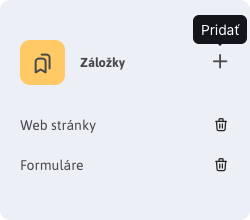

# Úvodná obrazovka

## Záložky

Do mini aplikácie záložky si môžete pridať odkazy na často používané sekcie v administrácii. Po prihlásení tak nemusíte hľadať danú sekciu v menu, ale priamo kliknete na odkaz v záložkách.

Kliknutím na oranžovú ikonu naľavo od textu Záložky sa otvorí dialógové okno, v ktorom zadáte názov záložky a adresu, ktorá sa má otvoriť po kliknutí na meno záložky.

Predvolene sú zobrazené záložky na zoznam web stránok a formulárov. Tieto sa zobrazia aj keď zmažete všetky záložky.

Upozornenie: zoznam záložiek sa ukladá v prehliadači, ak používate viacero prehliadačov nastavte si záložky vo všetkých.

    <iframe width="560" height="315" src="https://www.youtube.com/embed/G5Ts04jSMX8" title="YouTube video player" frameborder="0" allow="accelerometer; autoplay; clipboard-write; encrypted-media; gyroscope; picture-in-picture" allowfullscreen></iframe>

## Spätná väzba

Kliknutím na tlačidlo Zaslať spätnú väzbu môžete nám, programátorom, zaslať vašu spätnú väzbu k používaniu WebJET CMS. Pripomienka sa odošle po vyplnení formuláru emailom.

Vaše pripomienky posúdime a pridáme do [mapy rozvoja](../../ROADMAP.md). Môžete tak aj vašim názorom zlepšiť fungovanie WebJET CMS.

V dialógovom okne môžete zadať text vašej pripomienky, komentár, alebo pochvalu. V prípade potreby môžete priložiť aj súbory (napr. fotku obrazovky, alebo dokument s opisom vašej požiadavky).

Ak zvolíte možnosť Zaslať anonymne nebude do odoslaného emailu zadané vaše meno a emailová adresa ako meno a email odosielateľa.

## Moje aktívne prihlásenia

Mini aplikácia **Moje aktívne prihlásenia** zobrazuje zoznam všetkých aktívnych prihlásení do administrácie WebJET CMS pod Vaším používateľským kontom. Všetky aktivity sú rozdelené do skupín podľa cluster-a. Vaše aktuálne prihlásenie je označené ikonou <i class="ti ti-home fs-6"></i>.

Jednotlivé prihlásenia majú tooltip, ktorý zobrazí ďalšie informácie.

Kliknutím na ikonu <i class="ti ti-trash fs-6"></i> môžete ukončiť dané prihlásenie. Ak je to v rámci Vášho aktuálneho uzla clustra, prihlásenie bude okamžite ukončené. Ak je to prihlásenie v inom uzli, prihlásenie bude ukončené po synchronizácii medzi uzlami clustra (typicky do minúty).