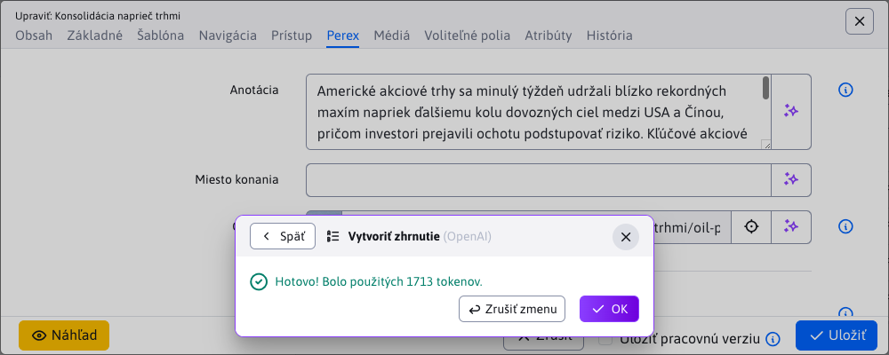
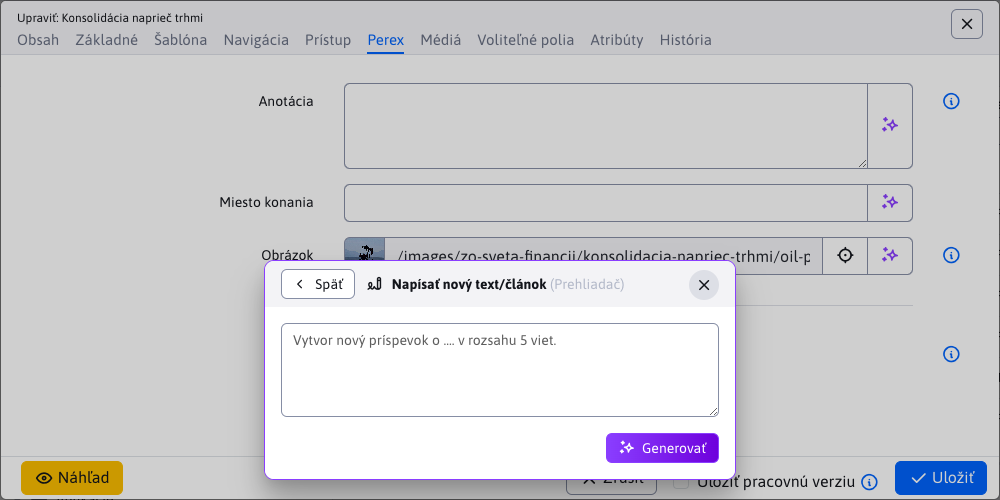
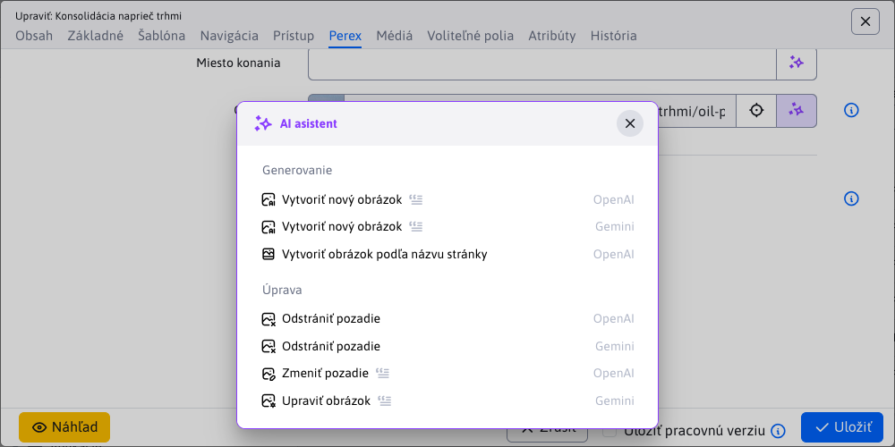
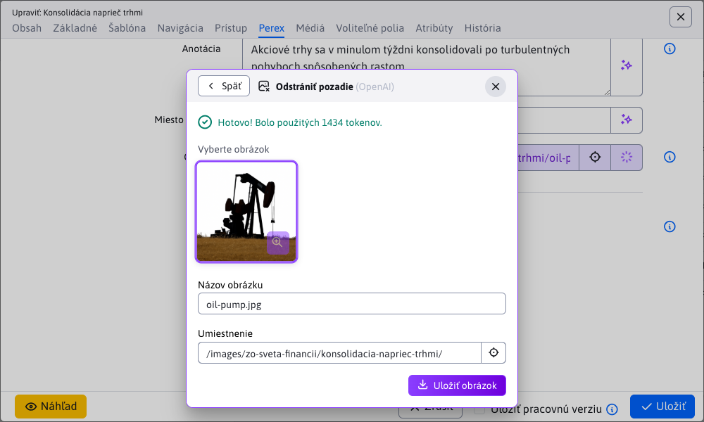
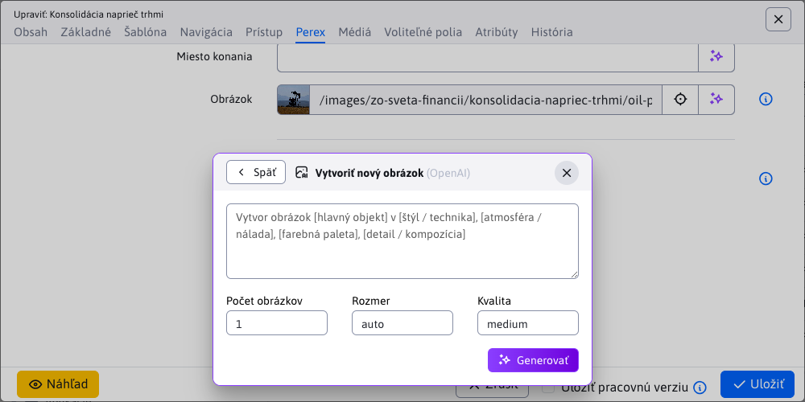
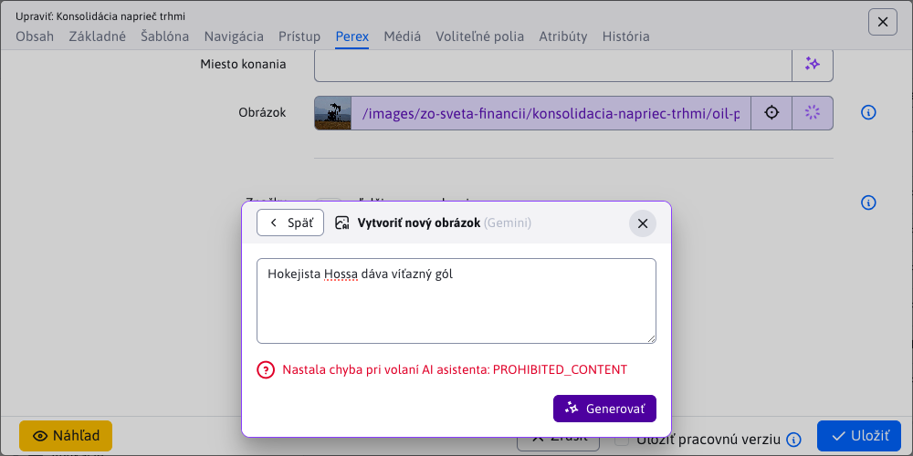
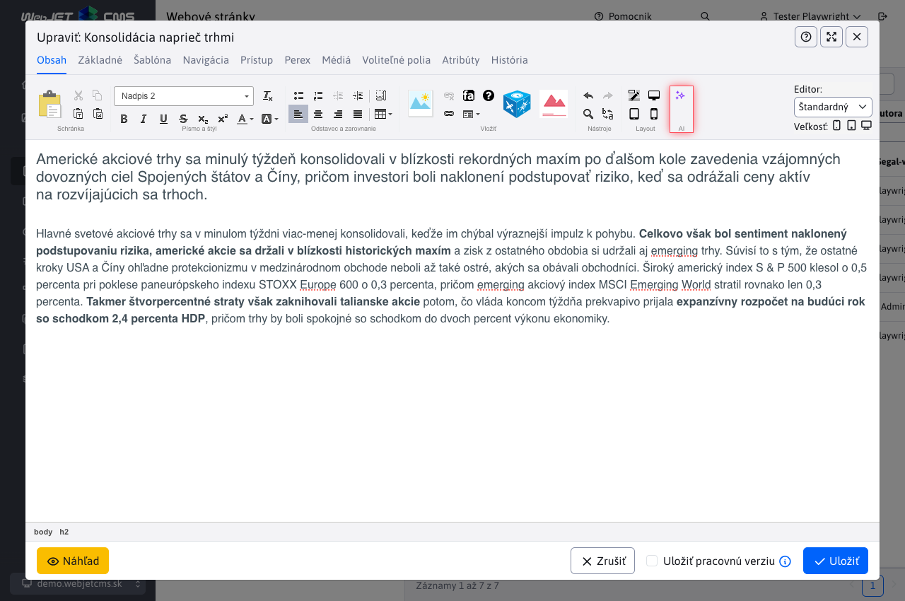
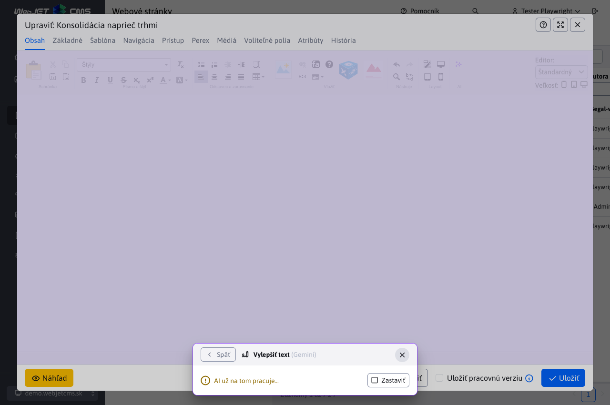
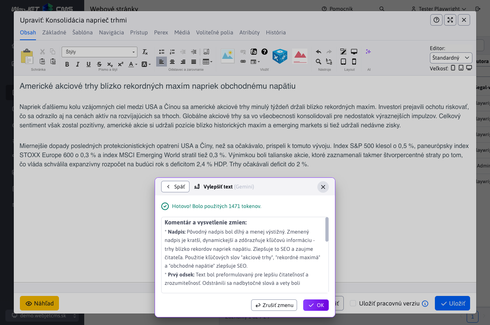
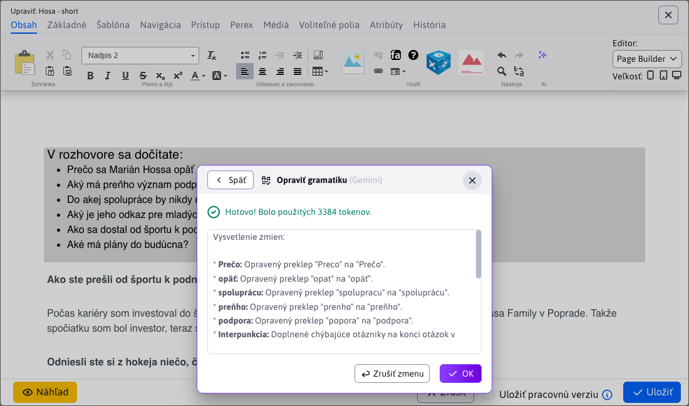

# Používanie AI asistentov

Logika využívania AI asistentov je jednotná naprieč celým CMS, aby mal používateľ konzistentný zážitok bez ohľadu na kontext. V tejto kapitole nájdete prehľad správania asistenta v dátových tabuľkách, CKEditore, PageBuilderi, pri označení textu aj v editore obrázkov.

## Textové polia

Asistent pri textovom poli (jednoriadkové pole aj textarea) slúži na vygenerovanie nového obsahu alebo úpravu existujúceho. Spúšťa sa cez tlačidlo <button class="btn btn-outline-secondary btn-ai" type="button"><i class="ti ti-sparkles"></i></button> na konci poľa.

Po kliknutí sa otvorí okno so všetkými dostupnými asistentmi pre dané pole. Sú prehľadne rozdelení do skupín (napr. **Generovanie**, **Vylepšenie**). Pri každom je názov, ikona a poskytovateľ.

Kliknutím na asistenta sa spustí jeho vykonanie. Ak má povolené postupné načítavanie, výsledok sa bude zobrazovať po častiach; inak sa zobrazí až po dokončení.

Po úspešnom dokončení sa výsledný text automaticky vloží do poľa. V okne sa zobrazí potvrdenie a informácia o spotrebe tokenov. Ak výsledok nevyhovuje, pomocou tlačidla <button class="btn btn-outline-secondary btn-ai-undo" type="button"><i class="ti ti-arrow-back"></i> Zrušiť zmenu</button> vrátite pôvodnú hodnotu.

### Vstup od používateľa

Ak asistent vyžaduje dodatočné pokyny, po jeho zvolení sa najprv zobrazí formulár na zadanie vstupu namiesto okamžitého spustenia.

Asistenti, ktorí potrebujú vstup používateľa, majú pri názve ikonu <i class="ti ti-blockquote has-user-prompt"></i> na jednoduché rozlíšenie.

Po zadaní pokynov stlačte **Generovať**. Ďalší priebeh (načítanie, vloženie výsledku, možnosť vrátenia) je rovnaký ako pri asistentovi bez používateľského vstupu.

### Quill

Nakoľko aj pole typu `Quill` patrí medzi textové polia, AI asistenti preň fungujú rovnako ako pre klasické textové polia. Jediný rozdiel je v umiestnení ikony, ktorá nie je na konci poľa, ale v hlavičke medzi nástrojmi.

## Obrázkové polia

Asistent pri obrázkovom poli slúži na vygenerovanie alebo úpravu obrázka. Spúšťa sa cez tlačidlo <button class="btn btn-outline-secondary btn-ai" type="button"><i class="ti ti-sparkles"></i></button> na konci poľa.

Po kliknutí sa otvorí okno so všetkými dostupnými asistentmi pre dané pole. Sú prehľadne rozdelení do skupín (napr. **Generovanie**, **Úprava**). Pri každom je názov, ikona a poskytovateľ.

Kliknutím na asistenta sa spustí jeho vykonanie. Ak si vyberiete asistenta, ktorý má upraviť už existujúci obrázok (napr. **Odstrániť pozadie**), ale obrázkové pole nemá nastavený žiadny obrázok, vráti sa chybová hláška.

Ak pole obsahuje obrázok, spustí sa spracovanie a zobrazí sa indikácia priebehu.

Po dokončení sa zobrazí potvrdenie, informácia o spotrebe tokenov a náhľad výsledku. Pomocou tlačidla <a target="_blank" class="zoom-in"><i class="ti ti-zoom-in"></i></a> si môžete obrázok otvoriť v plnej veľkosti na novej karte.

Obrázok sa neukladá automaticky. Najprv vyplňte alebo upravte polia **Názov obrázka** a **Umiestnenie**. Hodnoty sa predvyplnia podľa pôvodného obrázka, ale môžete ich zmeniť. Pole **Umiestnenie** umožňuje výber priečinka cez stromovú štruktúru.

Na uloženie stlačte **Uložiť obrázok**.

Ak ste názov ani umiestnenie nezmenili alebo kombinácia už existuje, zobrazí sa dialóg s možnosťami:

- **Prepísať súbor** – pôvodný súbor sa nahradí novým
- **Premenovať súbor** – systém ponúkne odporúčaný (AI generovaný) nový názov
- **Zrušiť uloženie** – návrat späť bez uloženia

Pri voľbe **Prepísať súbor** alebo **Premenovať súbor** sa obrázok v poli okamžite aktualizuje.

### Vstup od používateľa

Ak asistent vyžaduje dodatočné pokyny, zobrazí sa formulár. Doplňujúce polia sú špecifické pre konkrétneho **poskytovateľa**, preto sa môžu meniť. Pri poskytovateľovi `OpenAI` ide napríklad o:

- Počet obrázkov
- Rozmer
- Kvalita

Asistenti, ktorí potrebujú vstup používateľa, majú pri názve ikonu <i class="ti ti-blockquote has-user-prompt"></i>.

Po potvrdení prebieha spracovanie štandardne s jednou výnimkou pre `OpenAI`: umožňuje naraz vygenerovať viac obrázkov (podľa **Počet obrázkov**). Na príklade nižšie bolo nastavené číslo 3.

Vybrať a uložiť môžete len jeden výsledok – zvolíte ho kliknutím. Všetky náhľady je možné otvoriť cez <a target="_blank" class="zoom-in"><i class="ti ti-zoom-in"></i></a>.

### Problémy s obsahom

Poskytovateľ môže odmietnuť požiadavku, ak pokyny obsahujú chránenú alebo citlivú entitu (známa osoba, postava, licencovaná značka a pod.). Konkrétne pravidlá sa líšia podľa **poskytovateľa**. V takom prípade sa môže vrátiť chybová hláška `PROHIBITED_CONTENT`.

## CKEditor

Asistenti fungujú aj v `CKEditor` a slúžia na vygenerovanie nového obsahu alebo úpravu existujúceho obsahu stránky, ktorý je vložený v `CKEditor`. Spúšťajú sa cez ikonu <button class="btn-ai" type="button"><i class="ti ti-sparkles"></i></button> umiestnenú v paneli nástrojov.

Po kliknutí sa otvorí okno so všetkými dostupnými asistentmi pre dané pole. Sú prehľadne rozdelení do skupín (napr. **Generovanie**, **Copywriting**, **Vylepšenie**). Pri každom je názov, ikona a poskytovateľ.

Kliknutím na asistenta sa spustí jeho vykonanie. Ak má povolené postupné načítavanie, výsledok sa bude zobrazovať po častiach; inak sa zobrazí až po dokončení. Ak sa bude obsah načítavať po častiach, môže to vzbudiť dojem, že štruktúra stránky sa pokazila, ale všetko sa vráti do normálu, keď sa načíta celý obsah.

Po úspešnom dokončení sa výsledný obsah automaticky vloží do stránky. V okne sa zobrazí potvrdenie a informácia o spotrebe tokenov. Ak výsledok nevyhovuje, pomocou tlačidla <button class="btn btn-outline-secondary btn-ai-undo" type="button"><i class="ti ti-arrow-back"></i> Zrušiť zmenu</button> vrátite pôvodnú hodnotu.

V tomto prípade je asistent nastavený tak (a to aj odporúčame pri úprave obsahu stránky), aby v okne ešte opísal všetky zmeny, ktoré vykonal na obsahu stránky, čím ponúka spätnú väzbu, čo bolo potrebné upraviť.

### Iba časť textu

Nemusíte upravovať celý obsah stránky. Asistent pracujúci s `CKEditor` podporuje aj úpravy iba vybranej časti. Ak označíte iba časť obsahu a následne zavoláte asistenta, upraví iba danú vybranú časť.

## PageBuilder

Asistenti fungujú aj v `PageBuilder` a slúžia na vygenerovanie nového obsahu alebo úpravu existujúceho obsahu stránky vloženého v `PageBuilder`. Spúšťajú sa cez ikonu <button class="btn-ai" type="button"><i class="ti ti-sparkles"></i></button> umiestnenú v paneli nástrojov.

Po kliknutí sa otvorí okno so všetkými dostupnými asistentmi pre dané pole. Sú prehľadne rozdelení do skupín (napr. **Generovanie**, **Copywriting**, **Vylepšenie**). Pri každom je názov, ikona a poskytovateľ.

Kliknutím na asistenta sa spustí jeho vykonanie. Každý blok sa považuje za samostatný text/obsah a spracováva sa samostatne. Okno bude postupne aktualizovať stav, koľko blokov z celkového počtu už bolo spracovaných.

Po úspešnom dokončení sa výsledný obsah automaticky vloží do stránky. V okne sa zobrazí potvrdenie a informácia o spotrebe tokenov. Ak výsledok nevyhovuje, pomocou tlačidla <button class="btn btn-outline-secondary btn-ai-undo" type="button"><i class="ti ti-arrow-back"></i> Zrušiť zmenu</button> vrátite pôvodnú hodnotu.

V tomto prípade je asistent nastavený tak (a to aj odporúčame pri úprave obsahu stránky), aby v okne ešte opísal všetky zmeny, ktoré vykonal na obsahu stránky, čím ponúka spätnú väzbu, čo bolo potrebné upraviť.

### Iba časť textu

Nemusíte upravovať celý obsah stránky. Asistent pracujúci s `PageBuilder` podporuje aj úpravy iba vybranej časti. Ak označíte iba časť obsahu a následne zavoláte asistenta, upraví iba danú vybranú časť.

## Obrázky v stránke

AI asistenta môžete využiť aj pri vkladaní obrázkov do webovej stránky. Tlačidlo asistenta sa nachádza v pravom dolnom rohu na konci poľa s adresou obrázka.

Po kliknutí sa otvorí okno so všetkými dostupnými asistentmi, s ktorými sa pracuje rovnako, ako je to opísané v časti [Obrázkové polia](./README.md#obrázkové-polia)

