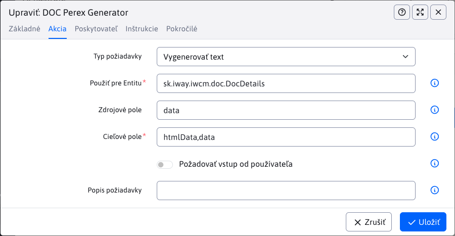
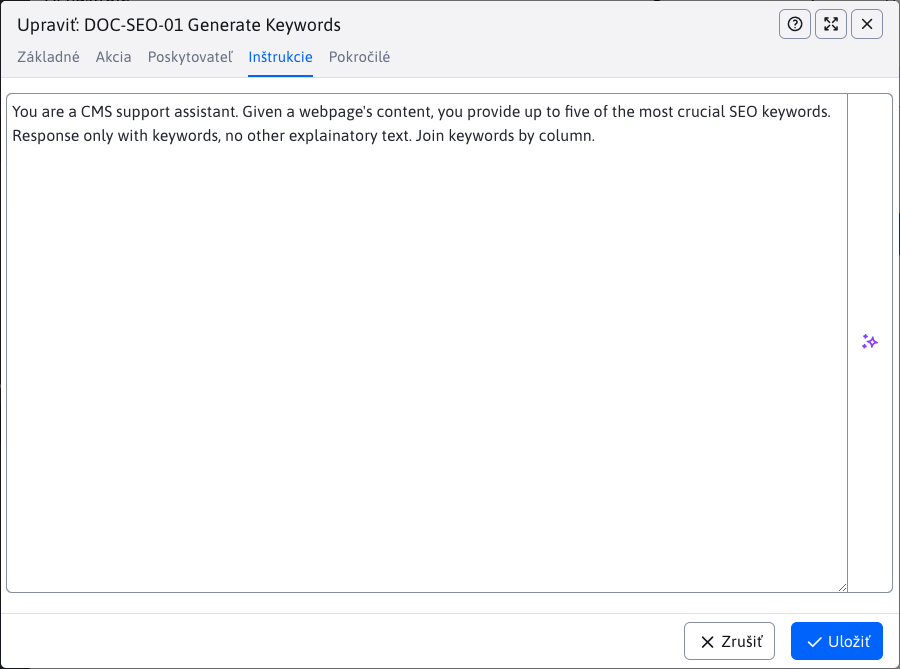
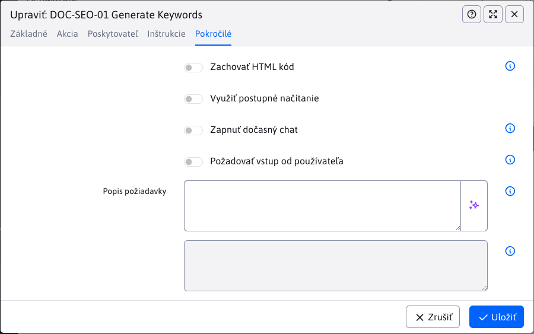

# Nastavenie

Tento dokument popisuje správu a konfiguráciu AI asistentov v CMS systéme. V sekcii **AI asistenti** môžete vytvárať a upravovať jednotlivých asistentov, pričom každý záznam predstavuje konkrétny typ akcie s vybraným poskytovateľom AI služieb. Nastavenia umožňujú určiť, kde (v ktorej tabuľke) a pre ktoré pole alebo polia bude daný asistent dostupný, čiže bude vykonávať nastavenú akciu.


!>**Upozornenie:** Nastavenia by mala vykonávať iba osoba, ktorá má dostatočné znalosti o fungovaní AI asistentov a rozumie možnostiam jednotlivých poskytovateľov. Nesprávne nastavenie môže viesť k neoptimálnemu správaniu asistenta alebo k obmedzeniu jeho funkčnosti. Odporúčame, aby konfiguráciu vykonával administrátor alebo technicky zdatný používateľ, ktorý vie správne zadať inštrukcie a parametre pre konkrétneho AI poskytovateľa.

## Základné informácie

V tejto časti si preberieme ako pridať/nastaviť nového **AI asistenta**. Pri tejto akcii sú dostupné nasledujúce karty:

- Základné
- Akcia
- Poskytovateľ
- Inštrukcie
- Pokročilé

### Karta - Základné

Táto karta obsahuje základné informácie o asistentovi ako názov, ikona alebo dátum vytvorenia. Obsahuje polia:

- **Unikátny názov**, unikátny názov asistenta, ktorý sa využíva ako identifikátor (používateľ ho nevidí)
- **Názov pre používateľa**, názov asistenta, ktorý sa zobrazí používateľovi a nemusí byť unikátny. Ak ho nenastavíte, použije sa **Unikátny názov**.
- **Ikona**, názov ikony, ktorá sa bude zobrazovať spolu s **Názov pre používateľa**. Zoznam ikon nájdete na `https://tabler.io/icons`
- **Skupina**, podľa ktorej sa asistenti vizuálne členia (nemá vplyv na funkcionalitu)
- **Vytvorené**, dátumové pole, ktoré sa nedá upraviť a zobrazí sa iba pri editácii asistenta (pri vytváraní sa automaticky nastaví)


### Karta - Akcia

Na tejto karte nastavujete, akú akciu má AI asistent vykonávať, odkiaľ bude získavať dáta a kde bude dostupný. K dispozícii sú tieto polia:

- **Typ požiadavky** – určujete, aký typ úlohy má asistent vykonať:
  - Vygenerovať text
  - Vygenerovať obrázok
  - Upraviť obrázok
  - Chat
- **Použiť pre Entitu** – vyberáte entitu (tabuľku), v ktorej bude asistent dostupný. Pri písaní sa automaticky zobrazia všetky podporované entity.
- **Zdrojové pole** – určujete pole z vybranej entity, z ktorého má asistent čerpať dáta pri vykonávaní akcie. Toto pole nie je povinné; vyberte ho len v prípade, že sú potrebné vstupné dáta. Zobrazia sa všetky polia danej entity.
- **Cieľové pole** – vyberáte pole v entite, kde sa uloží výsledok akcie asistenta alebo kde bude asistent dostupný. Opäť sa zobrazia všetky polia danej entity.
- **Požadovať vstup od používateľa** – ak je táto možnosť zapnutá, pred spustením asistenta bude používateľ vyzvaný na zadanie vstupného textu (napríklad špecifikácia obrázka, ktorý má byť vygenerovaný).
- **Popis požiadavky** – doplnková nápoveda, ktorá sa zobrazí používateľovi pri zadávaní vstupu. Vyplňte ju len v prípade, že je zapnutá možnosť **Požadovať vstup od používateľa**.



Pre entitu, zdrojové a cieľové pole je možné zadať aj hodnoty typu:

- `value1,value2,value3` - aplikuje sa na viaceré hodnoty
- `*` - aplikuje sa na všetky hodnoty
- `%value!` - aplikuje sa ak kdekoľvek obsahuje hodnotu `value`
- `%value` - aplikuje sa ak začína na hodnotu `value`
- `value!` - aplikuje sa ak končí na hodnotu `value`

Pre cieľové pole je možné zadať nielen meno atribútu v entite, ale aj CSS triedu a hodnotu `renderFormat`, je možné teda zadať hodnotu `dt-format-text,dt-format-text-wrap` pre aplikovanie na všetky typy textový polí.

Ak v entite nechcete, aby sa pre pole zobrazovali možnosti AI nástrojov stačí do anotácie pridať CSS triedu `ai-off`, v takom prípade sa pri poli zobrazí tlačidlo pre AI asistenta len ak je zadaný presne na danú entitu a pole.

```java
	@Lob
	@Column(name = "description")
	@DataTableColumn(inputType = DataTableColumnType.OPEN_EDITOR, renderFormat = "dt-format-text", tab="description", editor = {
			@DataTableColumnEditor(type = "textarea", attr = {
					@DataTableColumnEditorAttr(key = "class", value = "textarea-code ai-off") }) })
	private String description;
```

### Karta - Provider

Táto karta slúži na výber poskytovateľa AI služieb, ktorý bude použitý na spracovanie požiadavky asistenta. Vo výberovom poli sa zobrazia všetci dostupní a správne nakonfigurovaní poskytovatelia (napríklad tí, ktorí majú zadaný API kľúč). Po výbere konkrétneho poskytovateľa sa môžu zobraziť ďalšie špecifické nastavenia podľa možností daného poskytovateľa. Napríklad pri poskytovateľovi `OpenAI` je možné vybrať konkrétny model na spracovanie požiadavky, zatiaľ čo iní poskytovatelia môžu ponúkať iné alebo obmedzené možnosti konfigurácie.


### Karta - Inštrukcie

Táto karta je kľúčová pre správne fungovanie asistenta. Obsahuje jedno pole, do ktorého zadávate detailné inštrukcie, čo má asistent vykonať po spustení. Inštrukcie by mali byť jasné, konkrétne a zrozumiteľné, aby asistent vedel presne, akú úlohu má splniť. Správne zadané inštrukcie zabezpečia, že asistent bude vykonávať požadované akcie efektívne a podľa očakávaní. Viac sa dočítate v časti [písanie inštrukcií](../instructions/README.md).



### Karta - Pokročilé

Na tejto karte nájdete rozšírené možnosti konfigurácie asistenta, ktoré umožňujú detailnejšie prispôsobiť jeho správanie podľa vašich potrieb. Dostupné nastavenia sa môžu líšiť v závislosti od vybraného poskytovateľa AI služieb. Odporúčame meniť tieto nastavenia len v prípade, že presne viete, aký bude ich vplyv na fungovanie asistenta, keďže môžu ovplyvniť jeho výsledky alebo spôsob interakcie s používateľom.



## Poskytovatelia

Poskytovateľ je externá služba alebo platforma, ktorá zabezpečuje AI nástroje, modely a funkcionality využívané pri spracovaní požiadaviek v CMS. Aby bolo možné poskytovateľa používať, musí byť najskôr správne implementovaný a nakonfigurovaný v systéme (napríklad zadaním API kľúča). Jednotliví poskytovatelia sa môžu líšiť v možnostiach, cene, kvalite výsledkov alebo špecializácii na konkrétne typy úloh. Výber vhodného poskytovateľa závisí od vašich potrieb a požiadaviek na konkrétnu AI funkcionalitu.

### OpenAI

OpenAI patrí medzi najznámejších a najpoužívanejších poskytovateľov AI služieb. V CMS systéme je jeho API už integrované – na aktiváciu stačí zadať váš API kľúč do konfiguračnej premennej `ai_openAiAuthKey`. Pri zadávaní kľúča odporúčame využiť možnosť **Šifrovať** pre vyššiu bezpečnosť.

Aktuálne je podporovaná integrácia pre tieto typy požiadaviek:

- Generovanie textu
- Generovanie obrázkov
- Úprava obrázkov

API kľúč získate registráciou na stránke [OpenAI](https://platform.openai.com/signup). Po prihlásení do svojho účtu prejdite do sekcie `API Keys`, kde si môžete vygenerovať nový kľúč. Tento kľúč následne vložte do nastavení CMS podľa vyššie uvedeného postupu.

### Prehliadač

AI priamo v prehliadači je aktuálne [pripravovaný štandard](https://developer.chrome.com/docs/ai/get-started) vytvorený spoločnosťou Google. Aktuálne je podporovaný v prehliadači Google Chrome, po štandardizácii API sa predpokladá, že bude dostupný aj v iných prehliadačoch. Dostupnosť AI v prehliadači môžete vypnúť nastavením konfiguračnej premennej `ai_browserAiEnabled` na hodnotu `false`.

Pre spustenie AI v prehliadači je potrebné splniť:

- [HW požiadavky](https://developer.chrome.com/docs/ai/get-started#hardware) počítača.
- Spojenie do WebJET CMS musí byť zabezpečené (použitý protokol https).

Ak spĺňate požiadavky odporúčame najskôr vyskúšať asistenta na preklad a následne na sumarizáciu textu, to sú najjednoduchšie služby, ktoré AI v prehliadači podporuje. Overíte tak stiahnutie a inštaláciu modelu na váš počítač a ich funkčnosť v prehliadači.

Niektoré rozhrania sú [zatiaľ v experimentálnom režime](https://developer.chrome.com/docs/ai/built-in-apis#api_status), pre ich použitie je potrebné otvoriť v prehliadači stránku Experimenty zadaním adresy `chrome://flags/#prompt-api-for-gemini-nano` do prehliadača a nastaviť hodnotu `Enabled` pre položku `Prompt API for Gemini Nano`, `Summarization API for Gemini Nano`, `Writer API for Gemini Nano`, `Rewriter API for Gemini Nano`. Následne kliknite na Znova spustiť pre reštart prehliadača. Odporúčame na stránke v hornej časti zadať výraz `gemini` pre filtrovanie možností a ich jednoduchšie nájdenie. Bez povolenia týchto možností bude dostupné len API pre preklad a sumarizáciu.

Overiť stav AI modelov môžete zadaním nasledovnej stránky do adresného riadku prehliadača `chrome://on-device-internals/`.

Niektoré API zatiaľ nepodporujú prácu vo všetkých jazykoch, preto po použití môže dôjsť k automatickému prekladu. Prekladač je ale pri prvom použití potrebné tiež stiahnuť, preto odporúčame ako prvé vyskúšať AI nástroj pre preklad, aby sa prekladač nainštaloval. Následne sa už bude dať použiť po vykonaní iných AI asistentov na preklad výstupného textu.