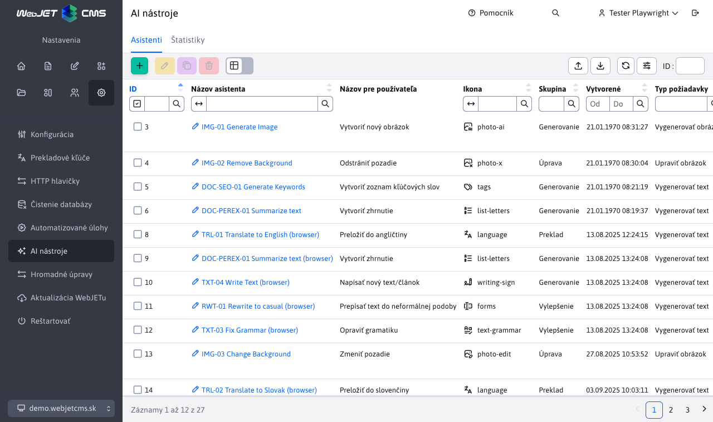
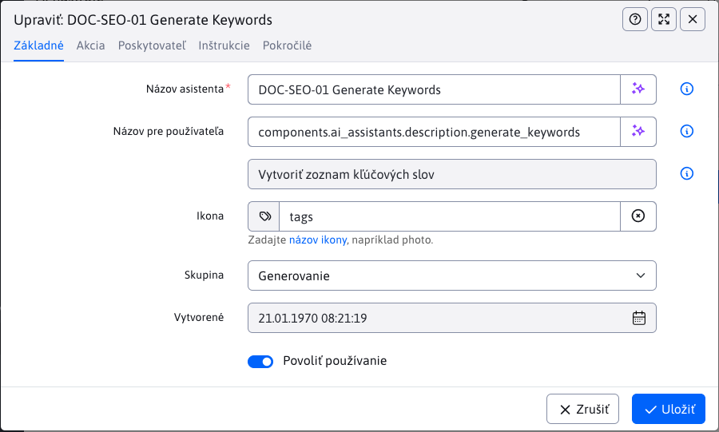
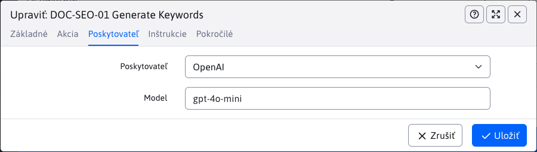

# Nastavenie

Tento dokument popisuje správu a konfiguráciu AI asistentov vo WebJET CMS. V sekcii **AI asistenti** môžete vytvárať a upravovať jednotlivých asistentov, pričom každý záznam predstavuje konkrétny typ akcie s vybraným poskytovateľom AI služieb. Nastavenia umožňujú určiť, kde (v ktorej tabuľke) a pre ktoré pole alebo polia bude daný asistent dostupný, čiže bude vykonávať nastavenú akciu.



!>**Upozornenie:** Nastavenia by mala vykonávať iba osoba, ktorá má dostatočné znalosti o fungovaní AI asistentov a rozumie možnostiam jednotlivých poskytovateľov. Nesprávne nastavenie môže viesť k neoptimálnemu správaniu asistenta alebo k obmedzeniu jeho funkčnosti. Odporúčame, aby konfiguráciu vykonával administrátor alebo technicky zdatný používateľ, ktorý vie správne zadať inštrukcie a parametre pre konkrétneho AI poskytovateľa.

## Základné informácie

V tejto časti si preberieme, ako pridať/nastaviť nového **AI asistenta**. Pri tejto akcii sú dostupné nasledujúce karty:

- Základné
- Akcia
- Poskytovateľ
- Inštrukcie
- Pokročilé

### Karta - Základné

Táto karta obsahuje základné informácie o asistentovi ako názov, ikona alebo dátum vytvorenia. Obsahuje polia:

- **Názov asistenta** – interný identifikátor asistenta (používateľ ho nevidí). Musí byť unikátny v kombinácii s hodnotou **Poskytovateľ** (t. j. rovnaký názov môžete použiť pre viacerých asistentov, ale každý musí mať iného poskytovateľa).
- **Názov pre používateľa** – zobrazený názov v rozhraní. Nemusí byť unikátny. Ak nie je vyplnený, použije sa hodnota z poľa **Názov asistenta**. Môžete zadať aj prekladový kľúč (hodnota kľúča sa zobrazí v poli pod ním).
- **Ikona** – názov ikony zo stránky https://tabler.io/icons. Zobrazuje sa spolu s poľom **Názov pre používateľa**. Zadajte len identifikátor ikony (bez URL).
- **Skupina** – logické alebo vizuálne zoskupenie asistentov v rozhraní. Nemá vplyv na spracovanie ani výsledok.
- **Vytvorené** – systémom generovaný dátum vytvorenia. Nedá sa upraviť a zobrazí sa len pri editácii existujúceho asistenta.
- **Povoliť používanie** – ak nie je zapnuté, asistent sa nezobrazuje používateľom a nie je možné ho spustiť (slúži ako rýchla deaktivácia).



### Karta - Akcia

Na tejto karte nastavujete, akú akciu má AI asistent vykonávať, odkiaľ bude získavať dáta a kde bude dostupný. K dispozícii sú tieto polia:

- **Typ požiadavky** – určujete, aký typ úlohy má asistent vykonať:
  - Vygenerovať text
  - Vygenerovať obrázok
  - Upraviť obrázok
  - Chat
- **Použiť pre Entitu** – vyberáte entitu (tabuľku), v ktorej bude asistent dostupný. Pri písaní sa automaticky zobrazia všetky podporované entity.
- **Zdrojové pole** – určujete pole z vybranej entity, z ktorého má asistent čerpať dáta pri vykonávaní akcie. Toto pole nie je povinné; vyberte ho len v prípade, že sú potrebné vstupné dáta. Zobrazia sa všetky polia danej entity.
- **Cieľové pole** – vyberáte pole v entite, kde sa uloží výsledok akcie asistenta alebo kde bude asistent dostupný. Opäť sa zobrazia všetky polia danej entity.


Pre entitu, zdrojové a cieľové pole je možné zadať aj hodnoty typu:

- `value1,value2,value3` – aplikuje sa na viaceré hodnoty
- `*` – aplikuje sa na všetky hodnoty
- `%value!` – aplikuje sa, ak kdekoľvek obsahuje hodnotu `value`
- `%value` – aplikuje sa, ak začína hodnotou `value`
- `value!` – aplikuje sa, ak končí hodnotou `value`

Pre cieľové pole je možné zadať nielen meno atribútu v entite, ale aj CSS triedu a hodnotu `renderFormat`. Je teda možné zadať hodnotu `dt-format-text,dt-format-text-wrap` pre aplikovanie na všetky typy textových polí.

Voliteľné polia (teda polia ktorých názov je `fieldX`) sa môžu dynamicky meniť, napríklad podľa zvolenej šablóny vo webových stránkach. Pri generovaní AI asistentov sa na serverovej strane deteguje len hlavný typ bez ohľadu na použitú šablónu stránky. Preto nemusí byť asistent zobrazený správne ak majú stránky rôzne šablóny. Voliteľné polia sa inicializujú pri obnovení web stránky podľa šablóny priečinka v ktorom sa nachádzate, čiže obnovenie stránky môže načítať správne hodnoty. Prechod na inú stránku s inou šablónou ale asistentov nezmení.

Zároveň ak je pre voliteľné pole nastavený konkrétny asistent (meno poľa sa zhoduje s hodnotou v poli Cieľové pole definície asistenta), nezobrazia sa ostatný všeobecný asistenti definovaný napr. podľa typu poľa a podobne. Predpokladá sa, že ak definujete asistenta pre konkrétne voliteľné pole, nepotrebujete ostatných všeobecných asistentov (ako napr. Opraviť gramatiku). Ak takéhoto asistenta potrebujete, stačí pridať meno voliteľného poľa aj do týchto všeobecných asistentov.

Ak v entite nechcete, aby sa pre pole zobrazovali možnosti AI nástrojov, stačí do anotácie nastaviť atribút `ai=false` alebo pridať CSS triedu `ai-off`. V takom prípade sa pri poli zobrazí tlačidlo pre AI asistenta len vtedy, ak je zadaný presne pre danú entitu a pole.

```java
	@Lob
	@Column(name = "description")
	@DataTableColumn(inputType = DataTableColumnType.OPEN_EDITOR, renderFormat = "dt-format-text", tab="description", ai=false, editor = {
			@DataTableColumnEditor(type = "textarea", attr = {
					@DataTableColumnEditorAttr(key = "class", value = "textarea-code") }) })
	private String description;
```

### Karta - Poskytovateľ

Táto karta slúži na výber poskytovateľa AI služieb, ktorý bude použitý na spracovanie požiadavky asistenta. Vo výberovom poli sa zobrazia všetci dostupní a správne nakonfigurovaní poskytovatelia (napríklad tí, ktorí majú zadaný API kľúč). Po výbere konkrétneho poskytovateľa sa môžu zobraziť ďalšie špecifické nastavenia podľa možností daného poskytovateľa. Napríklad pri poskytovateľovi `OpenAI` je možné vybrať konkrétny model na spracovanie požiadavky, zatiaľ čo iní poskytovatelia môžu ponúkať iné alebo obmedzené možnosti konfigurácie.



### Karta - Inštrukcie

Táto karta je kľúčová pre správne fungovanie asistenta. Obsahuje jedno pole, do ktorého zadávate detailné inštrukcie, čo má asistent vykonať po spustení. Inštrukcie by mali byť jasné, konkrétne a zrozumiteľné, aby asistent vedel presne, akú úlohu má splniť. Správne zadané inštrukcie zabezpečia, že asistent bude vykonávať požadované akcie efektívne a podľa očakávaní. Viac sa dočítate v časti [písanie inštrukcií](../instructions/README.md).


### Karta - Pokročilé

Na tejto karte nájdete rozšírené možnosti konfigurácie asistenta, ktoré umožňujú detailnejšie prispôsobiť jeho správanie podľa vašich potrieb. Dostupné nastavenia sa môžu líšiť v závislosti od vybraného poskytovateľa AI služieb. Odporúčame meniť tieto nastavenia len vtedy, ak presne viete, aký bude ich vplyv na fungovanie asistenta, keďže môžu ovplyvniť jeho výsledky alebo spôsob interakcie s používateľom.

- **Zachovať HTML kód** – ak je zapnuté, HTML značky zo zdrojového poľa sa neodstránia a odošlú sa poskytovateľovi tak, ako sú. Zapnite iba v prípade, že model potrebuje pracovať so štruktúrovaným HTML (napr. analýza alebo úprava obsahu). Inak ponechajte vypnuté kvôli čistejšiemu vstupu.
- **Využiť postupné načítanie** – odpoveď sa bude zobrazovať po častiach (streamovanie) namiesto jedného bloku. Vhodné pri dlhších generovaných textoch, aby mal používateľ okamžitú spätnú väzbu. Funguje iba pre textové výstupy.
- **Zapnúť dočasný chat** – kontext a výmena správ sa po ukončení relácie neukladajú. Použite pri citlivom alebo jednorazovom dopyte. História nebude k dispozícii pre ďalšie pokračovanie.
- **Požadovať vstup od používateľa** – pred spustením asistenta musí používateľ zadať vlastný vstup (napr. zadanie témy, doplňujúcej inštrukcie alebo kľúčových slov). Ak je vypnuté, asistent beží bez dodatočného vstupu.
- **Popis požiadavky** – krátka nápoveda zobrazovaná pri poli na zadanie vstupu (uľahčuje používateľovi pochopiť, čo má napísať). Môže byť zadaný aj prekladový kľúč; jeho vyhodnotená hodnota sa zobrazí v poli pod ním.


## Poskytovatelia

Poskytovateľ je externá služba alebo platforma, ktorá zabezpečuje AI nástroje, modely a funkcionality využívané pri spracovaní požiadaviek v CMS. Aby bolo možné poskytovateľa používať, musí byť najskôr správne implementovaný a nakonfigurovaný v systéme (napríklad zadaním API kľúča). Jednotliví poskytovatelia sa môžu líšiť v možnostiach, cene, kvalite výsledkov alebo špecializácii na konkrétne typy úloh. Výber vhodného poskytovateľa závisí od vašich potrieb a požiadaviek na konkrétnu AI funkcionalitu.

### OpenAI

OpenAI patrí medzi najznámejších a najpoužívanejších poskytovateľov AI služieb. Vo WebJET CMS je jeho API už integrované – na aktiváciu stačí zadať váš API kľúč do konfiguračnej premennej `ai_openAiAuthKey`. Pri zadávaní kľúča odporúčame využiť možnosť **Šifrovať** pre vyššiu bezpečnosť.

Aktuálne je podporovaná integrácia pre tieto typy požiadaviek:

- Generovanie textu
- Generovanie obrázkov
- Úprava obrázkov

API kľúč získate registráciou na stránke [OpenAI](https://platform.openai.com/signup). Po prihlásení do svojho účtu prejdite do sekcie `API Keys`, kde si môžete vygenerovať nový kľúč. Tento kľúč následne vložte do nastavení CMS podľa vyššie uvedeného postupu.

### Gemini

Gemini, podobne ako OpenAI, patrí medzi najznámejších a najpoužívanejších poskytovateľov AI služieb. Vo WebJET CMS je jeho API už integrované cez nástroj [AI Studio](https://aistudio.google.com/) – na aktiváciu stačí zadať váš API kľúč do konfiguračnej premennej `ai_geminiAuthKey`. Pri zadávaní kľúča odporúčame využiť možnosť **Šifrovať** pre vyššiu bezpečnosť.

Aktuálne je podporovaná integrácia pre tieto typy požiadaviek:

- Generovanie textu
- Generovanie obrázkov
- Úprava obrázkov

API kľúč získate nasledovne:

- Otvorte stránku [Google AI Studio](https://aistudio.google.com/apikey).
- Prihláste sa do účtu `Google` (kľúč bude viazaný na tento účet).
- Kliknite na `Create API key`.
- Vyberte existujúci alebo vytvorte nový `Google Cloud` projekt, ku ktorému sa kľúč priradí.
- Potvrdíte generovanie – zobrazí sa vygenerovaný kľúč, ktorý následne vložte do nastavení CMS podľa vyššie uvedeného postupu.

Novo vygenerovaný kľúč funguje najskôr v bezplatnom (obmedzenom) režime – platia limity na počet požiadaviek za minútu / hodinu / deň. Pre vyššie limity a stabilnú prevádzku nastavte fakturáciu cez odkaz `Set up billing` pri kľúči. Po pridaní spôsobu platby sa limity sprístupnia podľa aktuálnych podmienok spoločnosti `Google`.

Pokročilé nastavenia (kvóty, fakturácia, rotácia kľúčov, štatistiky) nájdete v [Google Cloud Console](https://console.cloud.google.com/).

### OpenRouter

Služba [OpenRouter](https://openrouter.ai) prepája rôznych poskytovateľov AI služieb do jedného spoločného API. Technicky vašu požiadavku smeruje na API daného poskytovateľa, výhoda je, že nepotrebujete mať vytvorené účty u viacerých poskytovateľov, ale máte jeden účet v OpenRouter, ktorý používate pre viacero poskytovateľov AI služieb. Mnoho modelov je dostupných zdarma, služba je teda výhodná aj na testovanie/skúšanie možností AI modelov.

Pre používanie platených modelov do služby môžete doplniť fixný kredit, alebo nastaviť automatické dopĺňanie kreditu, ak sa spotrebuje. Dostupné sú aj štatistiky využitia jednotlivých modelov.

Vygenerovaný API kľúč nastavte do konfiguračnej premennej `ai_openRouterAuthKey`.


### Prehliadač

AI priamo v prehliadači je aktuálne [pripravovaný štandard](https://developer.chrome.com/docs/ai/get-started) vytvorený spoločnosťou Google. Aktuálne je podporovaný v prehliadači Google Chrome za použitia zabezpečeného (HTTPS) spojenia. Po štandardizácii API sa predpokladá, že bude dostupný aj v iných prehliadačoch. Dostupnosť AI v prehliadači môžete vypnúť nastavením konfiguračnej premennej `ai_browserAiEnabled` na hodnotu `false`, kedy sa možnosti prestanú zobrazovať.

Pre spustenie AI v prehliadači je potrebné splniť:

- [HW požiadavky](https://developer.chrome.com/docs/ai/get-started#hardware) počítača.
- Spojenie do WebJET CMS musí byť zabezpečené (použitý protokol HTTPS).

Ak spĺňate požiadavky, odporúčame najskôr vyskúšať asistenta na preklad a následne na sumarizáciu textu – to sú najjednoduchšie služby, ktoré AI v prehliadači podporuje. Tým overíte stiahnutie a inštaláciu modelu na váš počítač a jeho funkčnosť v prehliadači.

Niektoré rozhrania sú [zatiaľ v experimentálnom režime](https://developer.chrome.com/docs/ai/built-in-apis#api_status). Pre ich použitie je potrebné otvoriť v prehliadači stránku Experimenty zadaním adresy `chrome://flags/#prompt-api-for-gemini-nano` a nastaviť hodnotu `Enabled` pre položky `Prompt API for Gemini Nano`, `Summarization API for Gemini Nano`, `Writer API for Gemini Nano`, `Rewriter API for Gemini Nano`. Následne kliknite na Znova spustiť pre reštart prehliadača. Odporúčame na stránke v hornej časti zadať výraz `gemini` pre filtrovanie možností a ich jednoduchšie nájdenie. Bez povolenia týchto možností bude dostupné len API pre preklad a sumarizáciu.


Overiť stav AI modelov môžete zadaním nasledujúcej adresy do riadku prehliadača: `chrome://on-device-internals/`.

Niektoré API zatiaľ nepodporujú prácu vo všetkých jazykoch, preto môže po použití dôjsť k automatickému prekladu. Prekladač je však pri prvom použití potrebné tiež stiahnuť, preto odporúčame ako prvé vyskúšať AI nástroj pre preklad, aby sa prekladač nainštaloval. Následne sa už bude dať použiť aj po vykonaní iných AI asistentov na preklad výstupného textu.