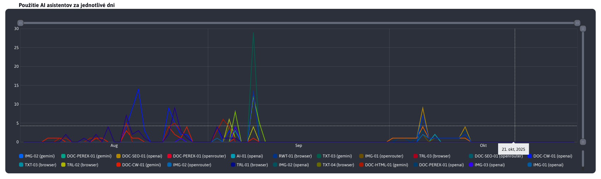
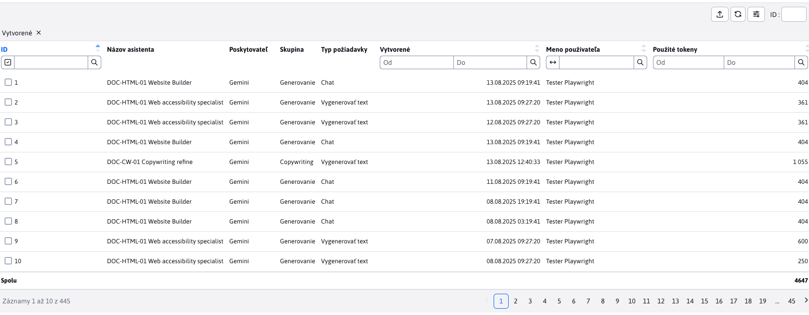

# Štatistika

Sekcia **Štatistika** poskytuje prehľad o využívaní AI asistentov v systéme. Nájdete tu vizuálne prehľady, ktoré zobrazujú najčastejšie používaných asistentov, asistentov s najvyššou spotrebou tokenov (teda s najväčšími nákladmi), ako aj detailné informácie o využití jednotlivých AI asistentov a ich spotrebe tokenov v konkrétnych dňoch.

Údaje sa zobrazujú za obdobie, ktoré si zvolíte (predvolený rozsah je posledných 30 dní). Filter v hlavičke umožňuje obmedziť zobrazenie podľa:

- **Typ požiadavky** (napr. Vygenerovať text, Vygenerovať obrázok, Chat)
- **Poskytovateľ** (napr. Prehliadač, OpenAI, Gemini)
- **Skupina** (napr. Generovanie, Analýza, Úprava)

Filtre môžete ľubovoľne kombinovať, aby ste sa zamerali na konkrétnu časť využívania. Všetky grafy aj tabuľka sa po zmene filtrov okamžite aktualizujú.

Viac o parametroch nájdete v časti [nastavenia](../settings/README.md).

## Koláčové grafy

Koláčové grafy znázorňujú rozdelenie TOP 5 (vrátane zvyšných ako kombinácie **Ostatné**) najčastejšie používaných AI asistentov a tých s najvyššou spotrebou tokenov v rámci zvoleného obdobia. Tieto vizualizácie vám umožnia rýchlo identifikovať najpoužívanejších asistentov a oblasti s najväčším čerpaním zdrojov.

## Použitie AI asistentov za jednotlivé dni

Tento graf zobrazuje počet využití jednotlivých AI asistentov v konkrétnych dňoch počas zvoleného obdobia. Umožňuje sledovať trendy v používaní asistentov a vyhodnotiť, ako sa ich využitie mení v čase.

## Počet použitých tokenov AI asistentmi za jednotlivé dni

Tento graf zobrazuje, koľko tokenov (zdrojov) jednotliví AI asistenti spotrebovali počas jednotlivých dní v danom období. Spotreba tokenov nemusí priamo súvisieť s počtom využití – graf vám však pomôže odhaliť asistentov s nadmernou spotrebou a zvážiť optimalizáciu ich inštrukcií na zníženie nákladov.

## Tabuľka

Sekcia štatistika na záver ponúka ja tabuľku, kde je prehľad všetkých volaní asistentov za zvolené obdobie. Obsahuje aj stĺpec používateľ, takže si viete pozrieť aj to, kto najčastejšie a na čo používa AI asistentov.

