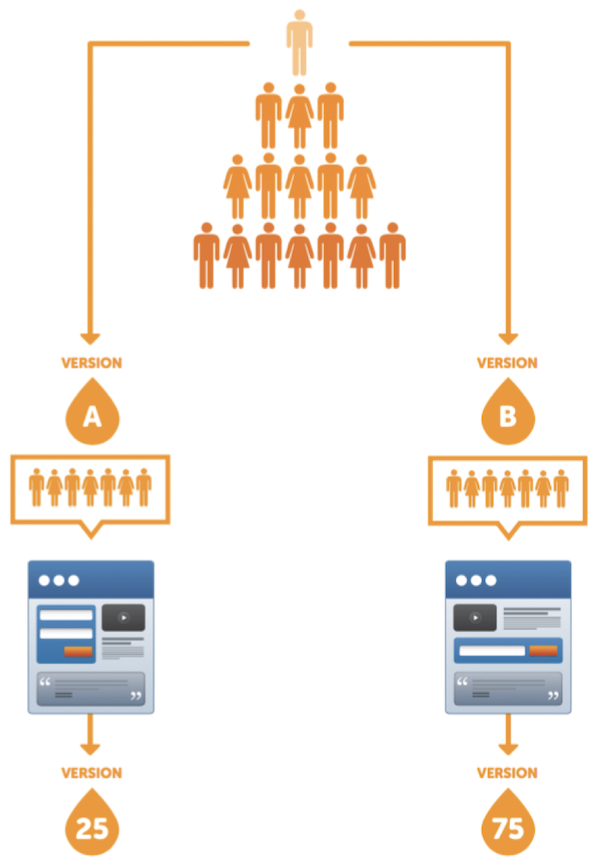
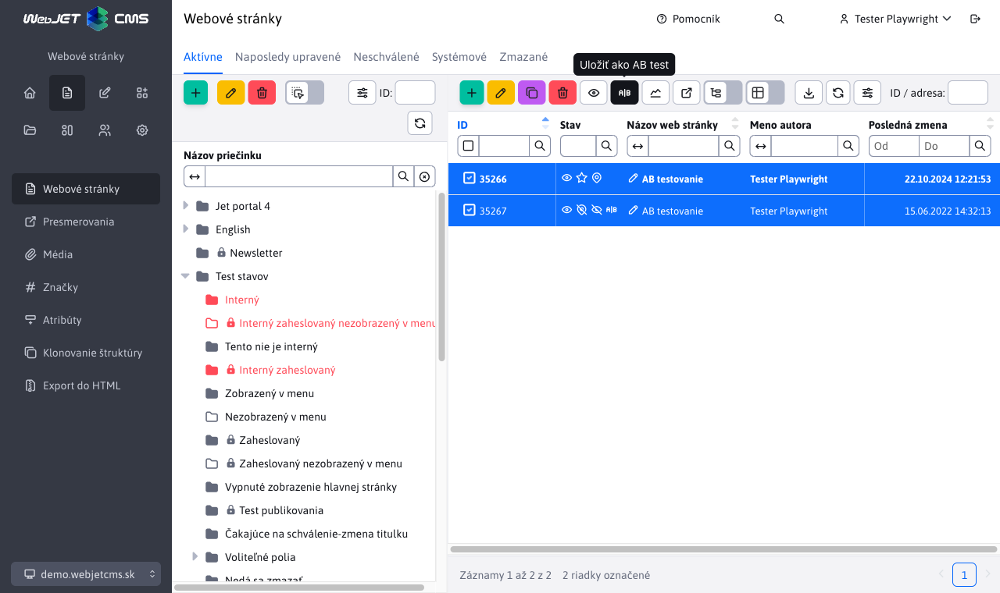

# AB testovanie

Aplikácia AB testovanie vám umožňuje vykonať AB testovanie verzie stránok. Je možné vytvoriť B verziu stránky kliknutím na tlačítko Uložiť ako AB test. Vytvorí sa kópia stránky s upravenou URL adresou v ktorej môžete testovať B verziu stránky. WebJET následne automaticky zabezpečí zobrazovanie A a B verzie stránky na pôvodnej URL adrese v definovanom pomere. Návštevník teda stále vidí pôvodnú URL ale namiesto A verzie sa mu automaticky zobrazí B verzia stránky.

## Čo je AB testovanie

- porovnanie jednej zásadnej zmeny
- meriame konverziu akcie
- odporúčaná dostatočná vzorka minimálne 1000 návštevníkov/zobrazení
- ```split``` test = testovanie komplexnej zmeny



**Výhody:**

- test je jednoduchý a rýchly
- určí nám dôležité objekty
- je ľahko merateľný

**Nevýhody:**

- často môže sklamať
- je potrebné správne navrhnúť čo testujeme a čo má byť výsledok
- veľkú zmenu budeme po krokoch testovať dlhšie

## Ako pripraviť test

Pripravte si hypotézu, ktorá by mala zlepšiť stav
- využite štatistiku (stránka s vysokým odchodom)
- brainstorming
- prieskum

**Čo je vhodné testovať:**

- titulok (stránky, tlačítka)
    - výstižný vs popisný
    - orientovaný na vlastnosť alebo benefit
- obrázky
    - usmievaví ľudia vs foto produktu
    - farebnosť, veľkosť
    - video
- text stránky
    - pod nadpisy, zvýraznenia slov
    - odrážky vs odstavce
    - benefity vs funkcie
- farebnosť
    - tlačidiel, odkazov, nadpisov
- formuláre
    - počet polí
    - povinné vs nepovinné
    - rozdelenie na viac krokov
- ```CTA``` prvky (prvky na ktoré návštevník kliká pre vykonanie akcie)
    - text, farba, pozícia, spôsob vykonania akcie
- zmena rozloženia objektov
- použiteľnosť
    - čo bude lepšie?
- nezabudnime na stránku po konverzii
    - získajme od návštevníka viac
    - sociálne ikony, newsletter
    - bonusová ponuka

## Vytvorenie testu

B verziu stránky vytvoríte označením originálnej verzie stránky a kliknutím na ikonu <i class="ti ti-a-b"></i> Uložiť ako AB test. Následne sa vám vytvorí kópia stránky, ktorá v stĺpci Stav bude zobrazovať ikonu <i class="ti ti-a-b"></i>. V B verzii môžete upraviť text stránky, ktorým budete testovať dopad zmien.



Je možné aj testovať tzv. ```split``` testy. Návštevníkovi sa pri prvom prístupe vygeneruje ```cookie``` ktorá určuje aká verzia stránky sa mu zobrazí. Ak sa vygeneruje B verzia, tak aj všetky nasledovné stránky ktoré majú B verziu sa zobrazia v B verzii. Návštevník tak môže prechádzať medzi viacerými stránkami B verzie.

V aplikácii AB testovanie je možné nastaviť pomer medzi A a B verziou, technické názvy URL ```suffixu``` a názvu cookie, platnosť cookie a hlavne sa AB testovanie zapína a vypína.

## Meranie výsledkov

- meriame stránku/akciu po konverzii
- split test umožní B verzie ďakovnej stránky
- pred testom si ujasnime čo a ako zmeráme
- aj zníženie konverzie je úspech testu

V aplikácii AB testovanie sa v tabuľke zobrazuje zoznam stránok ktoré majú B verziu s možnosťou zobrazenia grafu porovnania verzií. Ak nemáte pomer AB verzie 50:50 WebJET automaticky vykoná aj pomerový prepočet návštev jednotlivých verzií, aby sa dali čísla porovnať.

