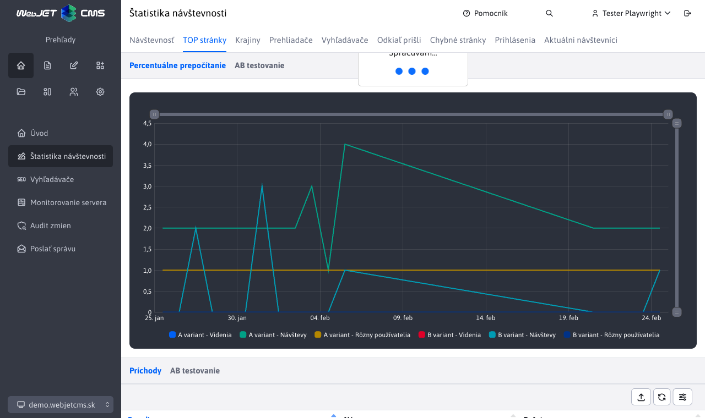
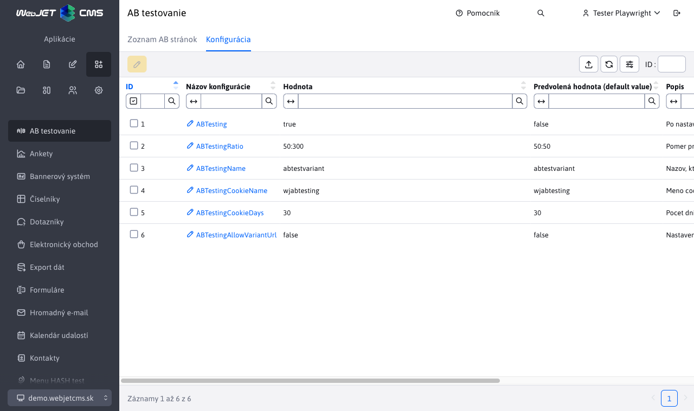

# Správa A/B testov

Aplikácia AB testovanie Vám poskytuje prehľad o AB stránkach a správu príslušných konfiguračných premenných:

- Zoznam AB stránok
- Konfigurácia

## Zoznam AB stránok

Sekcia Zoznam AB stránok ponúka zoznam stránok, ktoré majú vytvorenú B variantu. Tieto stránky nie je možné akokoľvek upravovať, pridávať či mazať.

K dispozícií máte možnosť zobrazenie stránky aj zobrazenie Štatistiky stránky pomocou tlačidiel na nástrojovej lište tabuľky. Dôležité v štatistike je meranie výsledkov percentuálnym prepočítaním podľa pomeru A/B verzie:

## Konfigurácia

Sekcia Konfigurácia Vám umožňuje prehľad a úpravu príslušných konfiguračných premenných pre AB testovanie.

Samotná úprava týchto konfiguračný premenných je okresaná iba na úpravu hodnoty premennej a šifrovania, žiadne iné zmeny alebo akcie nad premennými nie sú umožnené.

### Možné konfiguračné premenné

- `ABTesting` (predvolene `false`) - po nastavení na `true` sa aktivuje AB testovanie web stránok.
- `ABTestingRatio` (predvolene `50:50`) - pomer pri generovaní stránok medzi verziou A a B.
- `ABTestingName` (predvolene `abtestvariant`) - názov, ktorý sa pridáva do URL adresy B verzie stránky na jej odlíšenie - používa sa aj na dohľadanie B verzie stránky.
- `ABTestingCookieName` (predvolene `wjabtesting`) - meno `cookie` použitej pre zapamätanie si verzie testu pri `split` testoch - ak sa pri zobrazení rozhodne pre B variantu, zapamätá sa v `cookie` s týmto názvom a podľa toho sa ďalej budú poskytovať B verzie stránok.
- `ABTestingCookieDays` (predvolene `30`) - počet dní zapamätania si zvolenej verzie pri AB testovaní - čas exspirácie cookie.
- `ABTestingAllowVariantUrl` (predvolene `false`) - nastavením na `true` povolí priame zobrazenie variantnej URL adresy aj ne-administrátorom, napr. volanie `/investicie/abtestvariantb.html`.
- `ABTestingForLoggedUser` (predvolene `false`) - nastavením na `true` sa spustí režim, kedy neprihlásenému návštevníkovi je vždy zobrazená A varianta web stránky a prihlásenému je vždy zobrazená B varianta web stránky.