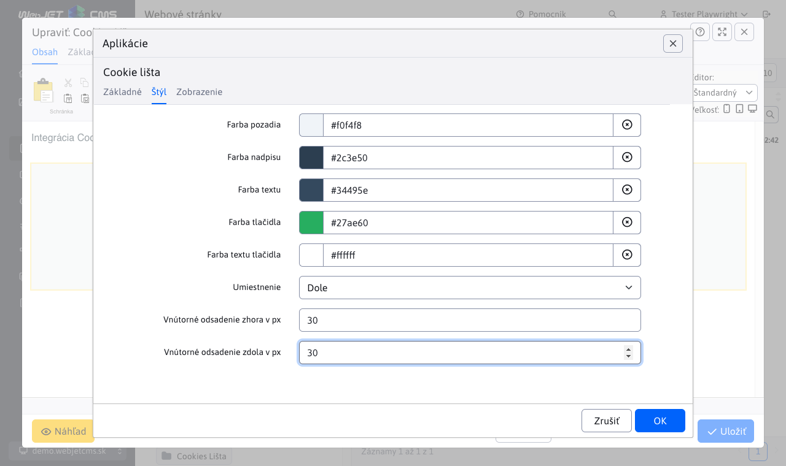

# Cookie lišta

Vložte na svoju stránku preddefinovaný panel súhlasu s cookies, kde návštevníci môžu potvrdiť svoj súhlas s ukladaním cookies na ich zariadení. Odporúčame umiestniť túto aplikáciu do pätičky, aby sa automaticky zobrazovala na každej stránke. Po udelení súhlasu sa panel znova nezobrazí po dobu 30 dní.

Cookies lišta sa najčastejšie používa na webových stránkach, ktoré nevyužívajú sledovacie alebo marketingové nástroje a kde je jediným účelom cookies zabezpečenie základných funkcií stránky.
Na rozdiel od [GDPR cookies súhlas](/redactor/apps/gdpr/README), kde má používateľ možnosť podrobne upraviť svoje nastavenia cookies (napr. prijatie len nutných alebo marketingových cookies), je Cookies lišta určená len na informovanie používateľa a neumožňuje aktívnu kontrolu nad tým, aké typy cookies sa ukladajú.

## Nastavenia aplikácie

V tejto časti je možné nastaviť:

### Karta Základné:
- **Text nadpisu**: Zadajte text, ktorý sa zobrazí ako hlavný nadpis na karte. Môže to byť napríklad „Používanie cookies“.
- **Text**: Popis informácie, ktorú chcete zobraziť používateľom, napríklad „Náš web používa súbory cookies“.
- **Text tlačidla pre akceptovanie**: Text pre tlačidlo, ktoré používateľ klikne na akceptovanie cookies, napríklad „Akceptovať“.
- **Text tlačidla pre zamietnutie**: Text pre tlačidlo, ktoré používateľ klikne na zamietnutie cookies, napríklad „Zamietnuť“.
- **Vložiť odkaz na zmenu povolenia vkladania cookies**: Odkaz, ktorý umožní používateľom zmeniť ich rozhodnutie ohľadom cookies v budúcnosti.

### Karta Štýl:
- **Farba pozadia**: Nastavte farbu pozadia pre zobrazenie oznámenia.
- **Farba nadpisu**: Zadajte farbu nadpisu.
- **Farba textu**: Farba samotného textu.
- **Farba tlačidla**: Farba pozadia tlačidiel.
- **Farba textu tlačidla**: Farba textu na tlačidlách.
- **Umiestnenie**: Definujte umiestnenie oznámenia, „Dole“ alebo „Hore“.
- **Vnútorné odsadenie zhora v px**: Napríklad `25px`, aby bolo nastavené správne odsadenie od vrchu prvku.
- **Vnútorné odsadenie zdola v px**: Napríklad `25px` pre vnútorné odsadenie od spodnej časti oznámenia.

## Zobrazenie aplikácie

