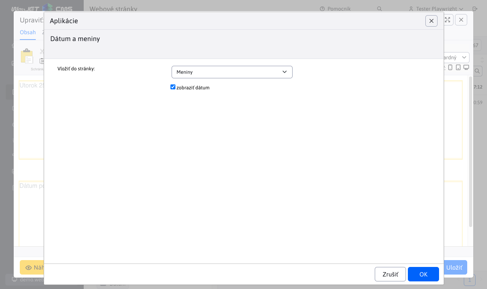

# Dátum

Aplikácia vloží do stránky aktuálny dátum, meniny prislúchajúce k danému dňu alebo dátum poslednej zmeny webstránky.

## Nastavenia aplikácie

V tejto časti je možné nastaviť:
- Formát aplikácie, ako sa zobrazí
- Pri niektorých formátoch sa dá vybrať, či sa zobrazí dátum alebo čas

## Zobrazenie aplikácie

