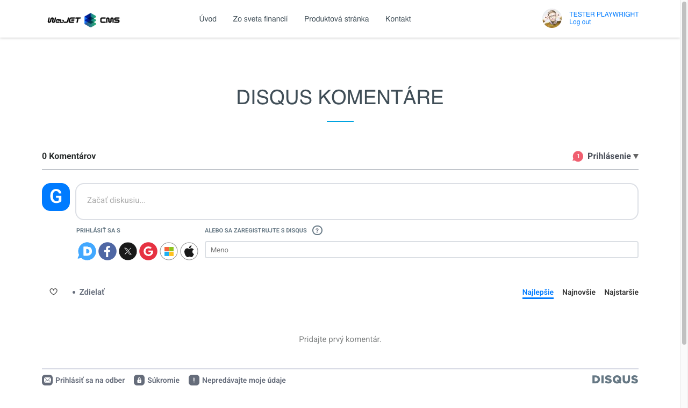

# Disqus komentáre

Vložte službu Disqus komentáre do vašej webstránky. Pred vložením do stránky si zdarma zaregistrujte účet na https://www.disqus.com cez ktorý budete nastavovať možnosti diskusie.

## Nastavenia aplikácie

Po vytvorení účtu si na https://disqus.com/admin/create/ zaregistrujte stránku a zvoľte si Unique Disqus URL (napr. webjet.disqus.com) a ten vložte do nasledujúceho poľa:

- Unique Disqus URL (website shortname)

## Zobrazenie aplikácie

