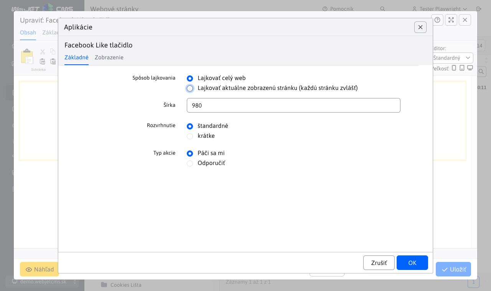

# Facebook Like tlačidlo

Facebook Like/share tlačidlo umožňuje nastaviť "Páči sa mi" alebo zdieľať obsah stránky s priateľmi návštevníka stránky.

## Nastavenia aplikácie

- **Spôsob lajkovania**: Vyberte preferovaný spôsob lajkovania:
  - Lajkovať celý web
  - Lajkovať aktuálne zobrazenú stránku (každú stránku zvlášť)
- **Šírka**: Zadajte šírku pre zobrazenie, napríklad `980`.
- **Rozvrhnutie**: Vyberte typ rozvrhnutia:
  - Štandardné
  - Krátke
- **Typ akcie**: Zvoľte typ akcie, ktorú chcete vykonať:
  - Páči sa mi
  - Odporučiť

## Zobrazenie aplikácie

