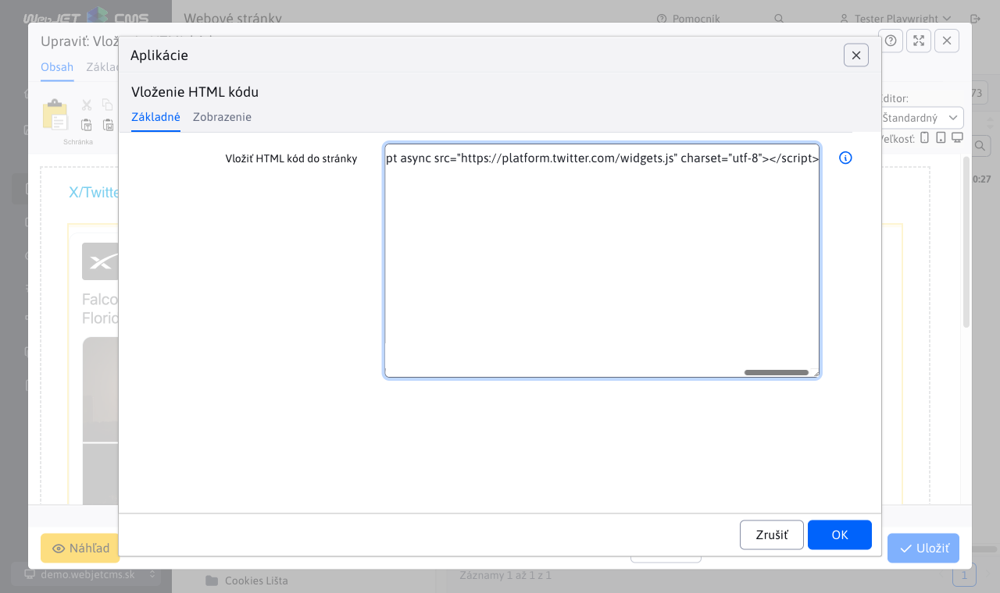
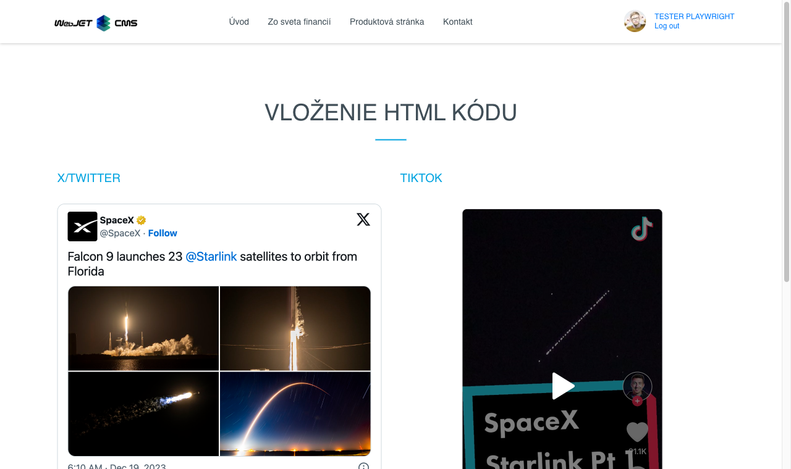

# Vloženie HTML kódu

Pridajte na svoju stránku externý HTML kód pre aplikácie, ktoré nie sú priamo podporované, ako napríklad TikTok video alebo príspevok z X/Twitter. Obohaťte svoj obsah o interaktívne prvky a zaujmite svojich návštevníkov.

## Nastavenia aplikácie

V nastaveniach možno:
- Vložiť HTML kód do stránky

## Zobrazenie aplikácie
