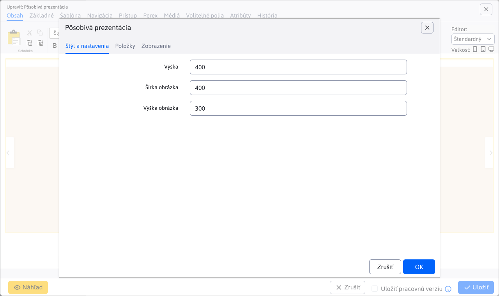
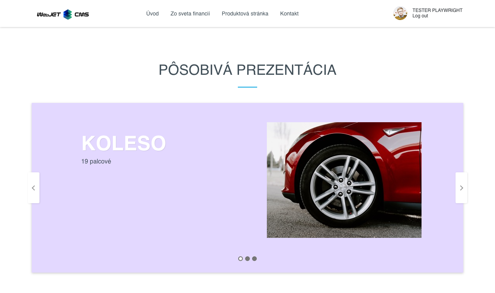

# Pôsobivá prezentácia

Animované zobrazenie prezentácie s 3D efektom prechodu medzi snímkami. Každej snímke môžete definovať nadpis, podnadpis, farbu písma a pozadia, ilustračnú fotografiu.

## Nastavenia aplikácie

Karty nastavení **Štýl a nastavenia** a **Položky**.

### Štýl a nastavenia

V tejto časti je možné nastaviť:

- Výška
- Šírka obrázka
- Výška obrázka

### Položky

V tejto časti je možné vidieť a spravovať položky aplikácie, takže klasické akcie ako pridanie/úprava/mazanie...

Pre jednotlivé položky môžete nastaviť tieto parametre:

- **Obrázok**, podporovaný je výber obrázka pomocou prieskumníka, ako aj priame zadanie cesty obrázka
- **Nadpis**, nadpis obrázka (možné je aj štýlovanie textu)
- **Podnadpis**, podnadpis obrázka (možné je aj štýlovanie textu)
- **Po kliknutí zobraziť inú stránku (presmerovať)**, výber stránky na ktorú budete presmerovaný (podporované je aj priame zadanie cesty)
- **Farba nadpisu**
- **Farba podnadpisu**
- **Farba pozadia**

## Zobrazenie aplikácie

