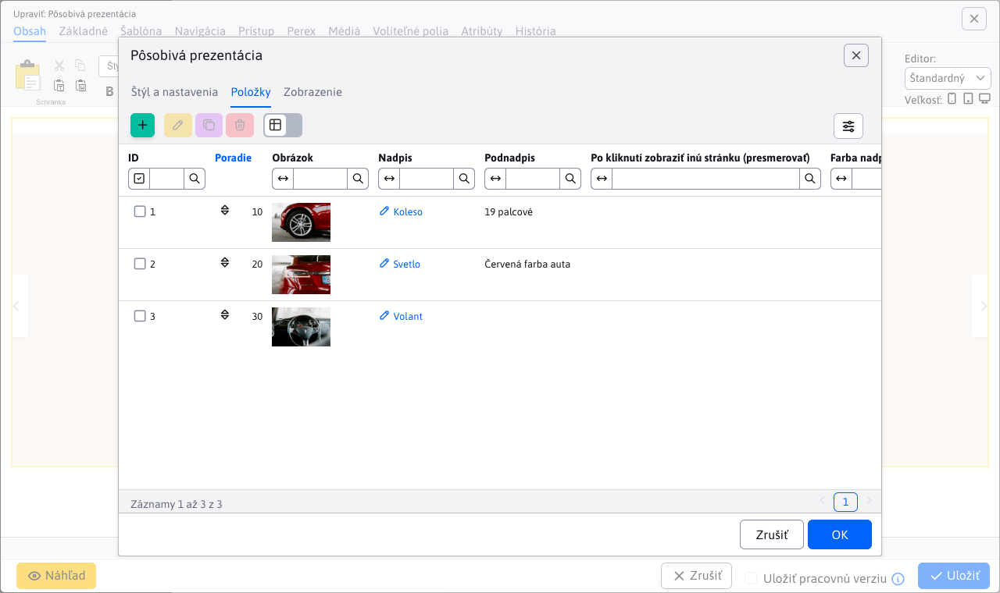

# Pôsobivá prezentácia

Animované zobrazenie prezentácie s 3D efektom prechodu medzi snímkami. Každej snímke môžete definovať nadpis, podnadpis, farbu písma a pozadia, ilustračnú fotografiu.

## Nastavenia aplikácie

### Štýl a nastavenia
V tejto časti je možné nastaviť:
- Výška
- Šírka obrázka
- Výška obrázka

### Položky
V tejto časti je pridať alebo odobrať položku:
Pri pridaní možno vyplniť nadpis, podnadpis, presmerovanie, farbu nadpisu, farbu podnadpisu, farbu pozadia.
Zároveň pri nadpise a podnadpise možno pomocou rozšíreného nastavenia upraviť štýl písma (hrubé písmo, kurzíva, odsadenie, veľkosť a štýl).
Pri položkách sa dá zmeniť poradie presunutím.
Odobratie položky možno kliknutím na červený krížik.

## Zobrazenie aplikácie
