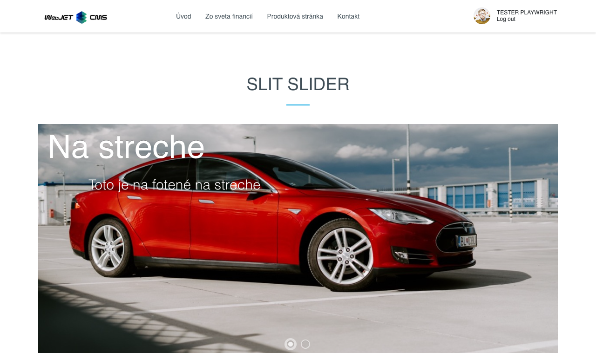

# Slit slider
Oživte svoju stránku s úchvatným animovaným sliderom fotografií. Využite efekt rozdelenia a otvorenia fotografií, ktorý pridáva dynamiku a zaujatie. Každá fotografia môže byť doplnená nadpisom a textom, čo umožňuje ešte väčšiu personalizáciu a interakciu so zákazníkmi.

## Nastavenia aplikácie

### Štýl a nastavenia
V tejto časti je možné nastaviť:
- Výška
- Nastavenie písma nadpisu (Zarovnanie písma, Veľkosť písma, Odsadenie zhora)
- Nastavenie písma podnadpisu (Zarovnanie písma, Veľkosť písma, Odsadenie zhora)

### Položky
V tejto časti je pridať alebo odobrať položku:
Pri pridaní možno vyplniť nadpis, podnadpis, presmerovanie, farbu nadpisu, farbu podnadpisu, farbu pozadia a obrázok.
Pri položkách sa dá zmeniť poradie presunutím.
Odobratie položky možno kliknutím na červený krížik.

## Zobrazenie aplikácie
