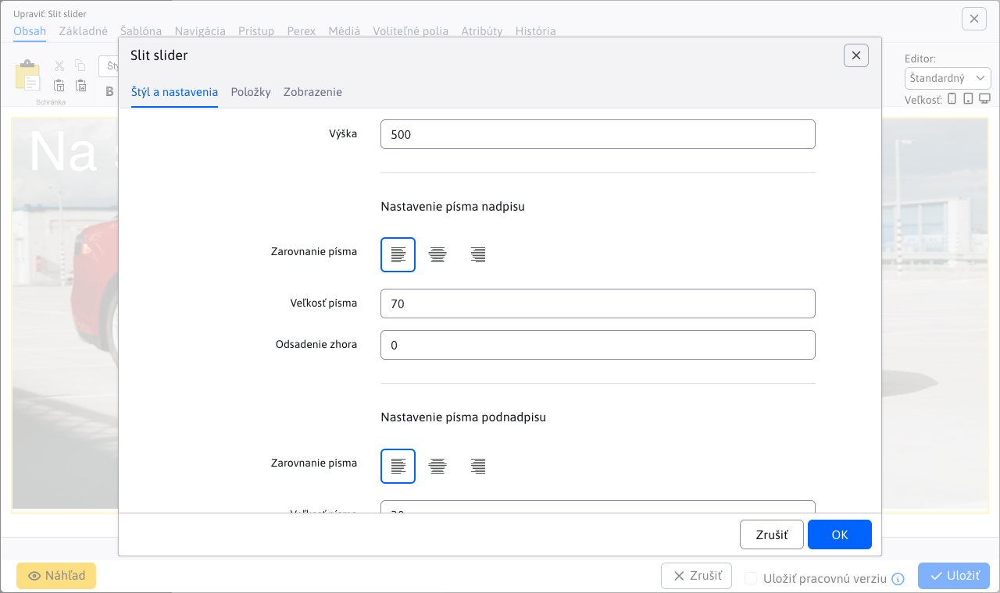

# Slit slider

Oživte svoju stránku s úchvatným animovaným sliderom fotografií. Využite efekt rozdelenia a otvorenia fotografií, ktorý pridáva dynamiku a zaujatie. Každá fotografia môže byť doplnená nadpisom a textom, čo umožňuje ešte väčšiu personalizáciu a interakciu so zákazníkmi.

## Nastavenia aplikácie

### Štýl a nastavenia

V tejto časti je možné nastaviť:

- **Výška**
- **Nastavenie písma nadpisu** (Zarovnanie písma, Veľkosť písma, Odsadenie zhora)
- **Nastavenie písma podnadpisu** (Zarovnanie písma, Veľkosť písma, Odsadenie zhora)

### Položky

V tejto časti je možné vidieť a spravovať položky aplikácie, takže klasické akcie ako pridanie/úprava/mazanie…

Pre jednotlivé položky môžete nastaviť tieto parametre:

- **Obrázok**, podporovaný je výber obrázka pomocou prieskumníka, ako aj priame zadanie cesty obrázka
- **Nadpis**, nadpis obrázka
- **Podnadpis**, podnadpis obrázka
- **Po kliknutí zobraziť inú stránku (presmerovať)**, výber stránky na ktorú budete presmerovaný (podporované je aj priame zadanie cesty)
- **Farba nadpisu**
- **Farba podnadpisu**
- **Farba pozadia**

## Zobrazenie aplikácie

