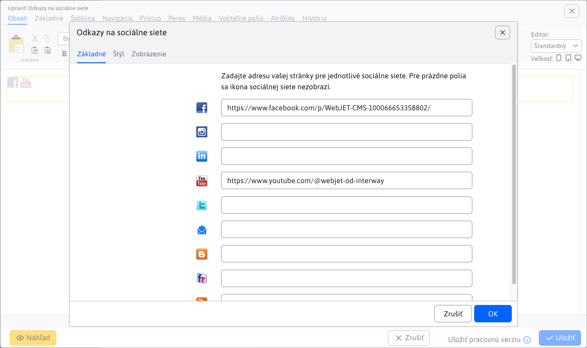
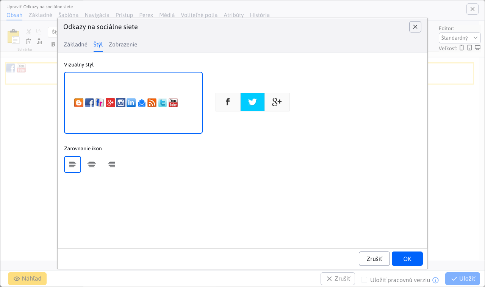

# Odkazy na sociálne siete

Vloží do stránky ikony s odkazmi na sociálne siete Facebook, Twitter, Instagram, LinkedIn, Flickr atď.

## Nastavenia aplikácie

Nastavenie obsahuje karty:

- **Základné**
- **Štýl**

### Karta - Základné

V karte môžete zadať adresu vašej stránky pre jednotlivé sociálne siete. Pre prázdne polia sa ikona sociálnej siete nezobrazí.

### Karta - Štýl

V karte môžete nastaviť:

- **Vizuálny štýl**, zobrazenia ikon
- **Zarovnanie ikon**, (vľavo, stred, vpravo)

## Zobrazenie aplikácie

