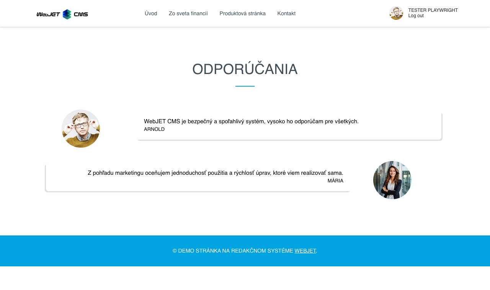
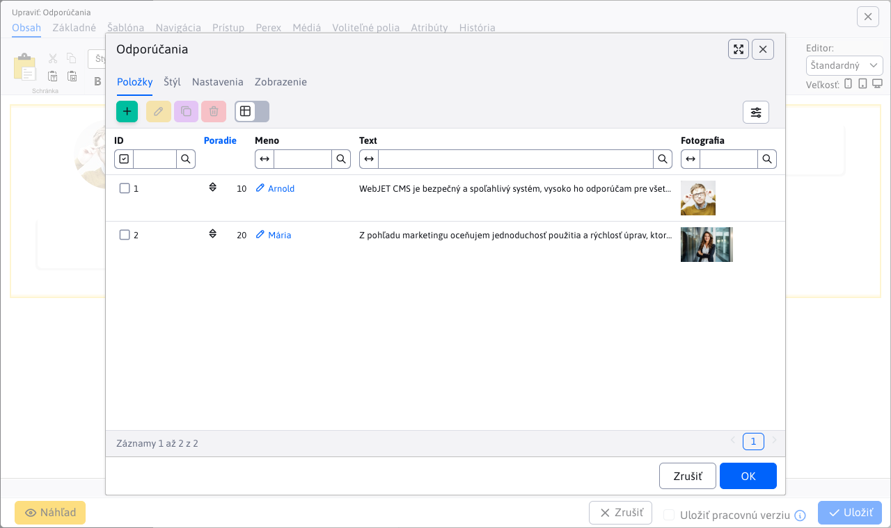
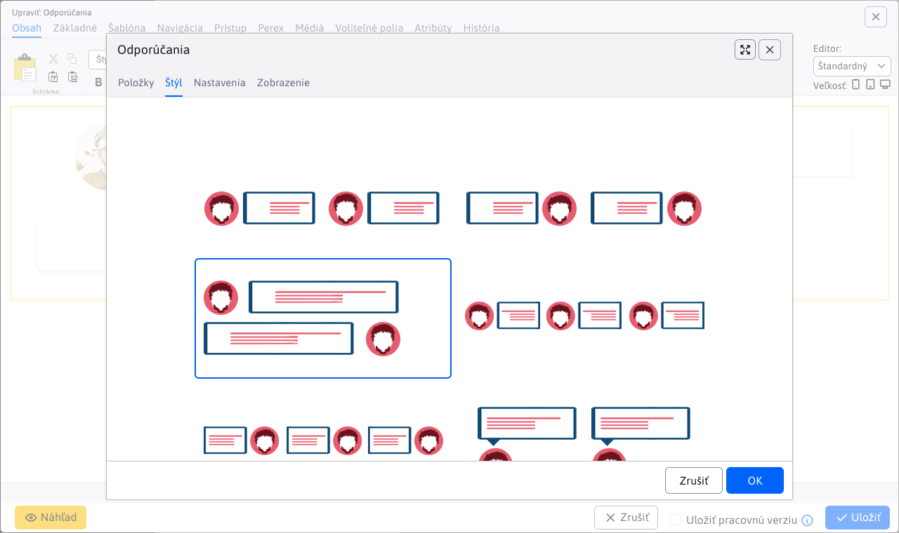
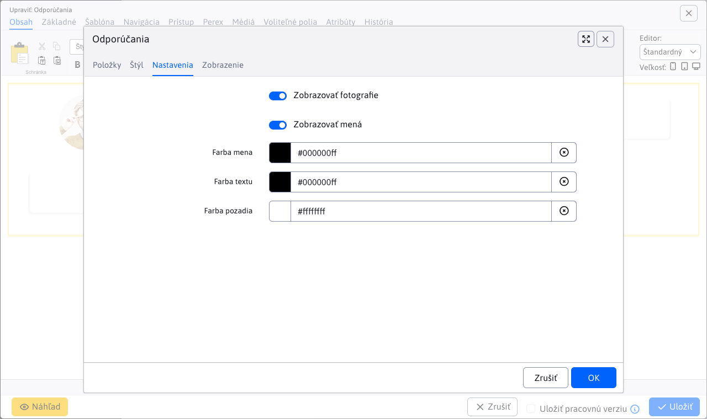

# Odporúčania

Vložte si do stránky aplikáciu zobrazujúcu odporúčania vašich zákazníkov.
Aplikácia zvýši dôveryhodnosť Vašej stránky a potencionálneho zákazníka uistí o kvalite Vašich služieb.

## Nastavenia aplikácie

### Položky

V tejto časti je možné pridať, upraviť alebo vymazať položku (odporúčanie). Tabuľka podporuje aj možnosť zmeny zoradenia pomocou akcie `drag&drop`.

Pre každú položku viete nastaviť:

- **Poradie** - poradie odporúčania v zobrazení
- **Obrázok** - obrázok zákazníka, ktorý dal odporúčanie
- **Meno** - meno zákazníka, ktorý dal odporúčanie
- **Text** - text odporúčania
- **Po kliknutí zobraziť inú stránku (presmerovať)** - ak je táto možnosť zvolená, zobrazí sa pole na zadanie URL adresy, na ktorú bude užívateľ presmerovaný po kliknutí na položku

### Štýl

V tejto časti môžete zvoliť štýl, ktorý sa aplikuje na odporúčania. Čiže viete zvoliť ako sa majú zobrazovať na webovej stránke.

### Nastavenia

V tejto časti je možné nastaviť:

- Zobrazovať fotografie
- Zobrazovať mená
- Farba mena
- Farba textu
- Farba pozadia

