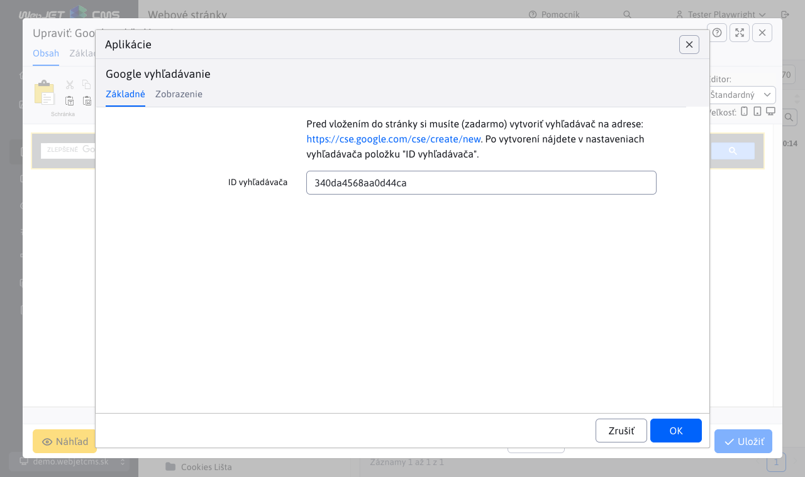
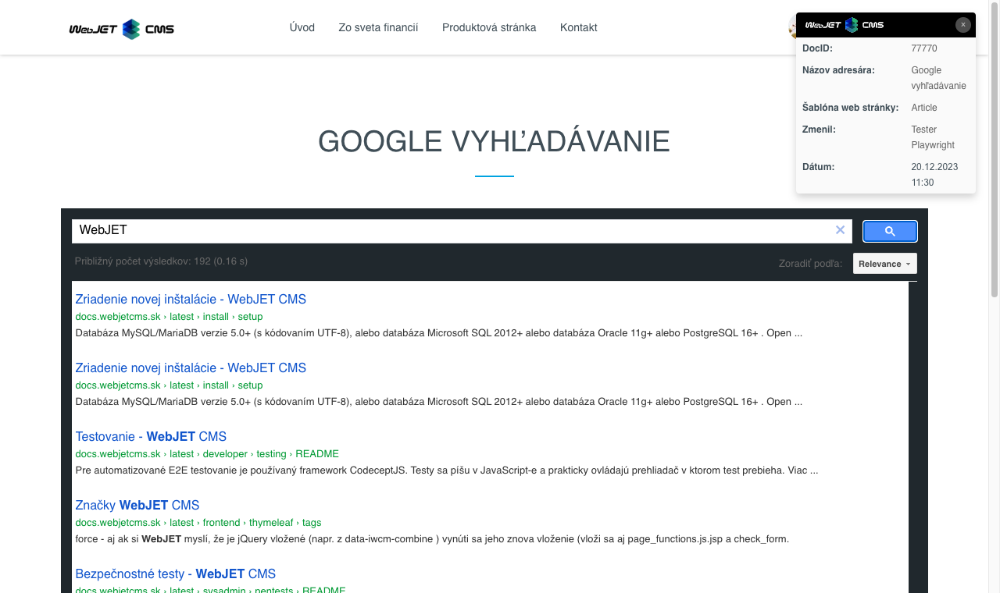

# Google vyhľadávanie

Prostredníctvom tejto aplikácie si môžete do vašej stránky umiestniť vyhľadávacie pole Google pre vyhľadávanie na vašom webe s využitím Google indexu/Google Custom Search.

Pred vložením do stránky si musíte (zadarmo) vytvoriť vyhľadávač na adrese: [cse.google.com](https://cse.google.com/cse/create/new). Po vytvorení nájdete v nastaveniach vyhľadávača položku "ID vyhľadávača".

## Nastavenia aplikácie

V tejto časti je možné nastaviť:

- ID vyhľadávača - hodnota získaná na stránke [cse.google.com](https://cse.google.com/cse/create/new)

## Zobrazenie aplikácie

