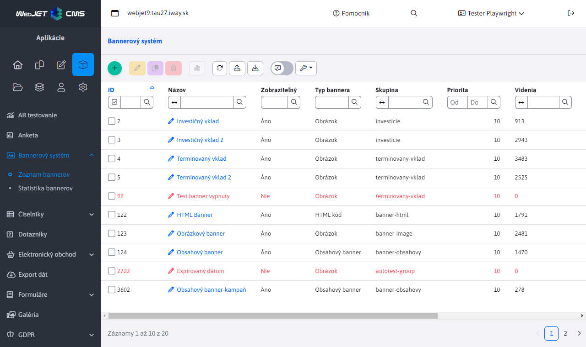
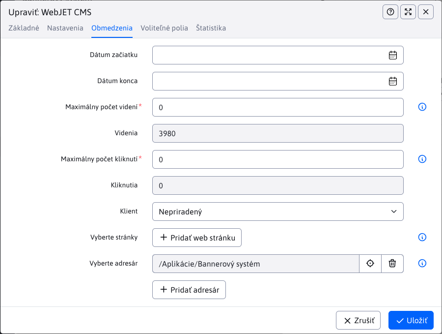
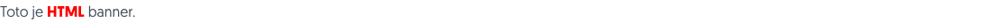
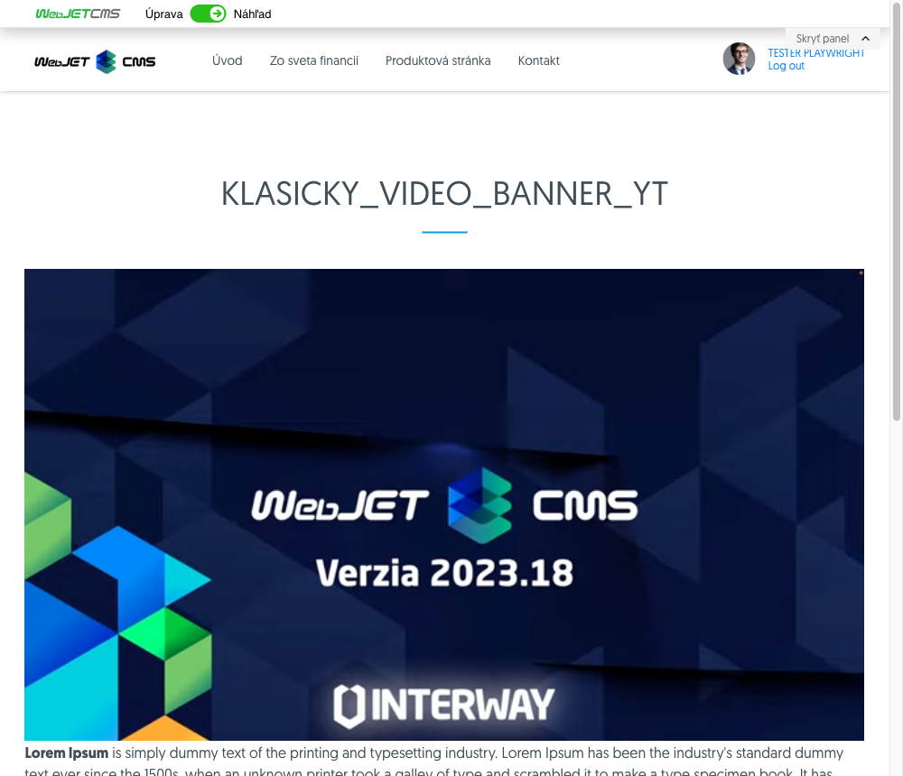
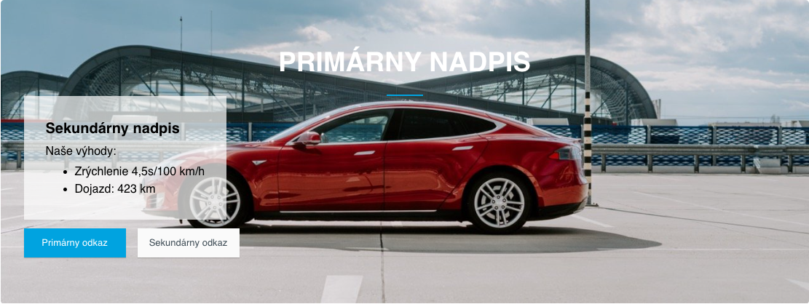
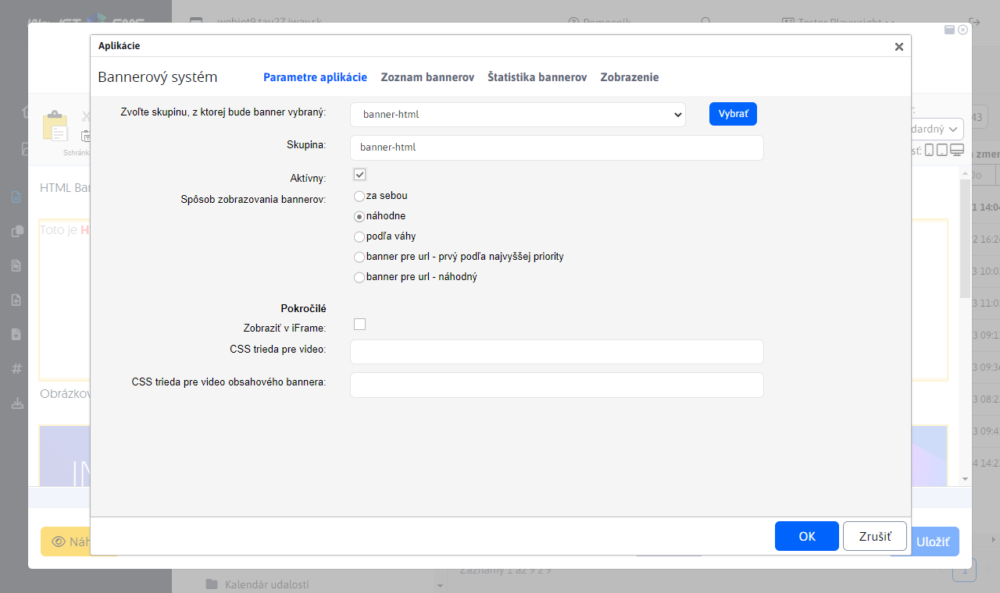
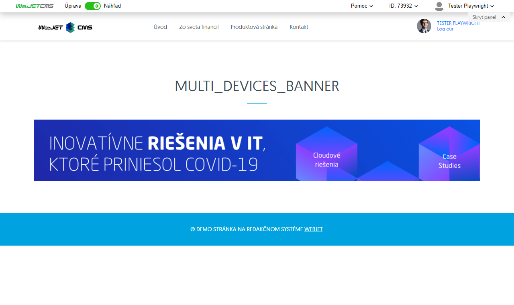

# Bannerový systém

## Zoznam bannerov

Aplikácia Bannerový systém, umožňuje do stránky vložiť banner. Systém podporuje nasledovné typy bannerov:

- Obrázok - zobrazí statický obrázok, alebo animovaný ```gif```. Eviduje kliknutie na banner.
- Html kód - vloží do stránky zadaný HTML kód dynamického bannera. Neeviduje kliknutie na banner.
- Obsahový banner - vloží do stránky obrázok v pozadí nad ktorým sa nachádza text a tlačidlá pre vykonanie akcie (tzv. click to action tlačidlá).
- Video - vloží do stránky lokálny video súbor, alebo video z YouTube.



V tabuľke sú červenou farbou zobrazené bannery, ktoré sa nedajú zobraziť. Kontroluje sa nielen možnosť aktívny, ale aj obmedzenia na počet zobrazení/kliknutí a dátumové obmedzenia. Môžete použiť filtrovanie podľa stĺpca Zobraziteľný pre filtrovanie zobraziteľných bannerov.

## Všeobecné parametre bannera

Parametre v karte Základné a Obmedzenia sú spoločné pre rôzne typy bannerov.

- Názov - vaše pomenovanie bannera (nezobrazuje sa nikde na web stránke, používa sa len na vašu identifikáciu).
- Typ bannera - Obrázok, HTML kód alebo Obsahový banner
- Skupina - skupina pre banner, po zadaní začiatku názvu skupiny, alebo znaku ```*``` zobrazí existujúce skupiny na výber. Skupiny sa používajú ako určenie umiestnenia v dizajne web stránky (napr. ```top-banner```, alebo ```banner-left-menu```) a následne pri zobrazení stránky sa na danej pozícii zobrazí banner zo zadanej skupiny.
- Aktívny - môžete aktivovať / deaktivovať zobrazovanie bannera.
- Priorita - ak nastavíte banneru vyššiu prioritu, bude uprednostnený pred bannermi s nižšou prioritou (záleží aj na nastavení aplikácie pre zobrazenie bannera).


V karte obmedzenia môžete nastaviť:

- Dátum začiatku - začiatočný dátum a čas, kedy sa má banner začať zobrazovať (zobrazovať sa začne až po zadanom dátume). Ak je pole prázdne, obmedzenie sa neaplikuje.
- Dátum konca - koncový  dátum a čas, kedy sa má banner prestane zobrazovať (zobrazovať sa prestane po zadanom dátume). Ak je pole prázdne, obmedzenie sa neaplikuje.
- Maximálny počet videní - maximálny počet zobrazení bannera. Nastavenie na hodnotu 0 vypne toto obmedzenie.
- Videní (iba na čítanie) - zobrazuje aktuálny počet zobrazení bannera.
- Maximálny počet kliknutí - maximálny počet kliknutí na banner (iba pre bannery, ktoré kliknutie evidujú, typicky Obrázkový banner). Nastavenie na hodnotu 0 vypne toto obmedzenie.
- Kliknutí (iba na čítanie) - zobrazuje aktuálny počet kliknutí na banner.
- Klient - ak používateľ nemá právo "Zobrazovať všetky bannery" v zozname bannerov sa zobrazia len tie, kde je nastavený ako klient. Môže to byť napr. agentúra, ktorá vám v systéme upravuje bannery.
- Vyberte stránky - kliknutím na Pridať web stránku môžete vybrať jednu alebo viac stránok, na ktorých sa banner môže zobrazovať. Ak nie je vybraná žiadna stránka, banner sa môže zobraziť na všetkých stránkach (pokiaľ nie je obmedzenie vytvorené pomocou výberu adresára).
- Vyberte adresár - kliknutím na Pridať adresár môžete vybrať jeden alebo viacero adresárov, v ktorých sa banner bude zobrazovať. Ak je pre banner nastavený adresár bude sa banner zobrazovať vo všetkých stránkach v tomto adresári, ako aj vo všetkých stránkach v pod-adresároch. Ak nie je vybraný žiadny adresár, banner sa zobrazí vo všetkých stránkach (pokiaľ nie je obmedzenie vytvorené pomocou výberu stránky).



V karte Voliteľné polia môžete nastavovať hodnoty polí podľa potrieb vašej implementácie, karta Štatistika zobrazuje graf štatistiky zobrazení a kliknutí na banner.

## Banner typu obrázok

Banner typu obrázok obsahuje v karte Nastavenia nasledovné možnosti:

- Adresa umiestnenia bannera - adresa obrázku bannera (napr. ```/images/banner.gif```).
- Linka presmerovania - adresa na ktorú sa presmeruje po kliknutí na banner (napr. ```/sk/produkty/```).
- Cieľ – môžete zvoliť v akom ráme sa linka presmerovania otvorí (vlastný rám, nové okno, najvyšší rám, nadradený rám).


## Banner typu HTML kód

Banner typu HTML kód obsahuje v karte Nastavenia nasledovné možnosti:

- Linka presmerovania - adresa na ktorú sa presmeruje po kliknutí na banner (napr. ```/sk/produkty/```). V HTML kóde musíte príslušný odkaz smerovať na adresu ```/components/_common/clk.jsp?bid=ID``` kde ID je ID bannera (musíte ho najskôr uložiť pre získanie ID).
- HTML kód - zadajte HTML kód dynamického bannera.



## Banner typu video

Banner typu video obsahuje v karte Nastavenia nasledovnú možnosť:

- Adresa umiestnenia bannera, môžete zadať
  - Adresa MP4 videa (napr. ```/images/video/bloky.mp4```), ktoré môže byť vybraté spomedzi nahratých súborov
  - Adresa ľubovoľného YouTube videa (napr. ```https://www.youtube.com/watch?v=A5upeBuEMbg```)
- Linka presmerovania - adresa na ktorú sa presmeruje po kliknutí na banner (napr. ```/sk/produkty/```), korektne funguje len pre video `mp4`, pre YouTube sa na odkaz z technických dôvodov nedá kliknúť.
- Cieľ – môžete zvoliť v akom ráme sa linka presmerovania otvorí (vlastný rám, nové okno, najvyšší rám, nadradený rám).




## Banner typu Obsahový banner

Banner typu obrázok obsahuje v karte Nastavenia nasledovné možnosti:

- Adresa web stránky na ktorej sa banner zobrazí - **Upozornenie:** obsahový banner sa nezobrazuje na základe skupiny, ale na základe zhody zobrazenej web stránky s adresou zadanou v tomto poli. Viete tak nastavovať zobrazenie bannerov podľa URL adries stránok.
- Linka presmerovania - adresa na ktorú sa presmeruje po kliknutí na tlačidlo v banneri (napr. ```/sk/produkty/```).
- Odkaz na obrázok - adresa obrázku bannera (napr. ```/images/banner.jpg```).
- Odkaz na obrázok pre mobilné zariadenia - adresa obrázku bannera pre mobilné zariadenia (napr. ```/images/banner-lores.jpg```). Tento obrázok sa použije pre rozlíšenie užšie ako 760 bodov.
- Primárny nadpis - hlavný (najväčší) nadpis v banneri.
- Sekundárny nadpis - pod nadpis v banneri (môže zostať prázdny).
- Popisný text - doplnkový text pod nadpismi (môže zostať prázdny).

Ak **Odkaz na obrázok** alebo **Odkaz na obrázok pre mobilné zariadenia** obsahuje umiestnenie **MP4 súboru alebo adresu YouTube videa** zobrazí sa v pozadí video prehrávač. Hodnota pre mobilné zariadenia sa použije v prípade detekcie telefónu na serveri podľa hodnoty `User-Agent` obsahujúci hodnotu `iphone` alebo `mobile` pre Android.

Podmienené zobrazenie podľa URL parametra (kampaňový banner):

- Hodnota URL parametra pre priame zobrazenie - pre reklamné kampane je možné nastaviť pole **Hodnota URL parametra pre priame zobrazenie**. Tu je možné zadať kód (napr. ```webjetcms```) a následne sa banner vždy zobrazí ak je zhoda parametra v URL. Ak teda máte k jednej stránke priradených viacero bannerov viete ich presne zobrazovať podľa zdroja reklamnej kampane (napr. podľa zdrojových stránok, alebo odkazu z emailu, alebo reklamnej kampane na Facebooku).
- Banner bude dostupný ako - zobrazuje vám náhľad adresy pre zobrazenie banneru. Meno parametra (predvolene ```utm_campaign```) je možné nastaviť v konf. premennej ```bannerCampaignParamName```.
- Zobrazovať iba pri zadanom URL parametri - ak je zvolené banner sa nebude štandardne zobrazovať (napr. ak je nastavené náhodné zobrazenie bannera), ale zobrazí sa len keď je v URL zadaný parameter. Použite keď máte napr. upravený banner, ktorý chcete zobraziť jedine ak príde návštevník z emailovej kampane (napr. s akciou na zvýhodnený nákup platný len pre emailovú kampaň).

Banner okrem nadpisov a obrázkov generuje aj dve tlačidlá, ktoré sa nastavujú v blokoch Primárny odkaz (použije sa pre primárne tlačidlo) a Sekundárny odkaz (pre sekundárne tlačidlo). Keď nezadáte názov tlačidlo sa nevygeneruje.

- Názov odkazu - názov, ktorý sa zobrazí na tlačidle (napr. Mám záujem).
- URL adresa odkazu - adresa, na ktorú je návštevník presmerovaný po kliknutí na tlačidlo. Ak chcete merať kliknutie zadajte adresu ```/components/_common/clk.jsp?bid=ID``` kde ID je ID bannera (musíte ho najskôr uložiť pre získanie ID). Hodnota presmerovania sa v takom prípade zoberie z poľa Linka presmerovania.
- Spôsob otvorenia odkazu - nastavenie, či sa odkaz otvorí v aktuálnom okne, alebo do nového okna.



Ak pre zobrazenú stránku nie je nájdený obsahový banner a stránka má nastavený Perex obrázok, použije sa tento obrázok ako kampaňový banner. V konf. premennej ```bannerDefaultImageUrl``` je možné definovať URL adresu obrázka, ktorý sa má zobraziť ak sa nenájde banner ani v perex obrázku. Zabezpečí sa tak zobrazenie predvoleného obrázku/banneru namiesto prázdneho miesta. Ako názov (hlavný nadpis) sa použije názov aktuálnej stránky.

## Vloženie aplikácie do stránky

Ak chcete do stránky vložiť aplikáciu pre banner, zvoľte si v editore stránok v menu aplikácie Bannerový systém. Aplikácia má nasledovné parametre:

- Zvoľte skupinu, z ktorej bude banner vybraný - z ponuky si vyberte skupinu a stlačte tlačidlo Vybrať.
- Skupina - zobrazuje aktuálne vybranú skupinu bannerov.
- Aktívny - môžete aplikáciu dočasne aktivovať / deaktivovať bez potreby jej zmazania z web stránky
- Spôsob zobrazovania bannerov:
    - za sebou - bannery sa cyklicky menia, sú usporiadané podľa banner ID
      - Index bannera v session - každá vložená banner aplikácia musí mať jedinečný index pre rozlíšenie poradia bannerov.
    - náhodne - náhodný výber bannera zo skupiny
    - podľa váhy - častejšie sa budú zobrazovať bannery s vyššou prioritou
- Zobraziť v iFrame - banner sa umiestni do iFrame. Nastavte rozmery iFrame (vhodné pre bannery typu HTML kód aby nedošlo k narušeniu/konfliktu kódu zobrazenej stránky).
  - Interval obnovenia banneru - po uplynutí intervalu sa na stránke zobrazí ďalší banner zo skupiny. Ak nezadáte nič alebo 0, ďalší banner sa zobrazí až po manuálnej aktualizácii stránky.
  - šírka - šírka iframe v bodoch
  - výška - výška iframe v bodoch

Pre použitie video súborov v banneroch je možné nastaviť:

- CSS trieda pre video - hodnota CSS atribútu štýlov pre zobrazenie video súboru, ak je prázdne predpokladá sa použitie video súboru v pomere strán `16:9` nastavením hodnoty `embed-responsive embed-responsive-16by9 ratio ratio-16x9 banner-has-video`. V prípade iného pomeru strán môžete zmeniť hodnotu `16by9` a `16x9` za inú podporovanú hodnotu (`21x9, 4x3, 1x1`).
- CSS trieda pre video obsahového bannera - hodnota CSS atribútu štýlov pre zobrazenie video súboru obsahového bannera, predvolene `jumbotron-has-video`. Ak chcete zobraziť video na celú veľkosť obrazovky nastavte na hodnotu `jumbotron-has-video-fullscreen`, táto hodnota sa použije automaticky aj ak zvolená skupina bannerov obsahuje slovo `fullscreen`.



## Zobrazenie banneru pre špecificky typ zariadenia

Pri vkladaní banneru do stránky máte možnosť špecifikovať typ zariadenia (alebo viacerých), ktoré tento banner uvidí. Toto nastavenie zabezpečuje premenná **Zobrazenie na zariadeniach**  v karte **Pokročilé**. Na výber sú 3 typy zariadení.

- Ak zvolíte všetky typy zariadení alebo nezvolíte nič, banner sa zobrazí pre všetky zariadenia.
- Ak zvolíte iba jeden typ alebo kombináciu zariadení, banner sa zobrazí iba týmto typom zariadení.


Upozornenie: zariadenie sa deteguje na serveri podľa HTTP hlavičky `User-Agent`. Telefón sa deteguje pri nájdení výrazu `iphone` alebo `mobile` pri detekcii výrazu `android`. Tablet ako `ipad||tablet||kindle` alebo ak obsahuje `android` a neobsahuje `mobile`.

V editore web stránky v náhľade sa zobrazí banner nezávisle od nastaveného typu zariadenia, pre ktoré sú určené. Dôvodom je aby ste mali celkový prehľad o použitých banneroch. Príklad je na nasledujúcom obrázku, kde vidíme editor stránky s 2 bannermi. Prvý je nastavený výhradne pre **Desktop**  ten druhý pre kombináciu **Telefón a Tablet**. Obe sa však v editore zobrazujú.

V náhľade je pre takýto prípad zobrazená textová informácia **Zobrazenie na zariadeniach: XXX** podľa zvolených zariadení. Text sa nezobrazí, ak sú zvolené všetky typy zariadení.


Pre otestovanie pri zobrazení web stránky môžete využiť URL parameter ```?forceBrowserDetector=```, ktorým vieme WebJET presvedčiť, že pristupujeme so zariadením špecifického typu. Podporované typy tohto parametra sú ```phone```, ```tablet``` a ```pc```. Napríklad, ak na skôr spomenutú stránku prejdeme s nastaveným parametrom ```?forceBrowserDetector=pc``` simulujeme prístup z počítača. NA tejto stránke sa zobrazí iba prvý banner, ktorí bol nastavený na zariadenia typu Desktop.



Ak web stránku zobrazíte s URL parametrom ```?forceBrowserDetector=phone``` alebo ```?forceBrowserDetector=tablet```, zobrazí sa banner, ktorý bol špecificky zadefinovaný pre zariadenia typu Telefón alebo Tablet.

## Možné konfiguračné premenné

```bannerCacheTime``` - ak je nastavené na hodnotu > 0 (v minútach) tak sa výber bannerov z DB cachuje, čo znamená, že sa nekontroluje zoznam bannerov pri každom zobrazení stránky (môže ale dôjsť k prekročeniu limitov videní). Zobrazenie bannera je ale rýchlejšie a menej zaťažuje databázový server.
