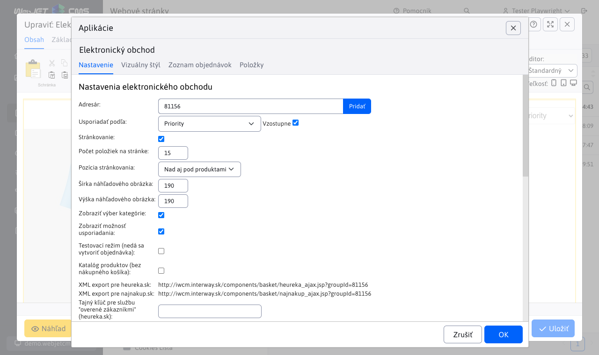
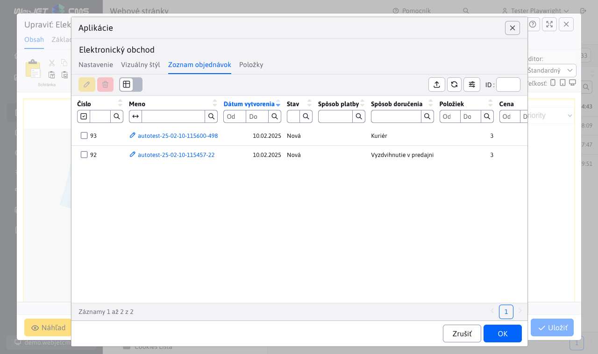
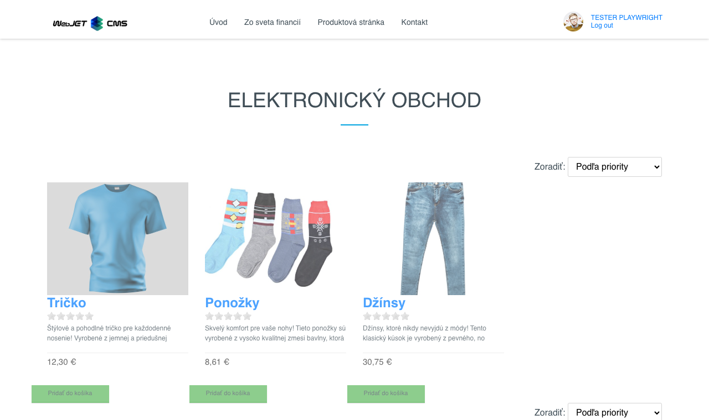

# Elektronický obchod

Cez aplikáciu E-shop môžete vytvoriť a spravovať jednoduchý elektronický obchod. V rámci aplikácie definujete jednotlivé produkty a ich atribúty (napr. veľkosť, farba), spôsoby doručenia, či platby. Aplikácia evidujete zoznam prijatých objednávok, umožňuje nastavovať ich stav s možnosťou notifikácie zmien v objednávke na zákazníkov email.

## Nastavenia aplikácie

### Karta Nastavenie:
- **Adresár**: Zadajte cestu k adresáru.
- **Usporiadať podľa**: Vyberte kritérium usporiadania, napríklad „Priority“.
  - **Vzostupne**: Definujte, či sa má usporiadať vzostupne.
- **Stránkovanie**: Určuje, či je stránkovanie zapnuté.
- **Počet položiek na stránke**: Zadajte počet položiek na stránke, napríklad `15`.
- **Pozícia stránkovania**: Vyberte, kde sa má stránkovanie zobraziť, napríklad „Nad aj pod produktami“.
- **Šírka náhľadového obrázka**: Zadajte šírku náhľadu obrázka v pixeloch, napríklad `190`.
- **Výška náhľadového obrázka**: Zadajte výšku náhľadu obrázka v pixeloch, napríklad `190`.
- **Zobraziť výber kategórie**: Definujte, či sa má zobraziť výber kategórie.
- **Zobraziť možnosť usporiadania**: Zapnutie možnosti usporiadania produktov.
- **Testovací režim (nedá sa vytvoriť objednávka)**: Aktivácia testovacieho režimu.
- **Katalóg produktov (bez nákupného košíka)**: Zobrazenie katalógu bez možnosti nákupu.
- **Tajný kľúč pre službu "overené zákazníkmi" (heureka.sk)**: Zadajte tajný kľúč pre službu.

#### Spôsob doručenia:
- **Zadajte spôsob doručenia**: Vyplňte dostupné spôsoby doručenia.
  - Pri stlačení **Pridať** možno vyplniť: **Cena bez DPH**, **Mena**, **Daň**, **Cena s DPH**, **Stará cena s DPH**

### Karta Vizuálny štýl:
- Možnosť vybrať z dvoch štýlov pre zobrazenie.

### Zoznam objednávok:
Pri zobrazení možno vyfiltrovať podľa:
- **Stav**
- **Vydaná / odoslaná**
- **Meno**
- **E-mail**
- **Číslo**

### Karta položky:
- **Názov web stránky**: Zadajte názov web stránky.
- **Popis produktu**: Zadajte popis produktu.
- **Zobraziť štítok**: Zapnúť zobrazenie štítku produktu.

#### Pridať variant:
- **Názov variantu**: Zadajte názov variantu produktu.
- **Hodnoty variantu**: Zadajte dostupné hodnoty variantu.

#### Informácie o produkte:
- **Cena bez DPH**
- **Mena**
- **Daň**
- **Cena s DPH**
- **Stará cena s DPH**
- **EAN**
- **Výrobca**

## Povolené krajiny

Pre dynamické nastavenie povolených krajín, kde sa dá tovar odoslať slúži konštanta `basketInvoiceSupportedCountries`. Konštanta obsahuje čiarkou oddelený zoznam `ccTLD` identifikátorov.

**Príklad**, pre povolenie krajín Slovensko, Česko a Poľsko musí byť konštanta nastavená ako `.sk,.cz,.pl`.

## Zobrazenie aplikácie

