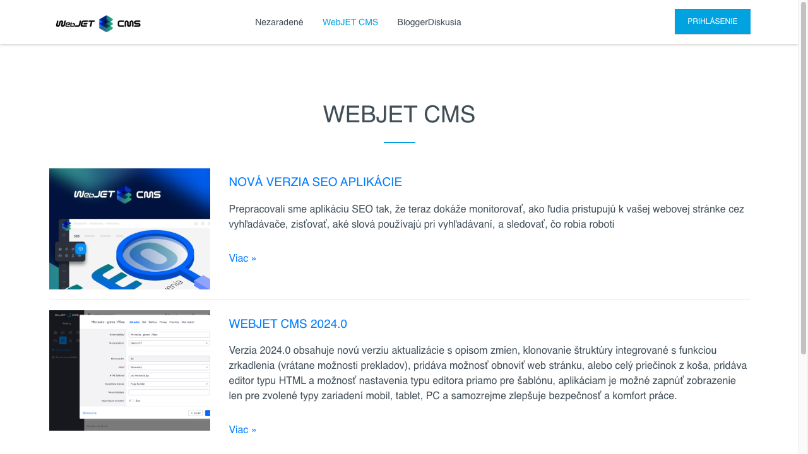
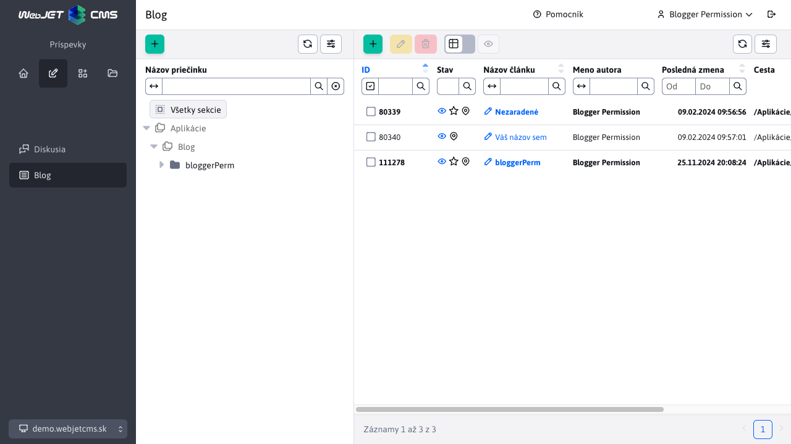
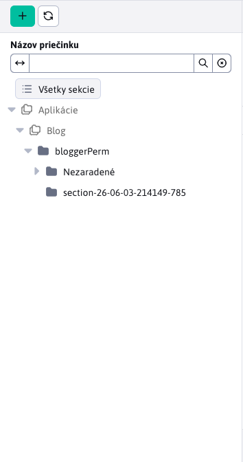
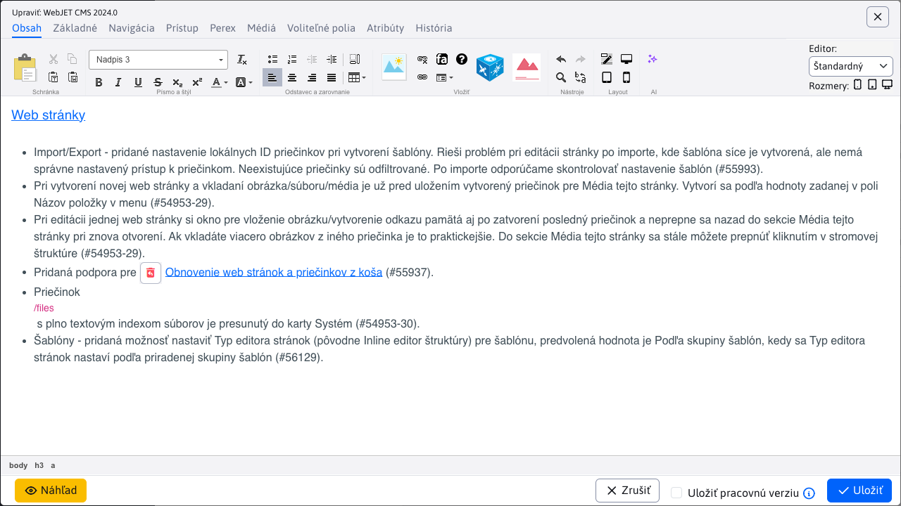
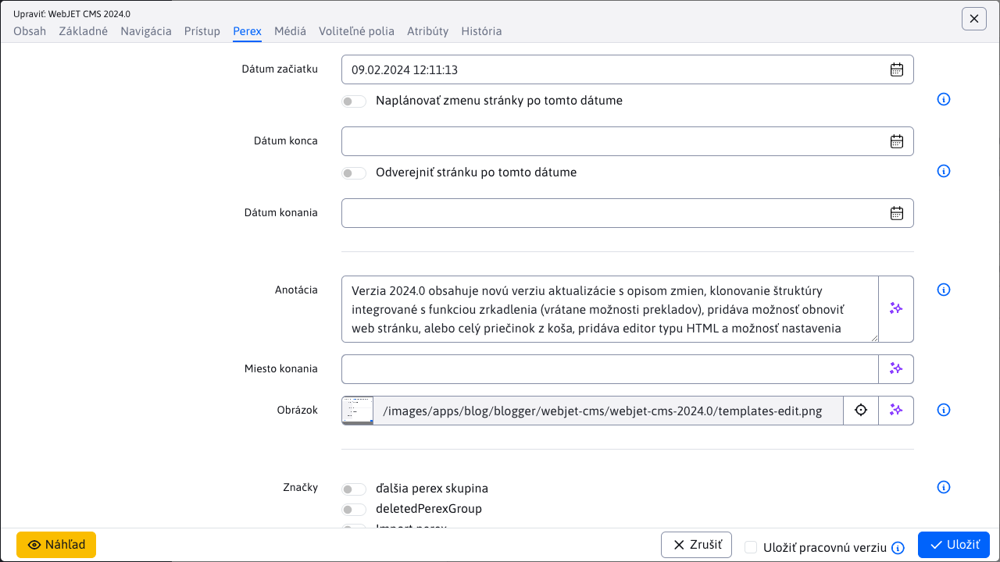
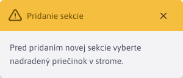
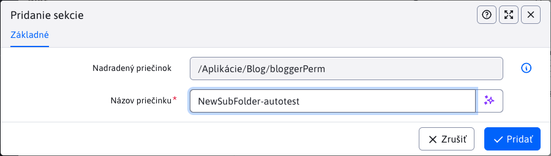
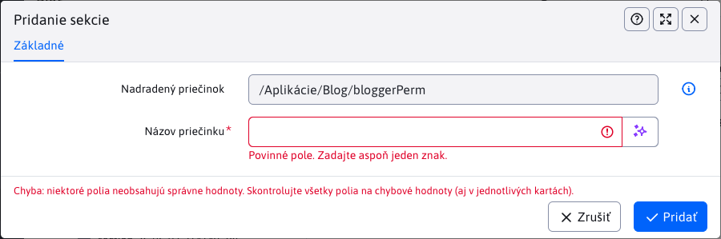
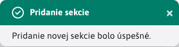
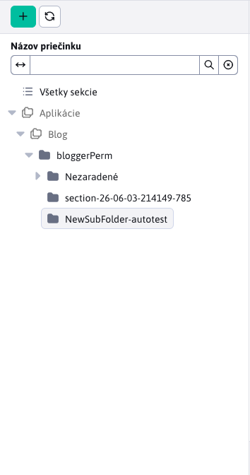

# Zoznam článkov

Aplikácia Zoznam článkov obsahuje zoznam všetkých článkov, práve prihláseného používateľa typu blogger. Umožňuje mu upravovať štruktúru svojho blogu pridávaním ďalších sekcií (pod-priečinkov) a vytvárať/upravovať/duplikovať/mazať články.

Výsledkom aplikácie je zobrazenie článkov na web stránke, pričom články sú umiestnené do kategórií/sekcií.

!>**Upozornenie:** táto aplikácia sa zobrazí práve prihlásenému používateľovi, iba ak spĺňa jednu z nasledujúcich podmienok:

- Práve prihlásený používateľ je takzvaný **bloger**. Inak povedané, používateľ musí mať právo Blog a taktiež musí patriť do skupiny používateľov Blog. Takýto používateľ môže vytvárať nové blog príspevky a nové sekcie vrámci jeho blogu.
- Práve prihlásený používateľ je takzvaný **administrátor blogerov**, ktorý je admin, musí mať právo Blog aj Správa blogerov a nemal by patriť do skupiny používateľov Blog. Takýto používateľ vytvára nových blogerov (používateľov), vie zmazať existujúceho blogera a prípadne vykonať úpravu v texte ľubovoľného blogera.

Poznáme teda dva typy používateľov:

- **bloger** môže pracovať iba s priečinkami, na ktoré má právo a článkami, ktoré patria pod jeho priečinky. Bližšie informácie k používateľov typu **bloger** nájdete v sekcii [Správa blogerov](bloggers.md).
- **administrátor blogerov** môže pracovať s priečinkami všetkých blogerov, ako aj s článkami patriacimi pod tieto priečinky.

## Filtrovanie podľa priečinka

V ľavom paneli sa zobrazuje strom priečinkov, v pravom paneli zoznam článkov. Predvolená položka **Všetky sekcie** zobrazí články zo všetkých dostupných sekcií blogu. Výber konkrétneho priečinka zobrazí iba jeho články.

Priečinky môžete rozbaľovať, vyhľadávať podľa názvu a obnoviť tlačidlom nad stromom. Spoločné nadradené priečinky, napríklad **Aplikácie** a **Blog**, zachovávajú hierarchiu. Ak slúžia iba na navigáciu, majú odlišnú ikonu a nemožno ich vybrať ako sekciu. Celá cesta sa zobrazí po prejdení myšou nad názov priečinka.

Tlačidlom **Nastavenia** nad stromom môžete zmeniť pomer šírky stromu a tabuľky. Nastavenie sa uloží pre prihláseného používateľa samostatne pre túto aplikáciu.

Bloger vidí svoje priečinky, administrátor blogerov priečinky blogerov v aktuálnej doméne. Strom rešpektuje aj oprávnenie zobrazovať skryté priečinky. Výber sekcie zostáva zachovaný pri vyhľadávaní, obnovení stromu a opätovnom otvorení adresy s ID priečinka za znakom `#`. Na úzkej obrazovke sa zoznam článkov zobrazí pod stromom.

Ak nie sú dostupné žiadne priečinky, zobrazí sa informačná správa a pridávanie článkov aj sekcií je vypnuté.

## Pridanie článku

Nový článok vytvoríte pomocou tlačidla <button class="btn btn-sm btn-success" type="button"><i class="ti ti-plus"></i></button>. Práca s článkami je podobná ako práca s [bežnými web stránkami](../../webpages/README.md).

Pri novom článku je zaradenie v stromovej štruktúre prednastavené podľa priečinka zvoleného v strome (napr. /Aplikácie/Blog/bloggerPerm).

!>**Upozornenie:** ak sa pokúsite vytvoriť nový článok pri zvolenej položke **Všetky sekcie** nastaví sa sekcia Nezaradené, alebo prvý priečinok na ktorý ma bloger práva. Sekciu môžete zmeniť v editore v karte Základné nastavením hodnoty Nadradený priečinok.

V zozname článkov sa zobrazí nadpis článku. Ak chcete v zozname zobraziť aj krátky úvod zadajte ho v editore článku v karte Perex do poľa Anotácia. Odporúčame zadať aj ilustračný obrázok do poľa Obrázok v karte Perex.

Na web stránke sa článok zobrazí podľa definovanej dizajnovej šablóny, napr. takto:

## Pridanie sekcie

Novú sekciu vytvoríte pomocou tlačidla nad stromom <button class="btn btn-sm btn-success" type="button"><i class="ti ti-plus"></i></button>.

Ak sa pokúsite vytvoriť novú sekciu bez zvolenia cieľového priečinka v strome, budete vyzvaný k jeho zvoleniu.

Po zvolení priečinka a stlačení tlačidla <button class="btn btn-sm btn-success" type="button"><i class="ti ti-plus"></i></button> sa otvorí dialóg **Pridanie sekcie**. Zobrazuje zvolený nadradený priečinok a povinné pole **Názov priečinku**.

Prázdny názov, názov obsahujúci iba medzery alebo názov už existujúcej sekcie v tom istom priečinku sa nedá uložiť. Chyba sa zobrazí priamo pri poli a dialóg zostane otvorený, aby ste mohli názov opraviť.

Ak sa sekcia úspešne vytvorí, budete informovaný notifikáciou.

Po úspešnom vytvorení sekcie sa strom automaticky obnoví. Novú sekciu nájdete pod zvoleným nadradeným priečinkom.

