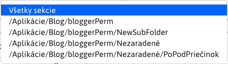
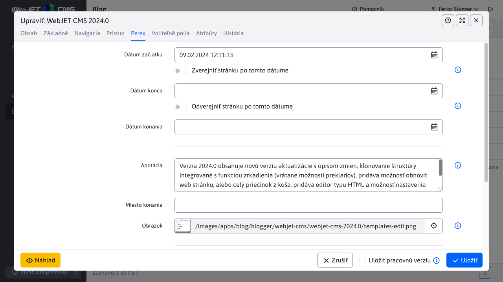
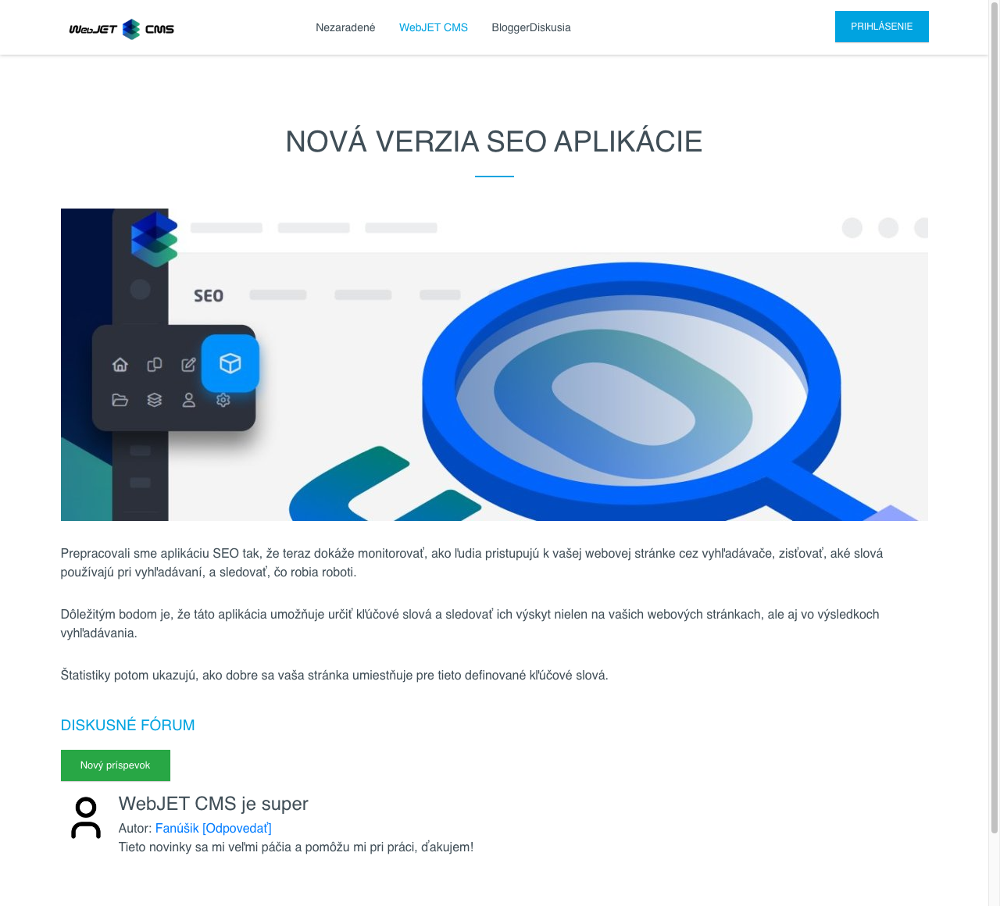
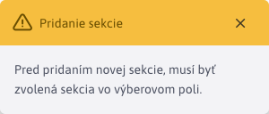
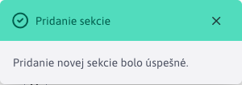
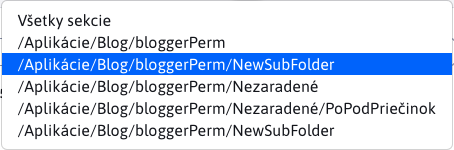

# Zoznam článkov

Aplikácia Zoznam článkov obsahuje zoznam všetkých článkov, práve prihláseného používateľa typu blogger. Umožňuje mu upravovať štruktúru svojho blogu pridávaním ďalších sekcií (pod-priečinkov) a vytvárať/upravovať/duplikovať/mazať články.

Výsledkom aplikácie je zobrazenie článkov na web stránke, pričom články sú umiestnené do kategórií/sekcií.

!>**Upozornenie:** táto aplikácia sa zobrazí práve prihlásenému používateľovi, iba ak spĺňa jednu z nasledujúcich podmienok:

- Práve prihlásený používateľ je takzvaný **bloger**. Inak povedané, používateľ musí mať právo Blog a taktiež musí patriť do skupiny používateľov Blog. Takýto používateľ môže vytvárať nové blog príspevky a nové sekcie vrámci jeho blogu.
- Práve prihlásený používateľ je takzvaný **administrátor blogerov**, ktorý je admin, musí mať právo Blog aj Správa blogerov a nemal by patriť do skupiny používateľov Blog. Takýto používateľ vytvára nových blogerov (používateľov), vie zmazať existujúceho blogera a prípadne vykonať úpravu v texte ľubovoľného blogera.

Poznáme teda dva typy používateľov:

- **bloger** môže pracovať iba s priečinkami, na ktoré má právo a článkami, ktoré patria pod jeho priečinky. Bližšie informácie k používateľov typu **bloger** nájdete v sekcii [Správa blogerov](bloggers.md).
- **administrátor blogerov** môže pracovať s priečinkami všetkých blogerov, ako aj s článkami patriacimi pod tieto priečinky.

## Filtrovanie podľa priečinka

Stránka obsahuje v ľavom hornom rohu externý filter na sekcie (pod-priečinky), ktorý umožňuje filtrovanie zobrazených článkov iba pre zvolenú sekciu blogu (priečinok). Prednastavená hodnota **Všetky sekcie**, zobrazí všetky články zo všetkých sekcií (pod-priečinkov).

Samotný výber sekcií je zoradený ako stromová štruktúra, kde hlbšie vnorené sekcie sú nižšie. Používateľ vidí celú cestu k sekcii, a hlavný priečinok má rovnaký názov ako jeho **prihlasovacie meno (login)**, čo v príklade na obrázku je `bloggerPerm`.

## Pridanie článku

Nový článok vytvoríte pomocou tlačidla . Práca s článkami je podobná ako práca s [bežnými web stránkami](../../webpages/README.md).

Pri novom článku je zaradenie v stromovej štruktúre prednastavené podľa hodnoty v externom filtri sekcií (napr. /Aplikácie/Blog/bloggerPerm).

!>**Upozornenie:** ak sa pokúsite vytvoriť nový článok bez zvolenia sekcie v externom filtri (pri jeho hodnote **Všetky sekcie**) nastaví sa sekcia Nezaradené, alebo prvý priečinok na ktorý ma bloger práva. Sekciu môžete zmeniť v editore v karte Základné nastavením hodnoty Nadradený priečinok.

V zozname článkov sa zobrazí nadpis článku. Ak chcete v zozname zobraziť aj krátky úvod zadajte ho v editore článku v karte Perex do poľa Anotácia. Odporúčame zadať aj ilustračný obrázok do poľa Obrázok v karte Perex.

Na web stránke sa článok zobrazí podľa definovanej dizajnovej šablóny, napr. takto:

## Pridanie sekcie

Novú sekciu vytvoríte pomocou tlačidla .

Ak sa pokúsite vytvoriť novú sekciu bez zvolenia cieľového priečinka v externom filtri, budete vyzvaný k jeho zvoleniu.

Po zvolení priečinka a stlačení tlačidla  bude vyzvaný z zadaniu názvu novej sekcie (pod-priečinka).

Proces spustíte potvrdením akcie tlačidlom .

Ak nebude zadaný názov pre novú sekciu, alebo nastane nejaká chyba, proces vytvorenia sekcie sa preruší a budete informovaný skrz notifikáciu.

Ak sa sekcia úspešne vytvorí, budete informovaný notifikáciou.

Okamžite po úspešnom vytvorení sekcie sa jeho hodnota automatický doplní do externého filtra.

