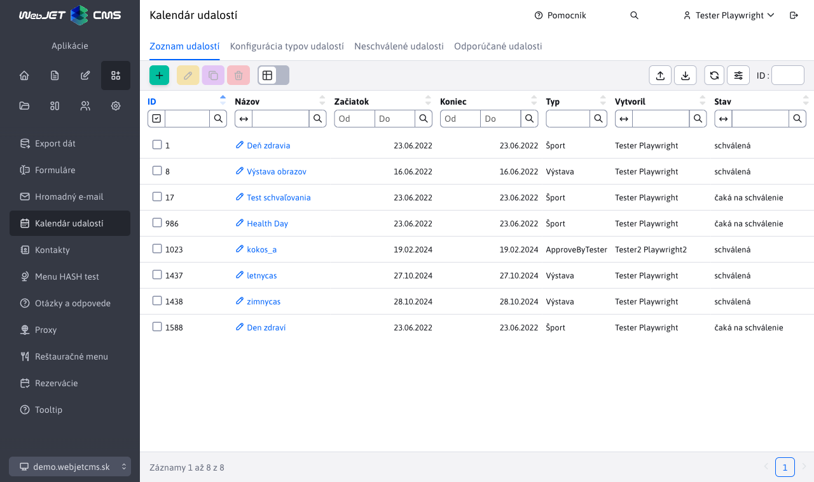
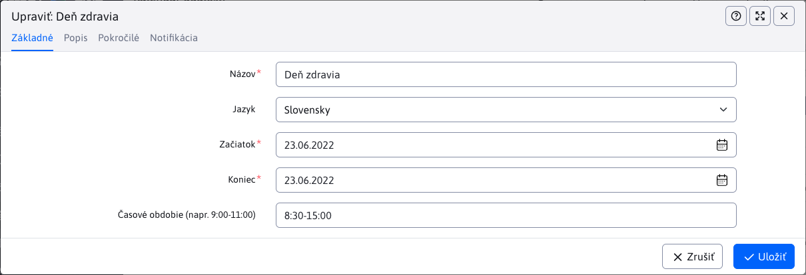

# Kalendár udalostí

## Zoznam udalostí

Kalendár udalostí umožňuje evidovať a zobrazovať rôzne akcie, o ktorých chcete informovať návštevníkov web sídla.

Zadané udalosti sa zobrazia v aplikácii kalendár na web stránke:

## Základné

V karte Základné sa vyplňujú základné informácie o udalosti. Povinný je iba názov. Začiatok a koniec udalosti sa automatický predvyplní podľa aktuálneho dňa.

## Popis

Karta obsahuje editor v ktorom môžete zadať opis udalosti, priložiť do textu obrázky a aplikácie.

## Pokročilé

V karte pokročilé môžete nastaviť podrobnejšie informácie o udalostí. Obsahuje taktiež [voliteľné polia](../../../frontend/webpages/customfields/README.md) "Info 1" až "Info 5".

Dôležitý je aj výber typu udalosti. Ak zvolený typ udalosti vyžaduje schválenie, odošle sa email so žiadosťou o schválenie pred zobrazením udalosti na web stránke.

## Notifikácia

Karta notifikácia umožňuje nastaviť odoslanie notifikácie na skupinu používateľov v prednastavený počet hodín pred začiatkom udalosti.

