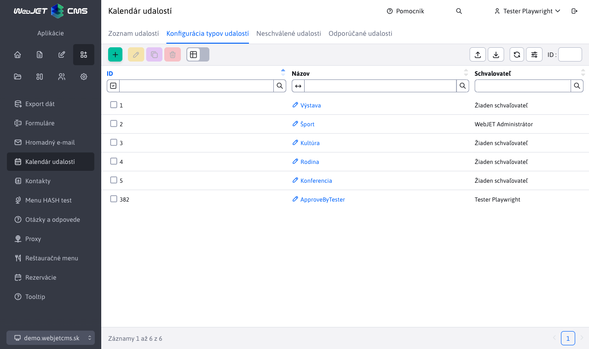
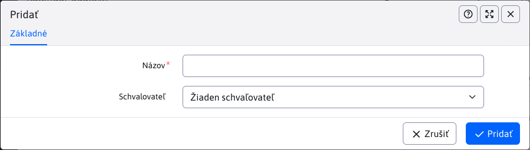

 # Konfigurácia typov udalostí

 V konfigurácii typov udalostí nastavujete typy udalostí, do ktorých je možné kategorizovať záznamy v kalendári udalosti.

 

 Upozornenie: v názve typu udalosti nepoužívajte znak `,` alebo `+`.

# Schvaľovanie

 Okrem názvu typu udalosti je možné [nastaviť aj schvaľovateľa](../non-approved-events/README.md). Ak je zadaný, po vytvorení novej udalosti v danom type sa udalosť nezačne zobrazovať ihneď na web stránke, ale čaká na jej schválenie zvoleným schvalovateľom.

 