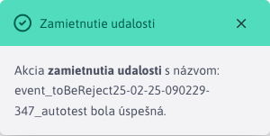

# Neschválené udalosti

Sekcia Kalendárne udalosti -> Neschválené udalosti slúži na proces schválenia/zamietnutia kalendárových [udalostí](../README.md), ktoré čakajú na schválenie. Práve prihlásený používateľ vidí/môže schváliť iba také udalosti, ktoré čakajú na schválenie a súčasne je ich schvaľovateľ práve on. To, kto je schvaľuje udalosť je dané [typom udalosti](../calendar-types/README.md).

**Upozornenie:** po schválenie/zamietnutí udalosti sa táto udalosť už naďalej **nebude zobrazovať** v sekcií Neschválené udalosti, takže nebude mať možnosť zmeniť svoju voľbu. Udalosť však bude naďalej viditeľná v časti [Zoznam udalostí](../README.md).

## Schválenie udalosti

Schválenie udalosti sa spúšťa tlačidlom . Po úspešnom schválení sa zobrazí informatívne hlásenie.

## Neschválenie (zamietnutie) udalosti

Zamietnutie udalosti sa spúšťa tlačidlom . Po úspešnom zamietnutí sa zobrazí informatívne hlásenie.

