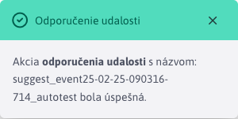
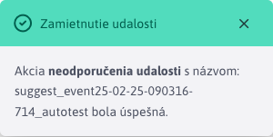

# Odporučenie udalosti

Sekcia Kalendárne udalosti -> Odporúčané udalosti slúži na proces odporučenia/neodporučenia kalendárových [udalostí](../README.md).

Zobrazujú sa udalosti, ktoré sú schválené (automaticky alebo administrátorom) a ktorých začiatok je v budúcnosti.

**Upozornenie:** po odporučení/neodporučení sa udalosť naďalej **bude zobrazovať** v tabuľke, takže je možné ich stav odporučenia zmeniť. Avšak, až sa začiatok udalosti dostane do minulosti, **prestanú sa zobrazovať**. Udalosti však budú naďalej viditeľné v časti [Zoznam udalosti](../README.md)

## Odporučenie udalosti

Odporučenie udalosti sa spúšťa tlačidlom . Po úspešnom odporučení sa zobrazí informatívna hláška.

## Neodporučenie udalosti

Neodporučenie udalosti sa spúšťa tlačidlom . Po úspešnom neodporučení sa zobrazí informatívna hláška.

