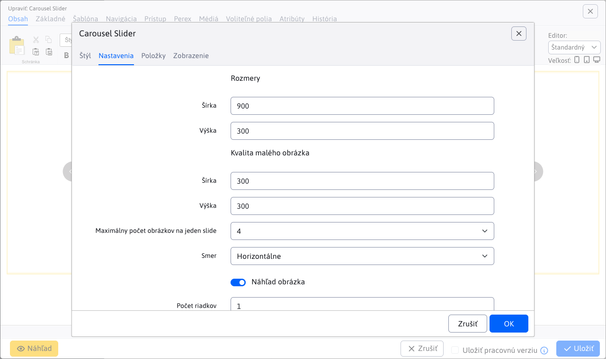
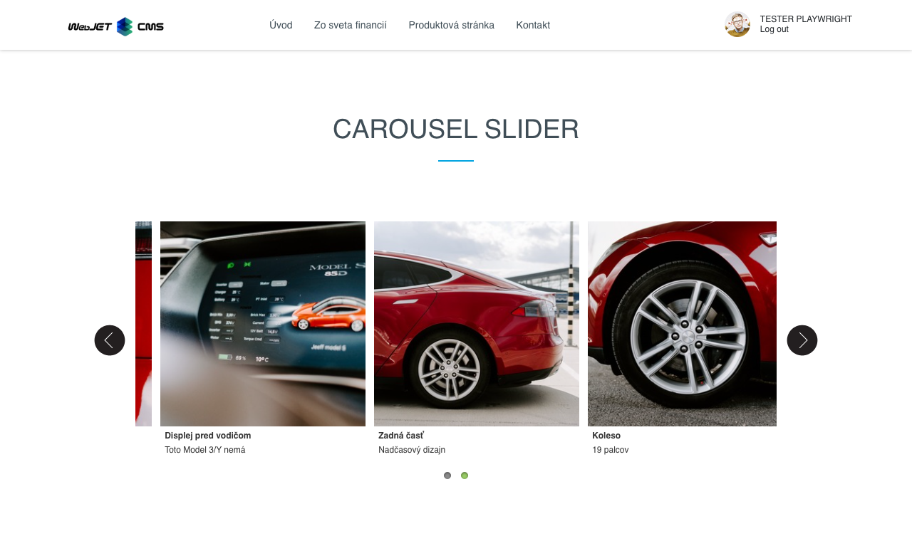

# Carousel Slider

Oživte svoju stránku s interaktívnym obrázkovým kolotočom. Kliknutím na malú verziu fotky sa zobrazí zväčšený originál, čo pridáva zaujímavosť a interaktivitu. Vyberte si zo širokej ponuky dizajnových štýlov, ktoré môžu obsahovať aj nadpisy a doplnkový text. Zaujmite a zapojte svojich návštevníkov pomocou pútavých obrázkových prezentácií.

## Nastavenia aplikácie

### Štýl

V tejto časti je možné si vybrať štýl aplikácie.
Dostupné štýly sú: `Classic, Fashion, Gallery, Rotator, Simplicity, Stylish`

### Nastavenia

V tejto časti je možné nastaviť:
- Rozmery
- Kvalita malého obrázka
- Maximálny počet obrázkov na jeden slide
- Smer (horizontálne, vertikálne)
- Náhľad obrázka
- Počet riadkov
- Štýl navigácie (žiadne, guličky)
- Zobraz šípky (žiadne, vždy, pri prejdení myšou)
- Posúvanie dotykom
- Náhodné poradie
- Automatické spustenie
- Pozastaviť pri prejdení myšou
- Kruhové zobrazenie
- Zobraz tieň
- Slučka (neustále, zastaviť po cykle)
- Interval

### Položky

V tejto časti možno pridať alebo odobrať položku z aplikácie.
Pri pridaní položky možno špecifikovať nadpis, podnadpis, presmerovanie a vybrať obrázok.
Položka sa odstraňuje kliknutím na červený krížik.

## Zobrazenie aplikácie

