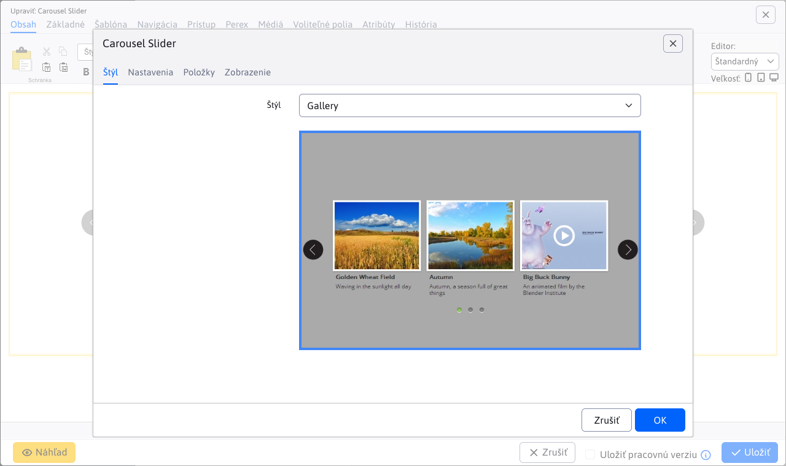
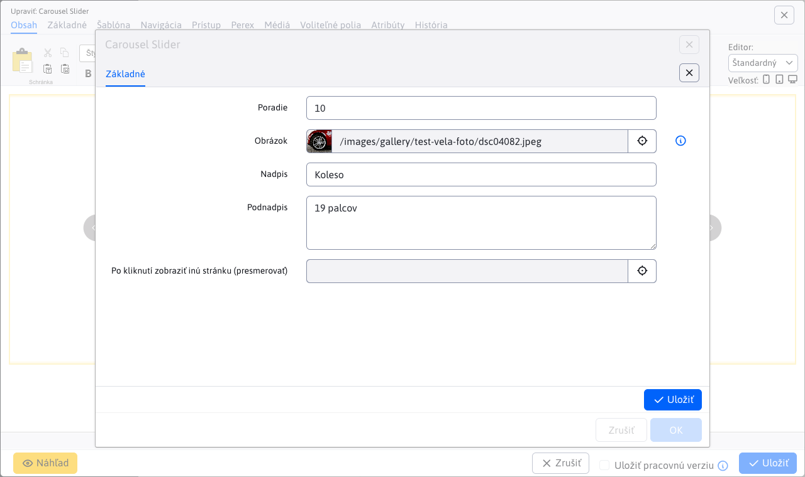

# Carousel Slider

Oživte svoju stránku s interaktívnym obrázkovým kolotočom. Kliknutím na malú verziu fotky sa zobrazí zväčšený originál, čo pridáva zaujímavosť a interaktivitu. Vyberte si zo širokej ponuky dizajnových štýlov, ktoré môžu obsahovať aj nadpisy a doplnkový text. Zaujmite a zapojte svojich návštevníkov pomocou pútavých obrázkových prezentácií.

## Nastavenia aplikácie

Dostupné karty:

- **Generované CSS štýly**
- **Rozšírené**
- **Položky**

### Generované CSS štýly

V tejto časti je možné si vybrať štýl aplikácie Carousel Slider.

### Rozšírené

V tejto časti je možné nastaviť rozšírené nastavenia:

- **Rozmery**
  - Šírka
  - Výška
- **Kvalita malého obrázka**
  - Šírka
  - Výška
- Maximálny počet obrázkov na jeden slide
- Smer (horizontálne, vertikálne)
- Náhľad obrázka
- Počet riadkov
- Štýl navigácie (žiadne, guličky)
- Zobraz šípky (žiadne, vždy, pri prejdení myšou)
- Posúvanie dotykom
- Náhodné poradie
- Automatické spustenie
- Pozastaviť pri prejdení myšou
- Kruhové zobrazenie
- Zobraz tieň
- Slučka (neustále, zastaviť po cykle)
- Interval

### Položky

V tejto časti je možné vidieť a spravovať položky aplikácie, takže klasické akcie ako pridanie/úprava/mazanie…

Pre jednotlivé položky môžete nastaviť tieto parametre:

- **Obrázok**, podporovaný je výber obrázka pomocou prieskumníka, ako aj priame zadanie cesty obrázka
- **Nadpis**, nadpis obrázka
- **Podnadpis**, podnadpis obrázka
- **Po kliknutí zobraziť inú stránku (presmerovať)**, výber stránky na ktorú budete presmerovaný (podporované je aj priame zadanie cesty)

## Zobrazenie aplikácie

