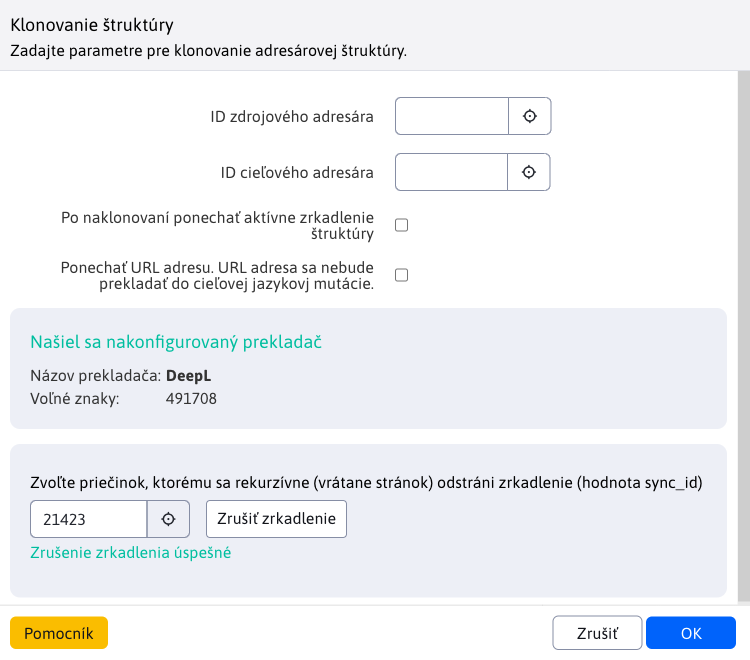

# Klonovanie štruktúry

Pomocou Klonovania štruktúry môžeme naklonovať celý obsah adresára v stránkach do iného adresára bez potreby znovu vytvárania celej adresárovej štruktúry. Táto možnosť je dostupná v sekcií **Web stránky** ako **Klonovanie štruktúry**. Po výbere tejto možnosti sa zobrazí okno k akcií klonovania. Typicky sa používa na vytvorenie novej jazykovej mutácie web sídla z existujúcej verzie. Jazyk sa preberie z nastavenia zdrojového a cieľového priečinka.


Pre vykonanie akcie klonovania je potrebné zadať ID zdrojového priečinka (ktorý priečinok klonujeme) a ID cieľového priečinka (kam na naklonuje zdrojový priečinok). ID priečinkov môžete zadať priamo, ak si ich pamätáte, alebo môže využiť možnosť **Vybrať**, ktorá otvorí nové okno so stromovou štruktúrou priečinkov, kde si konkrétny priečinok volíte kliknutím na jeho názov.

Samotné klonovanie využíva [Zrkadlenie štruktúry](../docmirroring/README.md) a [Automatický preklad](../../../admin/setup/translation.md). To znamená, že pri spustení klonovania sa vybrané priečinky (ak už nie sú) automatický prepoja konfiguračnou premennou ```structureMirroringConfig```. Zo zdrojového priečinka sa naklonujú všetky pod-priečinky (aj ich všetky vnorenia) aj s web stránkami do cieľového priečinka s tým, že originálne a klonované priečinky/stránky sa medzi sebou prepoja. Jazyk sa preberie z nastavenia zdrojového a cieľového priečinka. Taktiež sa tieto priečinky/stránky aj automatický preložia, ak je nastavený prekladač.

## Možnosti

### ID zdrojového adresára

Nastavte ID priečinka z ktorého sa bude klonovať.

### ID cieľového adresára

Nastavte ID priečinka do ktorého sa bude klonovať. V tomto priečinku sa vytvoria stránky a pod-priečinky podľa zdrojového priečinka.

### Ponechať aktívne zrkadlenie

Ak zvolíte možnosť **Po naklonovaní ponechať aktívne zrkadlenie štruktúry** zachová sa nastavené [zrkadlenie](../docmirroring/README.md) medzi zdrojovým a cieľovým priečinkom. Následne keď vznikne nový priečinok, alebo web stránka bude sa prenášať medzi zrkadlenými priečinkami.

Nastavenie môžete rozpojiť aj neskôr úpravou konf. premennej `structureMirroringConfig` z ktorej vymažete riadok s nastavenými ID priečinkov.

### Ponechať URL adresu

Zvolením možnosti **Ponechať URL adresu** za bezpečí, že sa URL adresa stránok a priečinkov nebude prekladať do jazykovej mutácie cieľového priečinka. To znamená, že nová jazyková mutácia bude mať **rovnaké URL adresy ale iný prefix, ktorým tieto adresy začínajú**.

Príklad:
Majme priečinky SK (s nastaveným slovenským jazykom) a EN (s nastaveným slovenským jazykom).
Priečinok SK obsahuje pod-priečinok **majetok**, ktorý má hlavnú stránku s rovnakým názvom. Adresa takejto stránky je **/sk/majetok/**.
Ak použijeme klonovanie štruktúry **bez ponechania URL**, z priečinka SK do priečinka EN, kópia tejto stránky bude mať URL **/en/property/**.
Ak použijeme klonovanie štruktúry **s ponechaním URL**, z priečinka SK do priečinka EN, kópia tejto stránky bude mať URL **/en/majetok/**. Ako vidíme, url nebola preložená, zmenil sa iba prefix zo /sk na /en, čo reprezentuje nadradený priečinok.


## Prekladač

Nakoľko klonovanie využíva [Automatický preklad](../../../admin/setup/translation.md), zobrazuje sa informácia, aký prekladač je nakonfigurovaný a koľko voľných znakov na preklad ešte ostáva. Ak žiaden prekladač nakonfigurovaný nie je (napr ak nie je zadaný licenčný kľúč pre prekladač `DeepL`) alebo už neostávajú žiadne voľné znaky na preklad, budeme pri klonovaní upozornený. V takom prípade sa **nebude** automaticky prekladať klonovaná štruktúra.


## Zrušenie synchronizácie

Okno ponúka možnosť zrušiť synchronizáciu zvoleného priečinka. Stačí a v dolnej časti okna zvolíte priečinok a stlačíte tlačidlo <button class="btn btn-sm btn-outline-secondary" type="button">Zrušiť synchronizáciu</button>. Následne sa pre zvolený priečinok, všetky podpriečinky ako ich stránky vymaže hodnota `sync_id`, ktorá zabezpečovala synchronizáciu.



!>**Upozornenie:** počas akcie rušenia synchronizácie sa nebude dať spustiť klonovanie, nakoľko tieto akcie by spolu kolidovali.