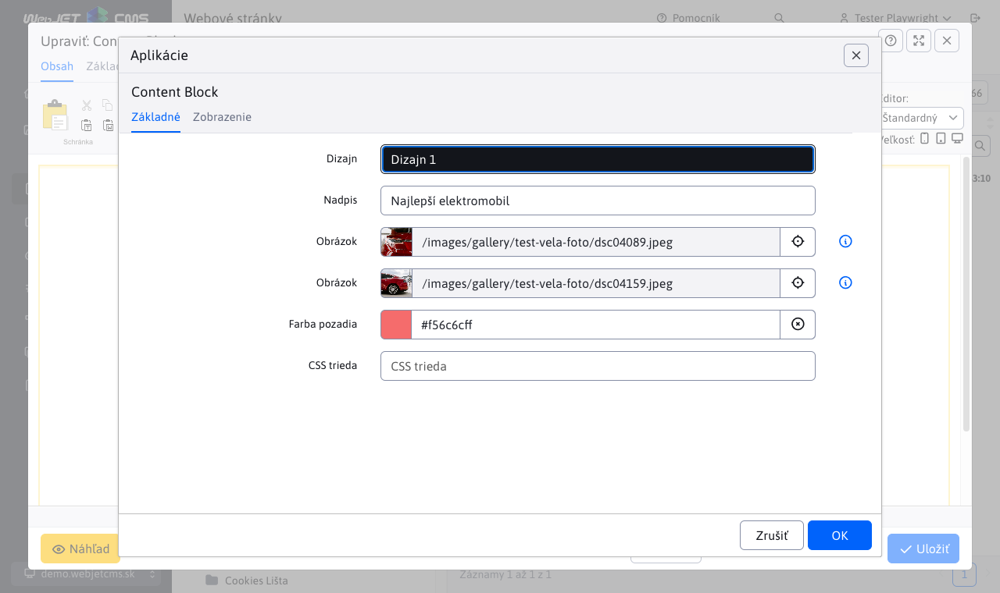
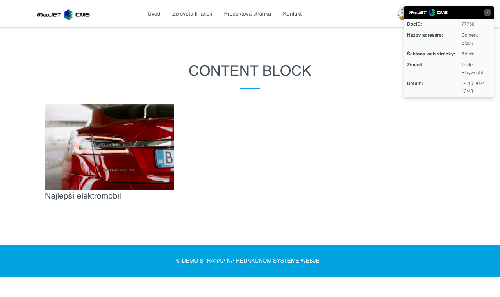

# Content Block

Slúži na vloženie pripraveného HTML kódu. Zadáte základné údaje ako nadpis, obrázok, farba a do stránky sa vygeneruje definovaný blok HTML kódu podľa zvoleného typu. Kód bloku vám pripraví dizajnér web sídla podľa požiadaviek.

## Nastavenia aplikácie

V tejto časti je možné nastaviť:
- Dizajn
- Nadpis
- Obrázok 1
- Obrázok 2
- Farba pozadia
- CSS trieda

## Zobrazenie aplikácie

## Nastavenie

Celkový počet dostupných blokov je možné nastaviť v konfiguračnej premennej `contentBlockTypeCount`, predvolene nastavené na `5`.
