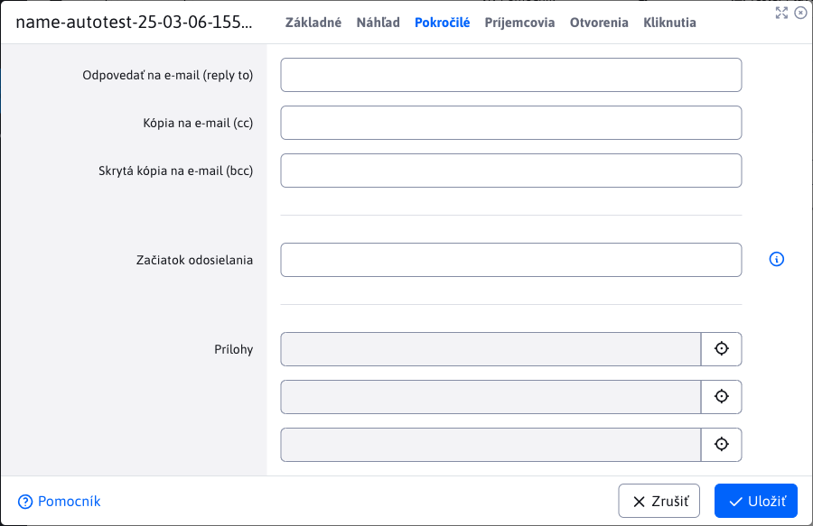
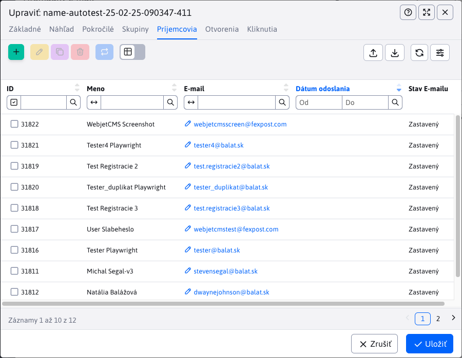
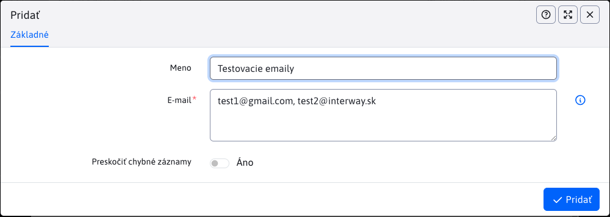
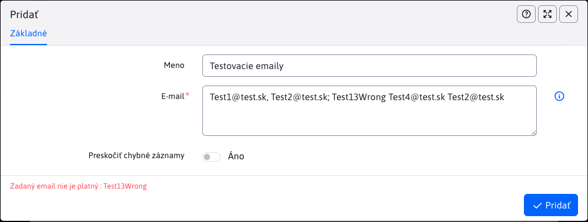
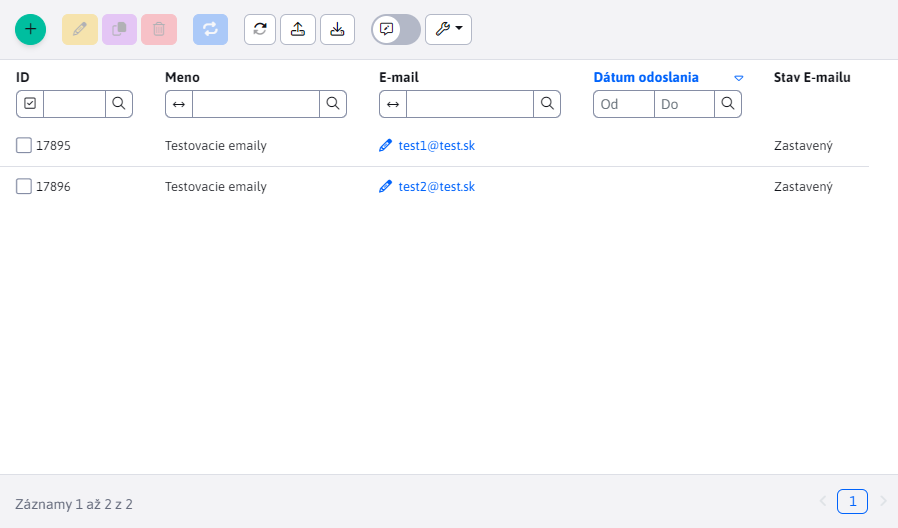
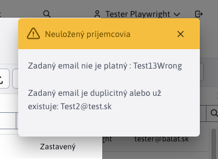
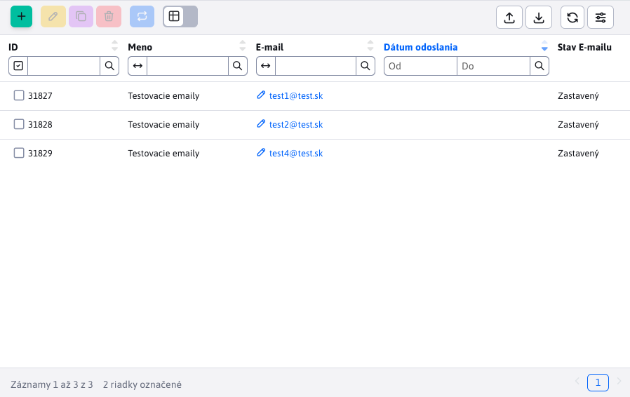
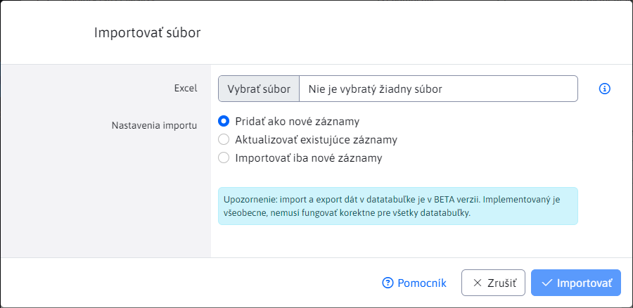
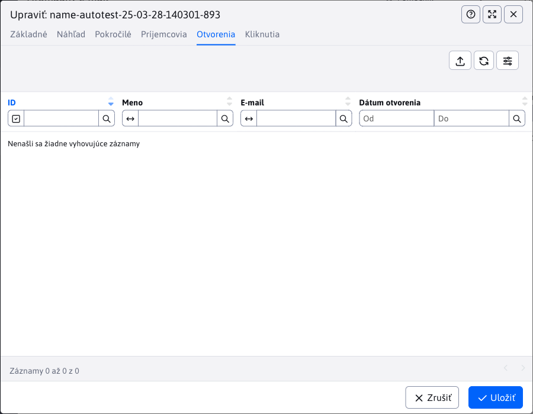
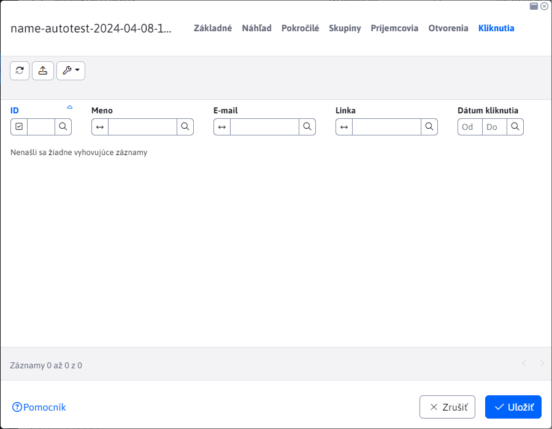

# Kampane

Aplikácia hromadný e-mail vám umožní posielať hromadné **personalizované** emailové správy viacerým používateľom. Každá správa sa posiela samostatne, jednotliví príjemcovia nevidia e-mail adresy ostatných príjemcov.

Výhodou je, že každý e-mail môže byť personalizovaný - ak do tela mailu vložíte značku !name! namiesto nej sa vloží skutočné meno príjemcu.

E-mail je možné posielať návštevníkom, ktorí sú registrovaní v admin časti systému Web JET, alebo vytvoriť súbor so zoznamom mien a e-mail adries a tie potom naimportovať ako príjemcov emailu.


## Karta - Základné

Pri vytváraní nového záznamu máme na výber iba jednú kartu zo základnými informáciami, ktoré potrebujeme vyplniť a to "Predmet" a "Web stránka". Údaje o odosielateľovi sa vyplnia automatický podľa prihláseného používateľa, ale môžete ich samozrejme zmeniť.

Text emailu je prebratý z vybranej web stránky (vrátane jej dizajnu). Odporúčame si v sekcii Web stránky vytvoriť priečinok napr. ```Newsletter``` s nastavenou vhodnou šablónou. V tomto priečinku najskôr vytvorte web stránku s textom emailu a následne ju vyberte v kampani.


Do textu web stránky môžete vložiť nasledovné značky pre vloženie údajov používateľa:

- ```!RECIPIENT_NAME!``` - meno a priezvisko príjemcu
- ```!RECIPIENT_EMAIL!``` - emailová adresa príjemcu
- ```!EMAIL_ID!``` - unikátne ID emailu

Ak je príjemca z databázy používateľov WebJET CMS je možné využiť aj ďalšie značky registrovaného používateľa:

- ```!LOGGED_USER_NAME!``` - meno a priezvisko (ak je konf. premenná ```fullNameIncludeTitle``` nastavená na true obsahuje aj titul)
- ```!LOGGED_USER_FIRSTNAME!``` - meno
- ```!LOGGED_USER_LASTNAME!``` - priezvisko
- ```!LOGGED_USER_TITLE!``` - titul
- ```!LOGGED_USER_LOGIN!``` - prihlasovacie meno
- ```!LOGGED_USER_EMAIL!``` - emailová adresa
- ```!LOGGED_USER_COMPANY!``` - firma
- ```!LOGGED_USER_CITY!``` - mesto
- ```!LOGGED_USER_ADDRESS!``` - adresa (ulica)
- ```!LOGGED_USER_COUNTRY!``` - štát
- ```!LOGGED_USER_PHONE!``` - telefón
- ```!LOGGED_USER_ZIP!``` - PSČ
- ```!LOGGED_USER_ID!``` - ID používateľa
- ```!LOGGED_USER_BIRTH_DATE!``` - dátum narodenia
- ```!LOGGED_USER_FIELDA!``` - voľné pole A
- ```!LOGGED_USER_FIELDB!``` - voľné pole B
- ```!LOGGED_USER_FIELDC!``` - voľné pole C
- ```!LOGGED_USER_FIELDD!``` - voľné pole D
- ```!LOGGED_USER_FIELDE!``` - voľné pole E
- `!LOGGED_USER_GROUPS!` - zoznam skupín používateľov

## Karta - Pokročilé

Môžete nastaviť polia email správy pre odpovedanie, kópiu a skrytú kópiu.

Ak zadáte dátum do poľa začiatok odosielania začnú sa emaily odosielať až po zadanom čase (môžete si teda e-mailovú kampaň naplánovať vopred).

K emailu môžete priložiť maximálne 3 prílohy (súbory).



## Karta - Skupiny

V karte Skupiny vybratím/zaškrtnutím konkrétnej skupiny používateľov sa **po uložení kampane** pridajú používatelia patriaci pod tieto skupiny medzi príjemcov. Čo znamená, že budú dostávať email-y tejto kampane.

Akcie na ktoré je potrebné si dať pozor:

- pri zmene zoznamu príjemcov je nevyhnutné **opätovné uloženie kampane** (ak ešte uložená nebola), pre korektné prepočítavanie príjemcov a odoslaných emailov.
- ak zmeníte zoznam príjemcov PO odoslaní emailov, výsledná štatistika nebude správna a môže vzbudiť dojem problému pri odosielaní.

Pri uložení kampane sa spočíta reálny zoznam príjemcov a už odoslaných emailov z databázovej tabuľky `emails`.


## Karta - Príjemcovia

V karte Príjemcovia vidíme prehľad všetkých príjemcov, ktorý budu dostavať email-y kampane. Príjemcov je možné v tabuľke pridať, upraviť, duplikovať alebo zmazať.



**Upozornenie,** zoznam príjemcov je ošetrený proti určitým nevyhovujúcim hodnotám:
- ochrana proti duplicite, kontroluje sa duplicita v zadaných emailoch ako aj s tými, ktoré už existujú v kampani
- ochrana proti nevhodnému emailu, email musí spĺňať štandardný formát **meno@domena.sk** (špeciálna výnimka pri [Import z xlsx](#import-z-xlsx))
- ochrana proti odhláseným emailom, nie možné pridať príjemcu, ktorého emailová adresa je v zozname [Odhlásené e-maily](../unsubscribed/README.md)

### Stav E-mailu

Dôležitý je stĺpec "Stav E-mailu" ktorý môže obsahovať hodnoty:

- Nový - novo pridaný email, je potrebné uložiť kampaň pre pridanie tohto emailu do kampane.
- Uložený - email je uložený, čaká v rade na odoslanie
- Odoslaný - email je odoslaný, v stĺpci Dátum odoslania je uložený presný dátum a čas odoslania emailu
- Zastavený - email je pripravený na odosielanie, v tabuľke zoznamu kampaní označte kampaň a kliknite na tlačidlo ```Spustiť odosielanie``` pre odoslanie emailu.
- Chyba odoslania - bol prekročený počet pokusov o odoslanie e-mailu (predvolene 3 pokusy). Buď je e-mail nesprávny, alebo je iná chyba v kampani.

### Manuálne pridanie

Manuálne pridanie emailov do kampane vykonáte kliknutím na tlačidlo "Pridať". Povinné je pole "E-mail", do ktorej musíte zadať jeden alebo viac emailov oddelených **čiarkou, bodkočiarkou, medzerou alebo novým riadkom**. Môžete využiť viaceré typy oddelenia súčasne, ako napr. "test1@test.sk, test2@test.sk; test3@test.sk  test4@test.sk". Zadané e-maily sa následné pridajú medzi príjemcov kampane.

Pole "Meno" je voliteľné. Ak ho nevyplníte, tak sa meno príjemcu získa z databázy používateľov na základe zhody emailu (ak existuje). Ak sa takýto email v databáze nenachádza, vloží sa ako meno hodnota "- -". Ak pole "Meno" vyplníte, tak sa nastaví všetkým emailov, ktoré práve vkladáte prostredníctvom poľa "E-mail".



Manuálne pridanie ponúka možnosť **Preskočiť chybné záznamy**. Ak zadáte ako E-mail ```Test1@test.sk, Test2@test.sk; Test13Wrong Test4@test.sk Test2@test.sk``` a možnosť Preskočiť chybné záznamy **je vypnutá**, tak sa pridávanie príjemcov zastaví na prvej nevyhovujúcej hodnote a zobrazí sa chyba:



Uloženie skončilo na treťom emaily ```Test13Wrong``` kvôli hodnote v nesprávnom formáte. Predchádzajúce dva emaily boli vyhovujúce a uložili sa (pre zobrazenie môžete znova načítať údaje v tabuľke).



**Ak je možnosť zapnutá**, tak sa nevyhovujúce hodnoty preskočia a zobrazí sa notifikácia s informáciou ktoré hodnoty a prečo sa neuložili:



Nakoľko zo zadaných piatich boli iba 3 emaily vyhovujúce, tak sa pridali iba traja príjemcovia ku kampani.



### Import z xlsx

Hromadný spôsob k pridaniu/aktualizácií príjemcov je cez štandardný import príjemcov z xlsx súboru.



V súbore v prvom riadku je potrebné mať definované nasledovné názvy:

- ```Meno|recipientName``` - meno a priezvisko príjemcu
- ```E-mail|recipientEmail``` - emailová adresa príjemcu


Korektný súbor pre import získate jednoducho exportom príjemcov. Následne môžete zmazať stĺpec ID a vyplniť mená a email adresy pre import príjemcov.

**Upozornenie:**

- Import z xlxs súboru nepodporuje pridanie viacerých emailov v jednej bunke ako v prípade manuálneho pridania. V bunke musí byť vždy len jedna emailová adresa.
- Import z xlxs súboru podporuje výnimku formátu emailu. Pri manuálnom pridaní musí mať každý mail formát **meno@domena.sk**. Ak však kopírujete emaily napr z outlook-u, skopírovaná hodnota môže mať formát ```"Ján Tester <jan_tester@test.com>"```. V prípade, že hodnota obsahuje znaky ```<>``` **(presne v tomto poradí)**, použije sa hodnota medzi nimi. V tomto prípade by to bola práve hodnota ```jan_tester@test.com```. Táto hodnota musí mať formát **meno@domena.sk**.

## Karta - Otvorenia

V karte otvorenia sa zaznamená otvorenie e-mailu príjemcom. Toto je realizované pomocou vloženého obrázka. Nie všetci príjemcovia potvrdia načítanie obrázka zo servera, takže zoznam nie je kompletný.



## Karta - Kliknutia

Zobrazuje zoznam kliknutí na odkaz v emaile. Príjemca môže na odkaz kliknúť viac krát, preto môže byť v tabuľke kliknutie zaznamenané viac krát od jedného príjemcu.

