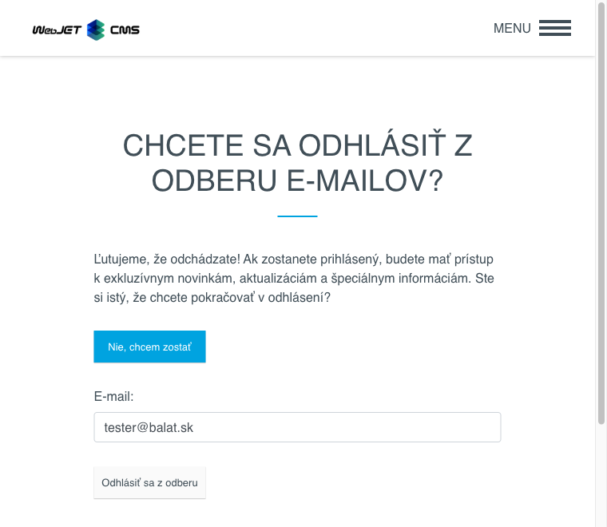

# Odhlásené e-maily

Aplikácia Hromadný e-mail obsahuje uzol Odhlásené e-maily, v ktorom sa eviduje zoznam odhlásených emailov. Na adresy v tomto zozname nebudú cez aplikáciu Hromadný e-mail odoslané žiadne emaily/kampane.

Pred odoslaním sa vždy kontroluje zoznam odhlásených e-mailov, čiže aj keby ste email naimportovali nanovo do hromadného e-mailu nebude na e-mail adresy zo zoznamu odhlásených emailov kampaň zaslaná.


Zoznam môžete plniť manuálne, importom z Excel súboru a automaticky odkazom v email správe. Stačí do email správy pridať nasledovný HTML kód:

```html
<a href="/odhlasenie-z-mailingu.html?email=!RECIPIENT_EMAIL!&save=true">Kliknite pre odhlásenie</a>
```

pričom stránka s adresou ```/odhlasenie-z-mailingu.html``` obsahuje aplikáciu na odhlásenie:

```html
!INCLUDE(/components/dmail/unsubscribe.jsp, senderEmail=name@your-domain.com, senderName="Your Name", confirmUnsubscribe=true)!
```

[Kliknutie na odkaz](../form/README.md#odhlásenie) zabezpečí odhlásenie email adresy príjemcu z mailovej kampane.



Pri vytváraní, editovaní, duplikovaní záznamu sa v editore povinne zadáva e-mail na odhlásenie.


