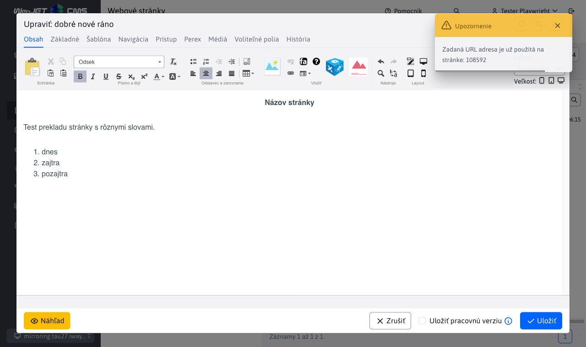

# Zrkadlenie štruktúry

Zrkadlenie štruktúry vzájomne preväzuje adresáre a stránky jazykových mutácií. Zmena v jednej jazykovej mutácii sa automaticky prejaví aj v druhej. Zároveň prepája web stránky vo verejnej časti, čiže ak sa nachádzam na stránke ```SK/O nás``` a kliknem na ```EN``` verziu v hlavičke stránky, dostanem sa na zrkadlenú stránku ```EN/About Us```.

Funkcionalita je za účelom odbremenenia redaktorov pri vytváraní stránok a možnosti prepojenia obsahov vo verejnej časti webu. Štruktúra jazykových mutácií je identická a **zníži sa  prácnosť pri pridávaní nových sekcií** či zmene poradia. Cieľom je, aby sa štruktúra v jazykových mutáciách časom nerozišla.

## Nastavenie

V rámci WebJET CMS zrkadlenia štruktúry aktivuje nastavením konfiguračnej premennej ```structureMirroringConfig``` s definíciou, ktoré adresáre majú byť takto previazané.

Formát zápisu je nasledovný:

```txt
groupId-sk,groupId-en,groupId-cz:poznamka (napr meno domeny)
ineGroupId1,ineGroupId2:poznamka inej domeny
```

pričom ako ```groupId-sk,groupId-en,groupId-cz``` zadávate ID adresára v sekcii Web stránky. Pri viac doménovom WebJETe môžete zadať viac riadkov konfigurácie - každú doménu na nový riadok. Zadané ID adresárov môžu, ale nemusia byť koreňové adresáre vo WebJETe.

Za znak ```:``` je možné zadať poznámku, napr. meno domény a podobne.

## Priebeh zrkadlenia

Ako príklad majme situáciu zrkadlenia SK a EN štruktúry. Vo WebJET CMS v časti WEB Stránky vytvorte 2 koreňové adresáre SK a EN. Následne nastavte konfiguračnú premennú ```structureMirroringConfig```.

Vytvorením adresára/stránky v SK alebo EN adresári sa automaticky vytvorí nový adresár/stránka v druhej jazykovej mutácii a vzájomne sa prepoja. Automaticky vytvorený adresár/stránka v druhej jazykovej mutácii sa nastaví na nezobrazovať, aby bol dostatok času na jeho preklad.

- Stránka – Zobrazovať na NIE
- Adresár - Spôsob zobrazenia v menu - NEZOBRAZOVAŤ

Ak vám nevyhovuje nastavenie vypnutia zobrazenia web stránky/priečinku (napr. počas vytvárania web sídla kedy nevadí, že sa sekcia ihneď začne zobrazovať) nastavte konf. premennú `structureMirroringDisabledOnCreate` na hodnotu `false`.

Pri ďalšej práci sa zrkadlia nasledovné operácie:

- Vytvorenie adresára/stránky
- Zmazanie adresára/stránky
- Zmena poradia adresára/stránky v štruktúre (okrem koreňových priečinkov)
- Presunutie adresára/stránky do iného adresára

Zvyšné vlastnosti adresárov/stránok ostávajú zachované a nemajú vplyv na svoj ekvivalent v druhej jazykovej mutácii.

## Vytvorenie odkazu na jazykové mutácie v hlavičke stránky

Aplikácia umožňuje do hlavičky stránky vložiť odkazy na všetky jazykové mutácie, ktoré smerujú na ekvivalent aktuálne zobrazenej stránky v ostatných jazykových mutáciách. V prípade, že stránka v jazykovej mutácii **je nastavená na nezobrazovať**, odkaz smeruje **na úvodnú stránku jazykovej mutácie**.

Odkaz je vo forme ```SK | CZ | EN``` generovaný ako ```ul-li``` zoznam. Pre vygenerovanie vložte do hlavičky nasledovnú aplikáciu:

```html
!INCLUDE(/components/structuremirroring/language_switcher.jsp)!
```

Názvy SK, CZ, EN sú generované zo zadaných ID adresárov v konfigurácii zrkadlenia, používa sa hodnota zadaná v poli **Navigačná lišta a menu**.

## Automatický preklad

WebJET dokáže automaticky prekladať názov adresára alebo stránky pri jej vytvorení. Je potrebné nasledovné nastavenie:

- [nakonfigurovať prekladač](../../../admin/setup/translation.md)
- koreňovým adresárom jednotlivých jazykových mutácií je potrebné vo vlastnostiach adresára v karte Šablóna nastaviť pole Jazyk na jazyk daného adresára

Prekladač pri vytvorení stránky hľadá v priečinkoch rekurzívne smerom ku koreňu nastavenia poľa Jazyk a keď nie je prázdne použije ho ako zdrojový alebo cieľový jazyk. Ak sa jazyk nenájde použije sa jazyk nastavený v šablóne zdrojového a cieľového priečinka.


Prekladá sa **Názov web stránky**, názov položky v menu, URL adresa a **Obsah** web stránky.

### Nová stránka

Pri vytváraní stránky sa vždy spustí automatický preklad. Ak vytvoríte novú stránku s názvom "dobré ráno" v priečinku `preklad_sk`, kde je nastavený Slovenský jazyk, tak v adresári `preklad_en` vznikne stránka `good morning`, obsah stránky bude tiež preložený do Anglického jazyka.

Web stránka v priečinku `preklad_sk`:



Vygenerovaná stránka s prekladom do anglického jazyka v priečinku `preklad_en`:


### Úprava existujúcej web stránky

Ak už existuje stránka v cieľovom jazyku je potrebné rozlíšiť, či má byť automaticky znova preložená pri zmene inej jazykovej mutácie. Zvyčajne po automatickom preklade je stránka manuálne skontrolovaná redaktorom, jazykovo korigovaná, sú opravené nesprávne slová.

WebJET potrebuje vedieť, či preložená stránka bola už upravená skutočným používateľom. Existuje konfiguračná premenná `structureMirroringAutoTranslatorLogin` do ktorej môžete zadať prihlasovacie meno používateľa (virtuálneho), ktorý slúži na evidenciu automatického prekladu - stránka v inom jazyku sa uloží akoby týmto používateľom. Pri znova uložení pôvodnej jazykovej verzie sa opakovane preloží text web stránky pokiaľ je autorom tejto stránky stále tento virtuálny používateľ - teda iný (skutočný) používateľ zatiaľ nezmenil preloženú web stránku.

V používateľoch teda vytvorte nového (virtuálneho) používateľa s právami na editáciu potrebných web stránok a jeho prihlasovacie meno zadajte do konf. premennej `structureMirroringAutoTranslatorLogin`. S takýmto používateľom by ste sa nemali nikdy prihlasovať a používať ho na redaktorskú činnosť, je to len technický/virtuálny používateľ. Predvolené prihlasovacie meno je `autotranslator`, ak použijete toto prihlasovacie meno nemusíte nastavovať uvedenú konf. premennú.

Automatický preklad už existujúcej stránky sa vykoná za nasledovných podmienok:

- Ak konfiguračná premenná `structureMirroringAutoTranslatorLogin` je nastavená a daný používateľ existuje v databáze.
  - A autor cieľovej stránky je zhodný s `structureMirroringAutoTranslatorLogin` - čiže stránka zatiaľ nebola korigovaná skutočným používateľom.
- Ak konfiguračná premenná `structureMirroringAutoTranslatorLogin` nie je nastavená, alebo v databáze sa nenachádza užívateľ s takýmto prihlasovacím menom, tak sa rozhoduje na základe toho, či je stránka zobrazená. Automatický preklad sa spustí iba v jazykových verziách, ktoré **nie sú zatiaľ zobrazené**, čiže majú hodnotu `available` nastavenú na `false`.

Pri nastavenej hodnote `structureMirroringAutoTranslatorLogin` je teda detekcia spoľahlivejšia, pretože aj ešte nezverejnenú verziu web stránky mohol už iný používateľ opraviť/korigovať, ale ešte ju nezverejnil. Pri vašej zmene by nastalo prepísanie textu, čo je neželaný stav. Odporúčame vytvoriť (virtuálneho) používateľa a jeho prihlasovacie meno nastaviť do `structureMirroringAutoTranslatorLogin` pre spoľahlivejšiu detekciu zmien.

Pri ukladaní stránky sa zmeny aplikujú na všetky kópie. Ak teda z SK verzie vytvorím EN a DE verziu (ktoré ešte nie sú publikované, alebo neboli zmenené reálnym redaktorom), tak pri zmene EN verzie sa text preloží do DE verzie. SK verzia sa neovplyvní, pretože je už typicky publikovaná, respektíve je vytvorená reálnym (nie `structureMirroringAutoTranslatorLogin`) používateľom.

Ak je nastavená konf. premenná `syncGroupAndWebpageTitle` na hodnotu `true` (čo je štandardná hodnota) automaticky sa synchronizuje názov priečinka s názvom hlavnej stránky v priečinku. Pri zmene názvu hlavnej stránky sa premenuje aj priečinok a to aj v preložených verziách.

## Zrušenie zrkadlenia

Zrušenie zrkadlenia vyžaduje aby ste prepojenie odstránili z konfiguračnej premennej ```structureMirroringConfig```. Lenže v databáze ostane ešte nastavená hodnota `sync_id`, ktorá prepojovala priečinky/stránky v rôznych jazykových mutáciách. Tieto hodnoty musia byť odstránené, inak priečinky/stránky ostanú naďalej prepojené/synchronizované. K tomuto účelu potrebuje využiť [Zrušenie synchronizácie](../clone-structure/README.md#zrušenie-synchronizácie).

## Technické informácie

Viac technických informácií sa nachádza v [dokumentácii pre vývojára](../../../developer/apps/docmirroring.md).