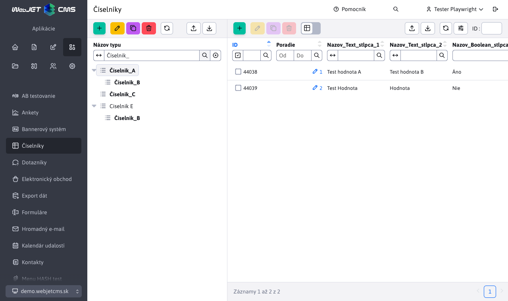
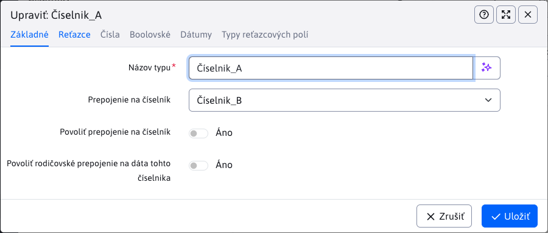
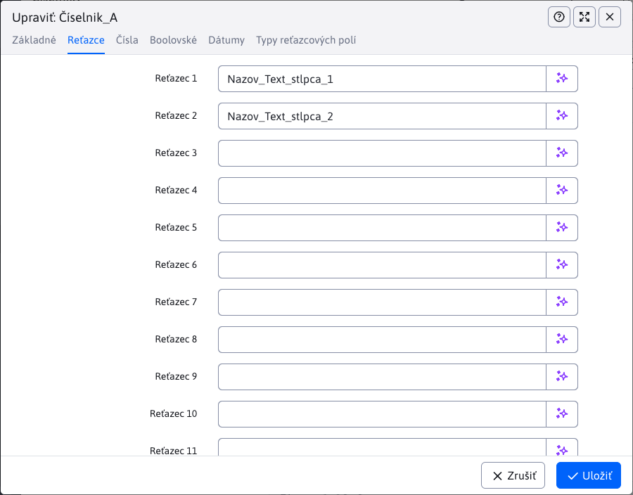
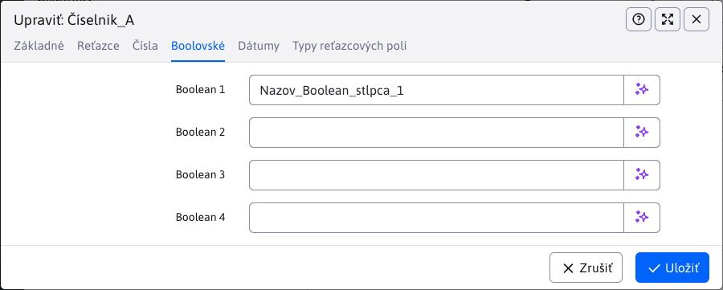
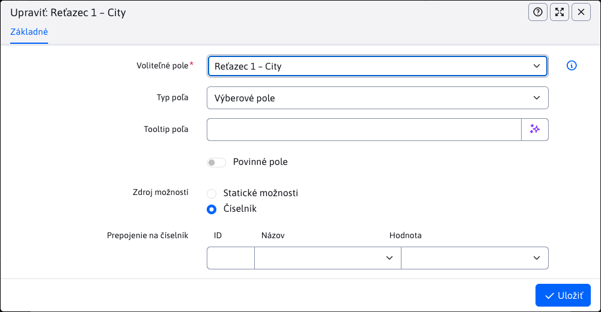
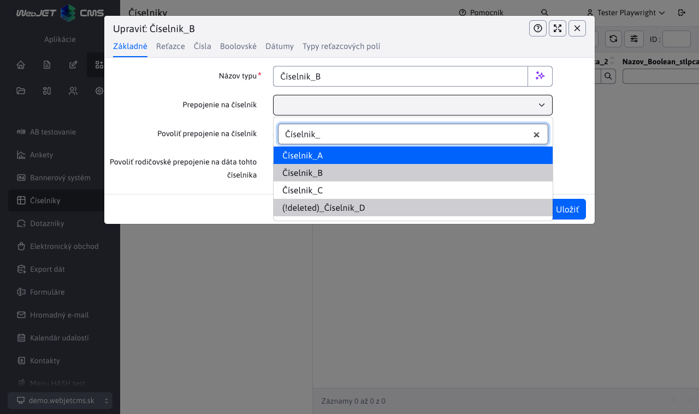
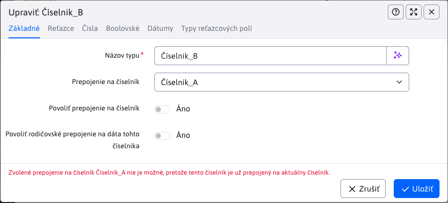
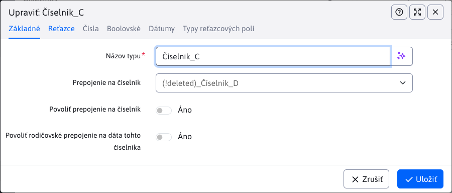
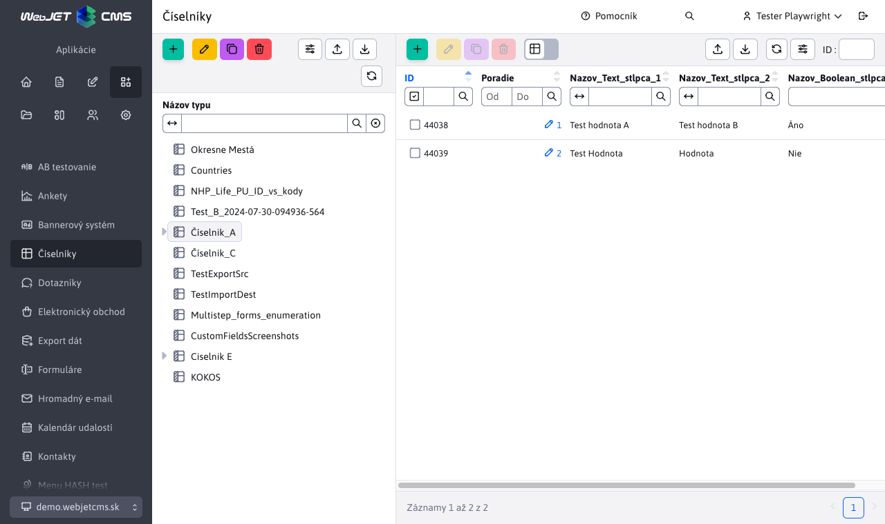
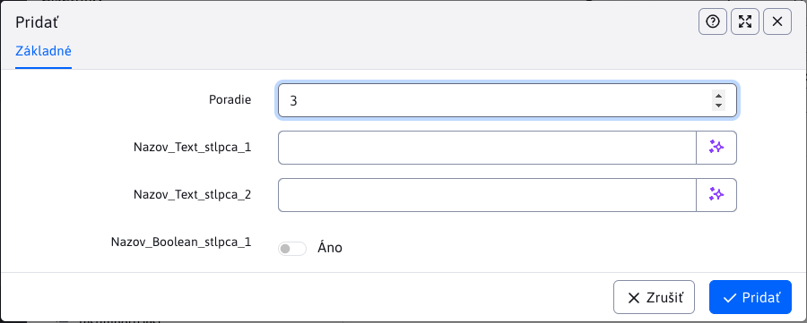

# Číselníky

Aplikácia Číselníky umožňuje vytvárať/editovať/mazať a duplikovať pomenované typy číselníkov, do ktorých je následne možné ukladať dáta týchto číselníkov. Typy a dáta číselníkov je tiež možné exportovať a importovať pomocou súboru.

Typy číselníkov sa vyberajú v stromovom zozname v ľavom paneli. Pravý panel zobrazuje dáta vybraného typu. Na menších obrazovkách sa panely zobrazia pod sebou.

## Typy číselníkov

Samostatnú kartu **Typy číselníkov** nahrádza ľavý panel. Tlačidlami nad stromom môžete typ vytvoriť, upraviť, duplikovať, zmazať, importovať alebo exportovať. Pri úprave sa otvorí rovnaký editor s nastaveniami polí a prepojení. Vyhľadávanie pod tlačidlami filtruje názvy typov; tlačidlo obnovenia znovu načíta zoznam. Vymazané typy sa štandardne v strome nezobrazujú. V nastaveniach stromu môžete zapnúť voľbu **Zobraziť vymazané typy**; zobrazia sa červenou farbou s ikonou koša a môžete ich vybrať a upraviť. Pri výbere vymazaného typu sú tlačidlá zmazania a duplikovania neaktívne. Obe operácie blokuje aj server, kým typ neobnovíte.

Tlačidlom **Nastavenia** nad stromom môžete zmeniť pomer šírky stromu a tabuľky. Nastavenie sa uloží pre prihláseného používateľa samostatne pre túto aplikáciu.

Strom zohľadňuje pole **Podradený typ číselníka** v nastavení typu: ak typ **A** odkazuje na typ **B**, typ **B** sa zobrazí pod typom **A**. Typ prepojený z viacerých rodičov sa zobrazí pod každým z nich; všetky jeho výskyty otvárajú rovnaké dáta a nastavenia. Vyhľadávanie ponechá viditeľnú aj cestu cez nadradené typy a pri obnovení výberu sa táto cesta rozbalí. Prepojenia jednotlivých dátových záznamov hierarchiu typov nemenia.

Výber typu sa ukladá do adresy stránky, takže odkaz môžete uložiť alebo zdieľať. Ak vybraný typ už neexistuje, zobrazí sa prvý dostupný typ. Ak nie je dostupný žiadny typ, vytvorte ho tlačidlom **+** nad stromom; pridávanie dát je dovtedy vypnuté.

Pri vytváraní nového typu číselníka musíte zadať meno, ktoré bude unikátne. Ostatné polia sú voliteľné. Všimnite si karty **Reťazce** / **Čísla** / **Boolovské** / **Dátumy**, ktoré obsahujú niekoľko očíslovaných polí. Týmito poľami zadefinujete aký formát budú mať dáta daného číselníka. Ak poľu zadáte názov, v dátach číselníka sa vygeneruje pole s meno, ktoré zodpovedá zadanému text-u a typu danej karty.

Príklad: ak vyplníte 2 polia v karte **Reťazce**

a jedno pole v karte **Boolovské**,

tak sa v dátach daného číselníka zobrazia 2 stĺpce/polia typu reťazec a 1 stĺpec/pole typu boolean s názvami, ktoré boli zadané (viď obrázok v sekcií [Zoznam dát číselníkov](#zoznam-dát-číselníkov)).

To znamená, že si môžete zadefinovať formát dát číselníkov pre každý číselník zvlášť. Ako už napovedajú názvy kariet, môžete kombinovať textové, číselné, Boolovské alebo dátumové polia. Ich počet je obmedzený pre každý typ počtom polí v jednotlivých kartách.

### Karta Typy reťazcových polí

Po prvom uložení typu číselníka sa zobrazí karta **Typy reťazcových polí**. Umožňuje rozšíriť pomenované polia z karty **Reťazce** o nastavenia známe z [voliteľných polí](../../../frontend/webpages/customfields/custom-fields-settings.md), napríklad o výberové pole, výber viacerých možností, automatické dopĺňanie, prepojenie na iný číselník, výber obrázka, odkazu, priečinka alebo webovej stránky.

V tabuľke sa zobrazujú iba reťazcové polia, pre ktoré je vytvorená konfigurácia. Pri jej pridaní sú v poli **Voliteľné pole** dostupné iba pomenované reťazcové polia vo formáte **Reťazec N – názov**. Ponuka polí, ich názvy a popisy vychádzajú z poslednej uloženej verzie typu číselníka. Po pomenovaní alebo premenovaní reťazcového poľa preto najskôr uložte typ číselníka; konfigurácia sa následne automaticky aktualizuje. Ak názov poľa odstránite, pole sa skryje a jeho nastavenie povinnosti sa zruší.

Pre každé pole je možné nastaviť:

- typ poľa a jeho typovo špecifické vlastnosti, napríklad možnosti výberového poľa,
- povinnosť vyplnenia,
- pomocný text zobrazený ako `tooltip`

Bez špecifickej konfigurácie sa pomenované reťazcové pole zobrazí ako bežné textové pole s maximálnou dĺžkou 1024 znakov. Nepomenované reťazcové polia sa v dátach číselníka ani v možnostiach konfigurácie nezobrazia.

!> **Upozornenie** číselníky (zatiaľ) nie su delené podľa zvolenej domény, nastavenia voliteľných polí (typy reťazcových polí) sa teda fixne ukladajú do hlavnej domény. Ak prejdete do sekcie [Voliteľné polia](../../../frontend/webpages/customfields/custom-fields-settings.md) budete nastavené hodnoty vidieť len v hlavnej doméne. Odporúčame ale v sekcii Voliteľné polia nemeniť a nenastavovať a vždy použiť kartu Typy reťazcových polí na ich nastavenie.

!> **Upozornenie na spätnú kompatibilitu:** dátové atribúty reťazcových polí sa zmenili z `string1` až `string12` na `fieldA` až `fieldL`. Vo vlastných alebo starších Excel šablónach na import dát číselníka musíte kódové názvy v hlavičke ručne upraviť, napríklad `Mesto|string1` na `Mesto|fieldA`. Rovnaké názvy `fieldA` až `fieldL` používajte aj v integráciách REST API, ktoré spracúvajú dáta číselníkov. Databázové stĺpce `string1` až `string12` zostávajú nezmenené.

### Karta Základné

V karte "Základné" sa nastavujú vlastnosti:

- Názov typu - jedinečný názov pre typ číselníka, nesmie byť prázdny.
- Vymazaný - označuje vyradený typ. Vypnutím tejto voľby a uložením obnovíte typ aj všetky jeho dátové záznamy.
- Podradený typ číselníka - vybraný typ sa zobrazí v strome pod aktuálnym typom. Toto nastavenie automaticky neprepája ich dátové záznamy.
- Povoliť prepojenie dátových záznamov na číselník - v editore jednotlivých záznamov sprístupní výber prepojeného číselníka. Nemení nastavenie podradeného typu.
- Povoliť výber rodičovského záznamu - jednotlivým záznamom umožní vybrať rodiča spomedzi ostatných záznamov toho istého číselníka.

Voľby **Povoliť prepojenie dátových záznamov na číselník** a **Povoliť výber rodičovského záznamu** nemožno povoliť súčasne. Nastavenie podradeného typu je od nich nezávislé. Pri každom z týchto troch polí je dostupný vysvetľujúci popis.

**Podradený typ číselníka** má určité obmedzenia a preto sa niektoré možnosti buď nedajú zvoliť (označené sivou farbou) alebo ich zvolenie vráti chybovú správu.

1. Prepojenie číselníka samého na seba je zakázané. V prípade že pre číselník **B** vyberáte prepojenie na iný číselník, v zoznam bude aj on sám ale táto možnosť sa nebude dať zvoliť.

2. Kruhové prepojenie číselníkov je zakázané. Ak si číselník **A** zvolí prepojenie na číselník **B**, tak číselník **B** sa nemôže prepojiť späť na číselník **A**. Možnosť zvoliť číselník **A** bude pre číselník **B** síce viditeľná a bude ju môcť aj zvoliť, ale pri pokuse o uloženie bude vrátená chybová správa.

3. Prepojenie na už vymazaný číselník. Môže nastať situácia, že číselník **C** sa prepojil na číselník **D**, ktorý bol následne zmazaný. V tomto prípade uvidíte zmazaný číselník **D** v možnostiach s prefixom **`(!deleted)_`**. Tento prefix bude jasne dávať najavo, že číselník už bol zmazaný a takáto možnosť sa nebude dať zvoliť. Avšak číselník **C**, ktorý sa prepojil ešte pred zmazaním číselníka **D** si toto prepojenie ponechá. Toto prepojenie sa bude dať zmeniť, ale po zmene sa spätne na vymazaný číselník už znovu nedokáže prepojiť.

**Povoliť prepojenie dátových záznamov na číselník** ak je povolené, jednotlivé dáta číselníka sa budú môcť prepájať na číselníky. Aj v tomto prípade tu sú určité obmedzenia.

1. Prepojenie na číselníky z ktorého dáta vychádzajú je zakázané. Ak dáta vytvárate pod číselníkom X majú povolené prepojenie na číselník, tak možnosť na číselník X sa ani nezobrazí.
2. Prepojenie na už vymazaný číselník. Tento prípad má rovnaké podmienky ako **Podradený typ číselníka** u typu číselníka.

**Povoliť výber rodičovského záznamu** ak je povolené, jednotlivé dáta číselníka si budú môcť zvoliť rodiča spomedzi ostatných dát pod tým istým číselníkom. Aj v tomto prípade tu sú určité obmedzenia.

1. V tomto prípade musí byť splnená jedna podmienka. Pre používanie rodičovského prepojenia musí mať typ číselníka zadefinovanú možnosť pre **Reťazec 1**. Dôvodom je fakt, že hodnota vo vygenerovanom stĺpci **Reťazec 1** sa bude používať ako identifikátor, ktorým sa bude dať zvoliť prepojenie na rodiča.
2. Prepojenie záznamu číselníka na seba je zakázané. Dáta číselníka pri výbere rodičovského prepojenia nebudú vidieť medzi možnosťami sami seba.

!>**Upozornenie:** ak vypnete a uložíte voľbu **Povoliť prepojenie dátových záznamov na číselník** alebo **Povoliť výber rodičovského záznamu**, všetky zodpovedajúce prepojenia dátových záznamov tohto číselníka sa odstránia. Opätovné zapnutie voľby ich neobnoví.

Napríklad záznam typu **X** odkazuje na číselník **Z**. Ak v type **X** vypnete voľbu **Povoliť prepojenie dátových záznamov na číselník** a uložíte zmenu, záznam príde o prepojenie na **Z**. Po opätovnom zapnutí voľby bude možné prepojenie znovu vybrať, ale pôvodná hodnota sa neobnoví.

## Zoznam dát číselníkov

Dáta číselníkov umožňuje editovať údaje vytvorených typov číselníkov. V strome v ľavom paneli vyberte číselník, ktorý sa bude spravovať. Nové záznamy sa vytvoria vo vybranom číselníku tlačidlom **+** nad tabuľkou dát. Po výbere konkrétneho číselníka sa zobrazia jeho príslušné dáta. V prípade ak typ číselníka má niektoré stĺpce nepomenované, tieto stĺpce a ich dáta nebudú zobrazené.

!>**Upozornenie:** vymazané typy sú dostupné iba po zapnutí voľby **Zobraziť vymazané typy**. Pred pridávaním alebo importovaním dát vymazaný typ obnovte.

Príklad:

Pri vytváraní číselníka **A** sme vyplnili polia **Reťazec 1**, **Reťazec 2** a **Boolean 1**. Vidíme, že tabuľka ma presne tie stĺpce, ktoré sme v číselníku zadefinovali. Ak budeme vytvárať nový záznam (nové dáta) pre číselník, v editore sa nám vygenerujú 2 polia typu reťazec a 1 pole typu boolean. Názvy týchto polí budú rovnaké ako tie, čo sme zadali pri vytváraní číselníka. Samozrejme, ak to sme to pri vytváraní číselníka povolili, v editore môžeme mať **rodičovské prepojenie** alebo **prepojenie na číselník**.

Pri zmene vybraného typu číselníka sa môže zmeniť celá tabuľka ako aj editor dát číselníkov.

## Mazanie dát

Štandardne sa pri zmazaní záznamu typu číselníka alebo dát fyzicky nezmažú z databázy, ale sa označia ako zmazané. Je to ochrana pred chybami získania dát v starých údajoch. Napr. ak sa používa číselník Farba auta a už pre nové záznamy nechceme nejakú farbu mať na výber, ale zároveň v starých záznamoch je potrebné farbu zobraziť. Typ číselníka môžete obnoviť v používateľskom rozhraní: v nastaveniach stromu zapnite **Zobraziť vymazané typy**, vyberte typ s ikonou koša, otvorte jeho editor a vypnite voľbu **Vymazaný**. Uložením sa obnoví typ aj všetky jeho dátové záznamy vrátane záznamov zmazaných samostatne pred zmazaním typu. Bežná úprava aktívneho typu zmazané dáta neobnovuje.

Pri zmazaní typu sa označia ako zmazané aj jeho dátové záznamy. Pri vypnutej voľbe **Zobraziť vymazané typy** typ zmizne zo všetkých vetiev stromu, ale existujúce prepojenia z ostatných typov zostanú uložené; v ich editore sa zobrazujú s prefixom **`(!deleted)_`**. Ak zmažete rodičovský typ, jeho prepojený typ sa nezmaže: zostane pod ďalšími aktívnymi rodičmi, alebo sa zobrazí na najvyššej úrovni stromu, ak už žiadneho aktívneho rodiča nemá.

Pri zobrazení vymazaných typov strom zachová aj ich prepojenia na rodičov a potomkov. Po obnovení typu sa opäť zobrazí v bežnom strome na základe zachovaných prepojení.
