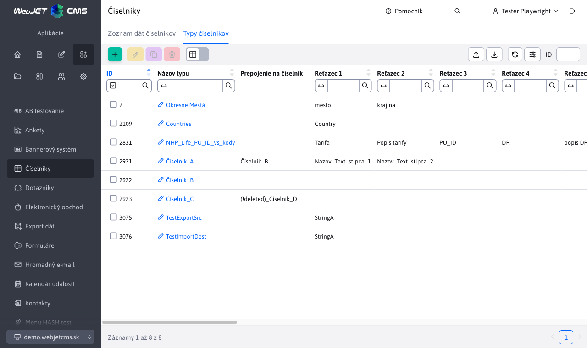
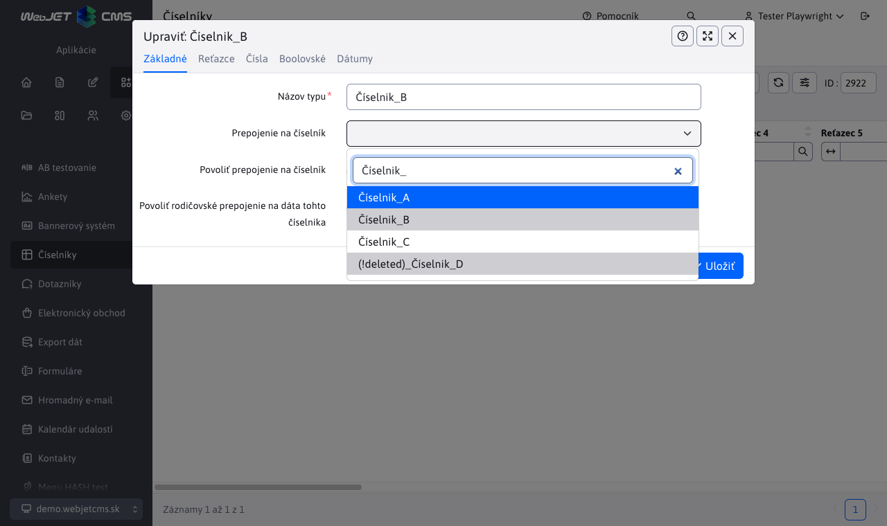
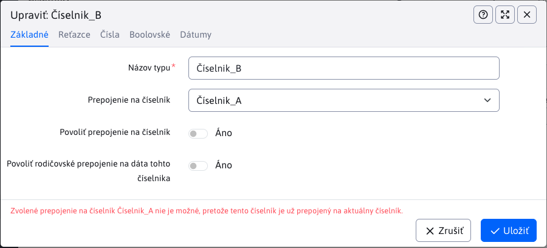
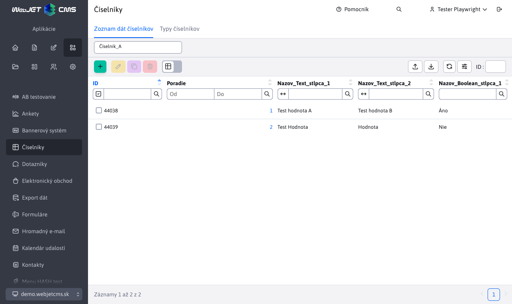
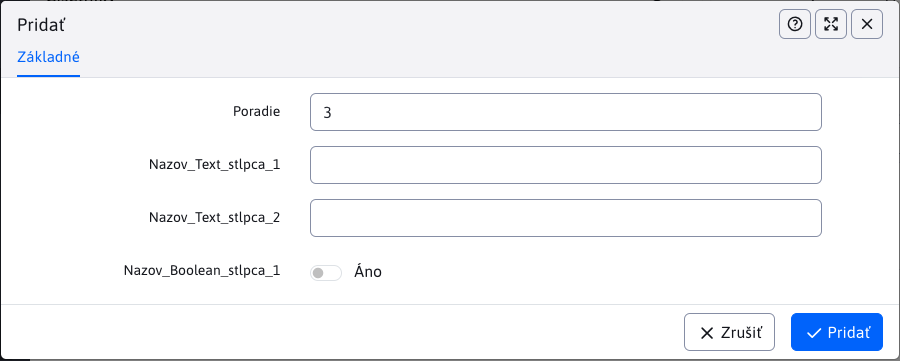

# Číselníky

Aplikácia Číselníky umožňuje vytvárať/editovať/mazať a duplikovať pomenované typy číselníkov, do ktorých je následne možné ukladať dáta týchto číselníkov. Typy a dáta číselníkov je tiež možné exportovať a importovať pomocou súboru.



## Typy číselníkov

Pri vytváraní nového typu číselníka musíte zadať meno, ktoré bude unikátne. Ostatné polia sú voliteľné. Všimnite si karty "Reťazce" / "Čísla" / "Boolovské" / "Dátumy", ktoré obsahujú niekoľko očíslovaných polí. Týmito poľami zadefinujete aký formát budú mať dáta daného číselníka. Ak poľu zadáte názov, v dátach číselníka sa vygeneruje pole s meno, ktoré zodpovedá zadanému text-u a typu danej karty.


Príklad: ak vyplníte 2 polia v karte "Reťazce", tak sa v dátach číselníka zobrazia 2 stĺpce/polia typu reťazec s názvami, ktoré boli zadané.


To znamená, že si môžete zadefinovať formát dát číselníkov pre každý číselník zvlášť. Ako už napovedajú názvy kariet, môžete kombinovať textové, číselné, Boolovské alebo dátumové polia. Ich počet je obmedzený pre každý typ počtom polí v jednotlivých kartách.

### Karta Základné

V karte "Základné" sa nastavujú vlastnosti:

- Názov typu - jedinečný názov pre typ číselníka, nesmie byť prázdny.
- Prepojenie na číselník - výber zo všetkých číselníkov pre prepojenie číselníka.
- Povoliť prepojenie na číselník - povolenie prepojenie na iný číselník (rovnako ako v prípade typu číselníka).
- Povoliť rodičovské prepojenie na dáta tohto číselníka - určuje, či budú mať dáta daného číselníka povolené zvolenie rodičovského prepojenia.

Nemôžete mať súčasne povolené pre dáta "prepojenie na číselník" a "rodičovské prepojenie".

**Prepojenie na číselník** má určité obmedzenia a preto sa niektoré možnosti buď nedajú zvoliť alebo ich zvolenie vráti chybovú správu.

1. Prepojenie číselníka samého na seba je zakázané. V prípade že pre číselník X vyberáte prepojenie na iný číselník, v zoznam bude aj číselník X ale táto možnosť sa nebude dať zvoliť.



2. Kruhové prepojenie číselníkov. Ak si číselník X zvolí prepojenie na číselník Y, tak číselník Y sa nemôže prepojiť späť na číselník X. Možnosť X bude pre Y síce viditeľná a bude ju môcť aj zvoliť, ale pri pokuse o uloženie bude zobrazená chybová správa.



1. Prepojenie na už vymazaný číselník. Môže nastať situácia, že číselník X sa prepojil na číselník Z, ktorý bol  následne zmazaný. V tomto prípade uvidíte zmazaný číselník Z v možnostiach s prefixom "(!deleted)_". Tento prefix bude jasne dávať najavo, že číselník už bol zmazaný a takáto možnosť sa nebude dať zvoliť. Avšak číselník X, ktorý sa prepojil ešte pred zmazaním číselníka Z si toto prepojenie ponechá. Toto prepojenie sa bude dať zmeniť, ale po zmene sa spätne na vymazaný číselník už znovu nedokáže prepojiť.


**Povoliť prepojenie na číselník** ak je povolené, jednotlivé dáta číselníka sa budú môcť prepájať na číselníky. Aj v tomto prípade tu sú určité obmedzenia.

1. Prepojenie na číselníky z ktorého dáta vychádzajú je zakázané. Ak dáta vytvárate pod číselníkom X majú povolené prepojenie na číselník, tak možnosť na číselník X sa nebude dať zvoliť.
2. Prepojenie na už vymazaný číselník. Tento prípad má rovnaké podmienky ako **Prepojenie na číselník** u typu číselníka.

**Povoliť rodičovské prepojenie na dáta tohto číselníka** ak je povolené, jednotlivé dáta číselníka si budú môcť zvoliť rodiča spomedzi ostatných dát po tým istým číselníkom. Aj v tomto prípade tu sú určité obmedzenia.

1. V tomto prípade musí byť splnená jedna podmienka. Pre používanie rodičovského prepojenia musí mať typ číselníka zadefinovanú možnosť pre ```Reťazec 1```. Dôvodom je že hodnota vo vygenerovanom stĺpci ```Reťazec 1``` sa bude používať ako identifikátor, ktorým sa bude dať zvoliť prepojenie na rodiča.
2. Prepojenie záznamu číselníka na seba je zakázané. Ak číselník X má povolené rodičovské prepojenie a pod týmto číselníkom vytvoríte  ```záznamA, záznamB a záznamC```, tak si takýto záznam nemôže byť rodičom. Pre ```záznamA``` bude možnosť rodičovského prepojenia na seba znemožnená (uvidí možnosť ```zaznamA``` ale nebude ju možné zvoliť).

**Je dôležité si uvedomiť**, že ak "povolenie prepojenia na číselník" alebo "povolenie rodičovského prepojenia" bude odobraté, všetky prepojenia, ktoré boli vytvorené u dát tohto číselníka budú odstránené a to aj v prípade, že toto povolenie bude spätne udelené opäť.

Ako príklad majme situáciu, kde si vytvoríme typ číselníka s označením X a tento typ číselníka povoľuje "prepojenie na číselník". Pod týmto typom číselníka vytvorime záznam, ktorý má povolené prepojenie na číselník a bude sa prepájať na číselník Z. Ak potom u typu číselníka X povolenie "prepojenie na číselník" zrušíme, takto záznam tohto číselníka, ktorý sa prepojil na číselník Z príde o toto prepojenie natrvalo. Ak by sme  "prepojenie na číselník" opäť povolili, u záznamu by sa zobrazila možnosť ale predchádzajúca voľba na číselník Z by bola vynulovaná.

## Zoznam dát číselníkov

Dáta číselníkov umožňuje editovať údaje vytvorených typov číselníkov. Je potrebné z ponuky v hlavičke stránky vybrať číselník, ktorý sa bude spravovať. Po výbere konkrétneho číselníka sa zobrazia jeho príslušné dáta. V prípade ak typ číselníka má niektoré stĺpce nepomenované, tieto stĺpce a ich dáta nebudú zobrazené.



Príklad:

Pri vytváraní číselníka X sme vyplnili polia ```reťazec1, reťazec2```. Ak budeme vytvárať nový záznam (nové dáta) pre číselník X, v editore sa nám vygenerujú 2 polia typu reťazec. Názvy týchto polí budú rovnaké ako tie, čo sme zadali pri vytváraní číselníka X. Taktiež tabuľka bude obsahovať iba tieto 2 zadefinované stĺpce. Samozrejme ak to číselník X povolil, pri vytváraní dát budeme môcť zvoliť rodiča alebo prepojenie na číselník (bližšie sú tieto výbery opísane vyššie v kapitole).



## Mazanie dát

Štandardne sa pri zmazaní záznamu typu číselníka alebo dát fyzicky nezmažú z databázy, ale sa označia ako zmazané. Je to ochrana pred chybami získania dát v starých údajoch. Napr. ak sa používa číselník Farba auta a už pre nové záznamy nechceme nejakú farbu mať na výber, ale zároveň v starých záznamoch je potrebné farbu zobraziť. Technicky je možné zmazaný záznam obnoviť priamo v databáze nastavením atribútu ```hidden```, používateľské rozhranie to aktuálne ale neumožňuje.