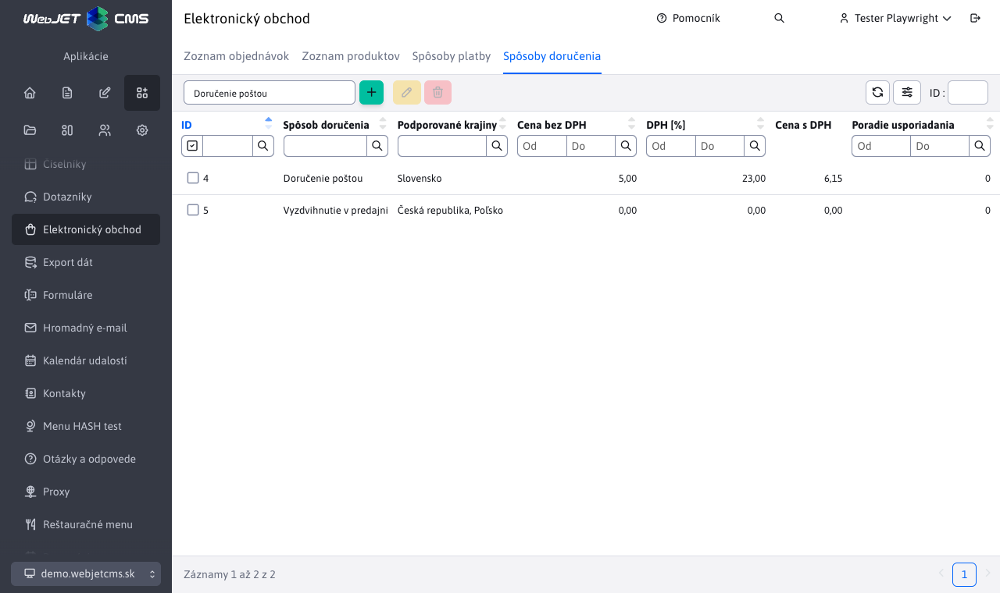

# Spôsoby doručenia

Aplikácia Spôsoby doručenia umožňuje nastaviť podporované spôsoby doručenia pre jednotlivé krajiny.



## Konfigurácia spôsobu doručenia

Každý spôsob doručenia má minimálne tieto polia:

- **Spôsob doručenia**, nezmeniteľná hodnota reprezentujúca typ spôsobu doručenia. Podporované spôsoby doručenia sú definované programátorsky.
- **Názov**, názov zobrazený zákazníkovi počas objednávky. Môžete zadať prekladový kľúč. Ak ponecháte prázdne, použije sa spôsob doručenia.
- **Podporované krajiny**, výber krajiny (alebo viacerých krajín), pre ktorú bude tento spôsob doručenia dostupný. Zoznam podporovaných krajín sa dá nastaviť konfiguračnou premenou `basketInvoiceSupportedCountries`.
- **Cena bez DPH**, hodnota predstavujúca cenu doručenia bez DPH
- **DPH `[%]`**, hodnota predstavujúca sadzbu DPH v percentách
- **Cena s DPH**, hodnota predstavujúca cenu doručenia s DPH (vypočítaná automaticky na základe ceny bez DPH a sadzby DPH)
- **Poradie usporiadania**, číselná hodnota k usporiadaniu spôsobu doručenia v elektronickom obchode.


Editor **môže obsahovať aj ďalšie polia**, v závislosti od implementácie konkrétneho spôsobu doručenia.

!> Voľbu spôsobu doručenia pri vytváraní nového záznamu, robíte pomocou rozbaľovacieho zoznamu v ľavo hornom rohu stránky.

## Validácia spôsobu doručenia

Musíte zvoliť aspoň jednu krajinu, pre ktorú bude tento spôsob doručenia dostupný.

Aj pri vytváraní/úprave záznamu spôsobu doručenia nezadáte hodnotu do poľa **Cena bez DPH** alebo **DPH `[%]`**, automatický sa doplní hodnota 0, čiže doručenie bude zadarmo.

## Nový typ spôsobu doručenia

Zadefinovanie nového spôsobu (typu) doručenia je možné naprogramovaním ```BackeEnd``` funkcionality. Bližšie informácie [pre programátora](../../../../custom-apps/apps/eshop/delivery-methods/README.md).