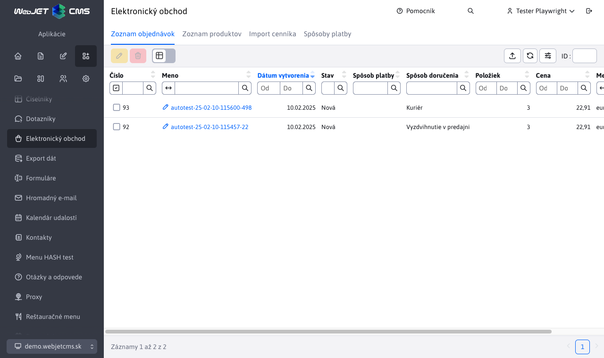
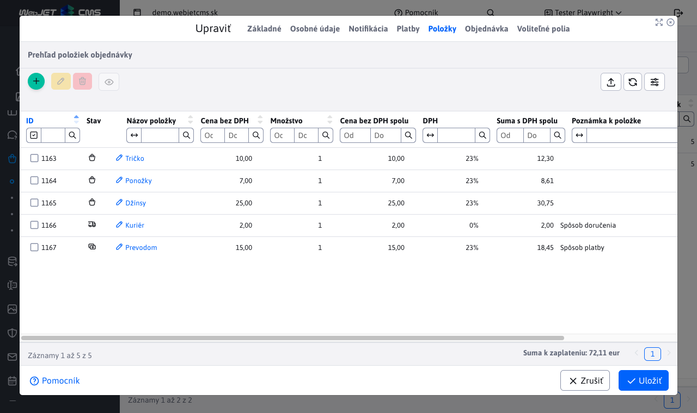
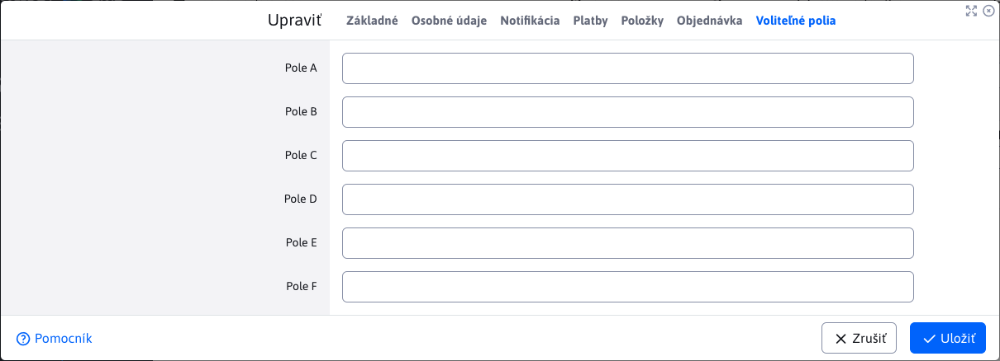

# Zoznam objednávok

Aplikácia Zoznam objednávok poskytuje prehľad všetkých vytvorených objednávok pomocou elektronického obchodu, s možnosťou ich spravovania.

Aplikácia neumožňuje pridávanie nových objednávok pomocou vytvorenia/duplikovania/importovania. Povolené akcie sú iba úprava/mazanie/exportovanie.

Môžete si všimnúť, že stĺpce **Meno** a **Priezvisko** majú niektoré hodnoty kombinované. Prvá hodnota **vždy** zobrazuje meno ako kontakt (fakturačné meno). Druhé meno v zátvorke sa zobrazí, iba ak bola zadaná adresa doručenia, ktorá je iná ako fakturačná. Nakoľko fakturačné meno a meno pre doručenie sa môžu líšiť. Pri filtrovaní sa hľadá zhoda pre obe tieto hodnoty. To isté platí aj u stĺpca priezvisko.

## Úprava objednávky

Okno pre úpravu objednávky pozostáva z kariet:
- Základné
- Osobné údaje
- Notifikácia
- Platby
- Položky
- Zobrazenie objednávky
- Voliteľné polia

### Karta - Základné

Poskytuje základné informácie o objednávke.

Dôležitý je parameter **Stav**, ktorý indikuje aktuálny stav objednávky, v ktorom sa práve nachádza.

Zobrazené stavy sú automatický dostupné. Ak si želáte pridať nové stavy, môžete tak urobiť pomocou konfiguračnej premennej `basketInvoiceBonusStatuses`. Nový status pridáte ako hodnotu id_statusu|prekladový_kľúč.

!>**Upozornenie:** hodnota id_statusu musí byť rovná alebo väčšia ako číslo 10. Pridané statusy s menšou hodnotou ako 10 budú od-ignorované.

Ak zvolíte možnosť **Odoslať notifikáciu klientovi**, tak notifikácia bude odoslaná pri uložení upravovanej objednávky (prehľad notifikácie v nasledujúcej kapitole).

### Karta - Osobné údaje

Poskytuje prehľad o **adrese doručenia** ako aj **kontaktné informácie** kupujúceho. Hodnoty sú získané z formuláru pri vytváraní objednávky v elektronickom obchode.

### Karta - Notifikácia

Poskytuje náhľad emailovej notifikácie na zákazníka, s možnosťou zmeny textu. Notifikácia sa odošle len v prípade zvolenia možnosti **Odoslať notifikáciu klientovi** v karte Základné.

**Odosielateľ** - automatický vyplnená hodnota s emailom aktuálne prihláseného používateľa. Slúži ako email odosielateľa notifikácie a je možné túto adresu zmeniť.
**Predmet** - automatický vyplnená hodnota s textom **Zmena stavu objednávky (id objednávky)**. Slúži ako predmet odoslaného emailu (notifikácie) a je možné ju zmeniť.

**Text notifikácie** - telo/text odoslaného emailu.
Hodnota `{STATUS}` bude pri odoslaní nahradená aktuálnym stavom objednávky.
Hodnota `{ORDER_DETAILS}` na nahradí celkovým prehľadom objednávky, ktorý nájdete v časti [Karta - Zobrazenie objednávky](#karta-zobrazenie-objednávky).

### Karta - Platby

Poskytuje [prehľad všetkých platieb](payments.md) k tejto objednávke (vo forme vnorenej tabuľky) a možnosť správy platieb.

### Karta - Položky

Poskytuje prehľad [všetkých položiek objednávky](items.md) a možnosť správy položiek.

### Karta - Zobrazenie objednávky

Poskytuje celkový prehľad objednávky, vrátane platieb a položiek. Tento prehľad **nie je možné upravovať**, slúži iba na informačné účely. Taktiež sa tento prehľad vloží do odoslanej [notifikácie](#karta-notifikácia) používateľovi, ako náhrada hodnoty `{ORDER_DETAILS}`.

Pri zmene hodnôt [platieb](#karta-platby) alebo hodnôt [položiek](#karta-položky) sa sa tento prehľad objednávky obnoví a poskytuje tak vždy aktuálne informácie.

### Karta Voliteľné polia

V karte Voliteľné polia môžete nastavovať hodnoty polí podľa potrieb vašej implementácie.

## Zmena stavu objednávky

Ak objednávke bola pridaná platba (alebo viacero platieb), ktorá **nepokrýva celkovú sumu objednávky** k uhradeniu, tak sa stav objednávky na pozadí automatický nastaví na hodnotu **Čiastočne zaplatená**.

Ak objednávke bola pridaná platba (alebo viacero platieb), ktorá **pokrýva celkovú sumu objednávky** k uhradeniu, tak sa stav objednávky na pozadí automatický nastaví na hodnotu **Zaplatená**.

## Vymazanie objednávky

Ak chcete vymazať objednávku, je potrebné najskôr zmeniť stav na **Stornovaná**. Po vymazaní sa automaticky vymažú aj súvisiace platby a položky objednávky.