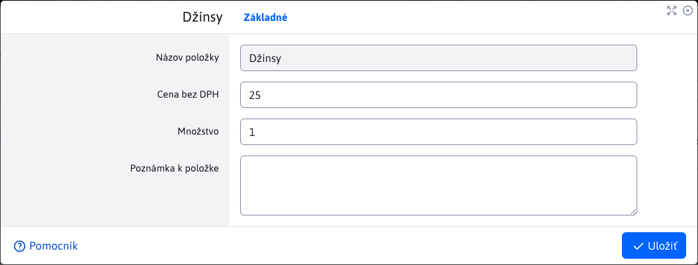

# Položky

Vnorená tabuľka Položky v detaile objednávky poskytuje prehľad položiek konkrétnej objednávky, počet kusov ako aj jednotlivú alebo celkovú cenu. Uvádzané sú ceny bez a vrátane DPH.

Umožnené sú len operácie pre úpravu a mazanie položiek objednávky. Pridávanie nových položiek je možné iba priamo v elektronickom obchode.

# Úprava položky

Okno editora položiek ponúka možnosť zmeny iba jediného parametra a to **Množstvo** kusov danej položky. Typ položky ako aj cena bez DPH sú fixné a nie je možné ich zmeniť.

## Pätička tabuľky

Pätička tabuľky obsahuje užitočnú informáciu o tom, aká je celková suma objednávky k uhradeniu, vrátane DPH. Ak sa počet položiek zmení alebo je nejaká položka vymazaná, táto hodnota sa automatický upraví.

Táto zmena sa automatický prejaví aj pätičke tabuľky [platby](./payments.md#pätička-tabuľky).