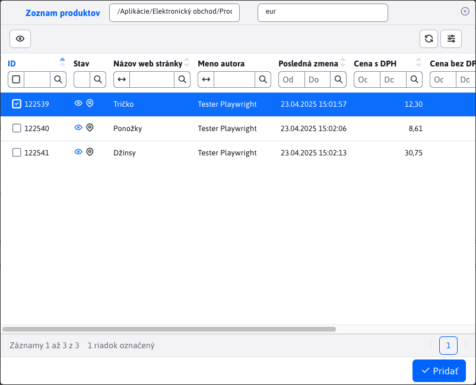

# Položky

Vnorená tabuľka **Položky** v detaile objednávky poskytuje prehľad položiek konkrétnej objednávky, počet kusov ako aj jednotlivú alebo celkovú cenu. Uvádzané sú ceny bez a vrátane DPH.

## Stav položiek

Nakoľko medzi položky objednávky sa ráta aj zvolený spôsob platby a zvolený spôsob doručenia, stĺpec **Stav** rozoznáva jednotlivé typy položiek nasledovnými ikonami:

- <i class="ti ti-shopping-bag"></i> - objednaná položka z obchodu
- <i class="ti ti-truck-delivery"></i> - zvolený spôsob doručenia
- <i class="ti ti-cash"></i> - zvolený spôsob platby

## Pridanie položiek

Pri pridaní položiek sa nám v okne zobrazí celá sekcia [Zoznam produktov](../product-list/README.md). V tomto okne môžete vykonávať klasické filtrovanie, ale akákoľvek úprava nie je povolená. Povolené je len tlačidlo  <button class="btn btn-sm btn-outline-secondary" type="button"><i class="ti ti-eye"></i></button>  pre zobrazenie stránky produktu.

Pre pridanie produktov ich musíte označiť a svoju voľbu potvrdiť tlačidlom <button class="btn btn-primary"><i class="ti ti-check"></i> Pridať</button>. Ak tento produkt/položka v objednávke ešte nebola, bude pridaná. Ak sa v objednávke tento produkt/položka už nachádza, len sa zvýši množstvo o hodnotu `1`.

## Úprava položky

Okno editora položiek ponúka možnosť zmeny poli **Cena bez DPH**, **Množstvo**, **Poznámka k položke**. Takto viete v objednávke zmeniť množstvo položiek alebo ak položka poškodená, dať na ňu zľavu atď.

## Pätička tabuľky

Pätička tabuľky obsahuje užitočnú informáciu o tom, aká je celková suma objednávky k uhradeniu, vrátane DPH. Ak sa počet nejaká položka pridá, upraví alebo vymaže, hodnota sa automaticky upraví.

Táto zmena sa automatický prejaví aj pätičke tabuľky [platby](./payments.md#pätička-tabuľky).

!>**Upozornenie:** ak robíte úpravy v zozname položiek mali by ste pre túto objednávku **Odoslať notifikáciu klientovi** , nakoľko zmena ceny k zaplateniu môže zmeniť aj stav celej objednávky.