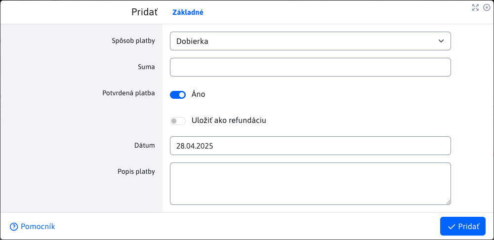
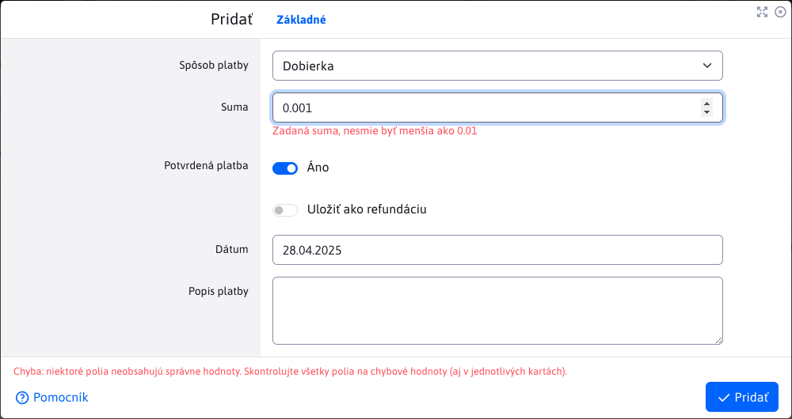
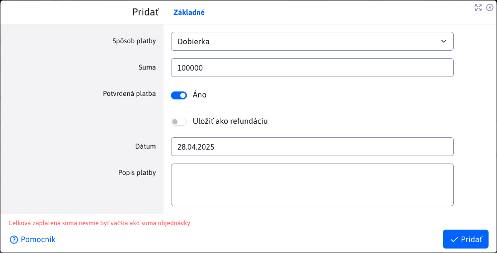

# Platby

Vnorená tabuľka Platby v detaile objednávky poskytuje prehľad platieb ku konkrétnej objednávke. Nad touto tabuľkou sú možné všetky operácie s dátami.

Požadovaná suma objednávky nemusí byť zaplatená naraz, ale môže byť zaplatená v jednotlivých platbách, čo je dôvod prečo sú platby vedené v samostatnej tabuľke.

## Pridanie/úprava platieb

Okno editora platieb obsahuje iba niekoľko parametrov.

**Dátum**, automatický nastavený aktuálny dátum, kedy je platba vytváraná. Táto hodnota sa nedá zmeniť a pri úprave ostáva nezmenená.

**Spôsob platby**, poskytuje na výber nasledujúce možnosti.

**Suma**, suma platby k objednávke. Zadaná suma má svoje obmedzenia.

Zadaná suma nemôže byť menšia ako 0.01.

Súčet všetkých platieb, alebo jedna samostatná platba nesmie byť väčší ako celková suma objednávky k úhrade.

## Pätička tabuľky

Pätička tabuľky obsahuje užitočnú informáciu o tom, koľko z celkovej sumy objednávky je už reálne uhradené a aj to, aká je tá celková cena objednávky. Používateľ má tak prehľad, koľko ešte musí zaplatiť alebo či už je všetko zaplatené.

Informácia v pätičke sa automatický mení v čase pri každej úprave platby, alebo [položky](./items.md#pätička-tabuľky).