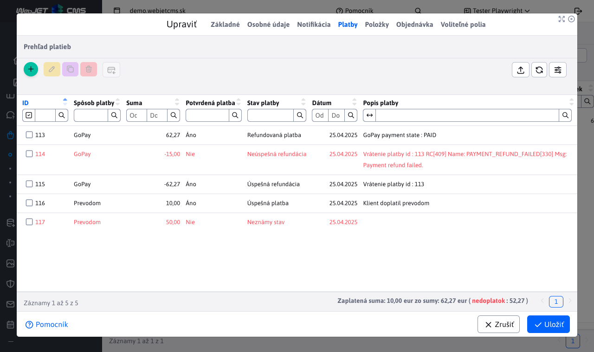
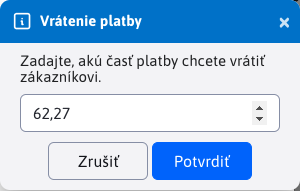
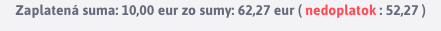

# Platby

Vnorená tabuľka **Platby** v detaile objednávky poskytuje prehľad platieb ku konkrétnej objednávke.

Požadovaná suma objednávky nemusí byť zaplatená naraz, ale môže byť zaplatená v jednotlivých platbách, niektoré platby môžu byť refundované alebo čakajúce na schválenie, čo je dôvod prečo sú platby vedené v samostatnej tabuľke.



## Stav platby

Stavy platby je automaticky nastavovaná hodnota, ktorá môže nadobudnúť stavy:

- **Neúspešná platba**, platba ktorá bola vytvorená ale nepodarila sa, napríklad kvôli problému s platobnou bránou.
- **Úspešná platba**, úspešne spracovaná platba.
- **Úspešná refundácia**, úspešná refundácia existujúcej platby alebo refundácia sumy.
- **Neúspešná refundácia**, neúspešná refundácia inej existujúcej platby.
- **Refundovaná platba**, platba, ktorá bola úspešne refundovaná v plnej sume.
- **Čiastočne refundovaná platba**, platba, ktorá bola úspešne refundovaná iba z časti (nie je ešte plne refundovaná).
- **Neznámy stav**, platba je v neznámom stave. Napríklad ručne vytvorená platba, ktorá ešte len nie je potvrdená.

## Akcie nad platbami

Akcie pridania/úpravy/mazania sú povolené, iba ak ich povolí programátor, ktorý pridával platobnú metódu do systému. V niektorých prípadoch, môže programátor túto voľbu pridať do konfigurácie [spôsobu platby](../payment-methods/README.md), napríklad ako u spôsobu platby ```GoPay```, kde je táto možnosť označená ako **Umožniť administrátorovi editáciu platieb**.

## Pridanie platby z aplikácie

Po vytvorení objednávky v aplikácií **Elektronický obchod**, môže nastať jedna z týchto situácií, podľa toho, aký spôsob platby bol vybraný:

- **platba sa automaticky vytvorí**, v prípade, že zvolený spôsob platby neimplementuje platobnú bránu (ako naríklad spôsoby platby **dobierka** alebo **prevod**). K danej objednávke sa automaticky vytvorí záznam platby daným spôsobom. Tento záznam platby je v plnej cene objednávky a je prednastavený ako **nepotvrdená platba**. To znamená, že táto platba má **Neznámy stav** a nepočíta sa medzi úspešné platby. Je potom na na Vás, aby ste overili, či bola suma zaplatená a následne označili platbu v administrácií ako  **potvrdená platba**.

!>**Upozornenie:** nakoľko takéto platby vyžadujú manuálnu zmenu stavu v administrácií, ubezpečte sa, že implementácia spôsobu platby umožňuje editáciu v administrácií.

- **platba sa automaticky nevytvorí**, v prípade, že zvolený spôsob platby implementuje platobnú bránu. Poskytne Vám možnosť túto objednávku okamžite zaplatiť. Je na Vás, či sa to rozhodnete zaplatiť okamžite alebo neskôr. Všetky úspešné ako aj neúspešné pokusy o zaplatenie objednávky (cez platobnú bránu) zvoleného spôsobu platby sa automaticky uložia. Takže sú v tabuľke platby viditeľné.

!>**Upozornenie:** nakoľko platba cez implementovanú platobnú bránu je automatizovaný proces nastavený programátorom, silne doporučujeme **nepovoliť** editáciu platby v administrácií pre daný spôsob platby.

## Pridanie platby z administrácie

V ideálnom prípade, nebude potrebné pridávanie novej platby cez administráciu, ale iba jej úpravu alebo refundáciu. Avšak, ručné pridanie novej platby je dostupné a má parametre:

- **Spôsob platby**, poskytuje na výber dostupné spôsoby platby, ktoré sú **nakonfigurované**.
- **Suma**, zaplatená suma objednávky. Zadaná suma má svoje [obmedzenia](./payments.md#obmedzenie-sumy).
- **Potvrdená platba**, potvrdenie, že platba bola úspešne vykonaná/prijatá. Pred-nastavene je platba potvrdená.
- **Uložiť ako refundáciu**, uložiť platbu ako [refundačnú platbu](./payments.md#refundačná-platba).
- **Dátum**, automatický nastavený aktuálny dátum, kedy je platba vytváraná (dá sa zmeniť).
- **Popis platby**, dobrovoľný popis k platbe, ktorý slúži ako bonusové informačné pole. Napr. prečo sa platba nepodarila, alebo akú platbu táto refunduje.


!>**Upozornenie:** daný spôsob platby musí podporovať [akcie nad platbami](./payments.md#akcie-nad-platbami).

### Obmedzenie sumy

Zadaná suma nesmie byť menšia, ako povolené minimum `0.01`.


Celková zaplatená suma nesmie byť väčšia, ako je celková suma objednávky. Pri pridávaní platby cez administráciu, sa kontroluje súčet súm z platieb, vrátane, práve pridávanej platby.


Počítajú sa iba sumy platieb, ktoré sú:

- potvrdené platby
- platby s úspešným stavom:
  - **Úspešná platba**
  - **Úspešná refundácia**
  - **Čiastočne refundovaná platba**
  - **Refundovaná platba**

Ak platba pri vytváraní **nie je** označená ako **potvrdená**, validácia zadanej sumy sa nekoná. Vykoná sa až pri úprave, keď sa označí za potvrdenú.

### Stav vytváranej platby

Vytváraná platba cez administráciu môže nadobudnúť stav:

- **Úspešná platba**, ak vytváraná platba má platnú sumu a je označená ako **potvrdená platba**
- **Neznámy stav**, ak vytváraná platba **nie je** označená ako **potvrdená platba**
- **Úspešná refundácia**, ak ide o úspešne vytvorenú [refundačnú platbu](./payments.md#refundačná-platba).

## Refundácia platby

Refundácia platby slúži k vráteniu čiastočnej alebo plnej sumy existujúcej platby. K refundácií slúži tlačidlo <button class="btn btn-sm btn-outline-secondary" type="button"><span><i class="ti ti-credit-card-refund"></i></span></button>. Platba sa dá refundovať iba ak:

- refundácia tohto typu platby je povolená v anotácií `@PaymentMethod` a je riadne implementovaná (napr cez platobnú bránu). Viac sa dočítate v časti [spôsoby platby](../../../../custom-apps/apps/eshop/payment-methods/README.md).
- platba je **potvrdená**
- refundujete sumu menšiu rovnú ako zostatková suma platby, ktorá ešte nebola refundovaná
- platba je v stave:
  - **Úspešná platba**
  - **Čiastočne refundovaná platba**

### Priebeh refundácie

Označíte platbu (iba jednu), ktorú chcete refundovať. Následne stlačíte tlačidlo <button class="btn btn-sm btn-outline-secondary" type="button"><span><i class="ti ti-credit-card-refund"></i></span></button> na refundáciu. Zobrazí sa dialóg, kde musíte zadať sumu, ktorú chcete refundovať. Pred-nastavená je celá suma platby. Môžete refundovať naraz celú platbu, alebo iba časť platby. Po zadaní sumy pokračuje stlačením tlačidla <button type="button" class="btn btn-primary">Potvrdiť</button>



Následne môže nastať jedna z nasledujúcich situácií.

**Neplatná refundácia**

Pokúsili ste sa refundovať platbu, ktorá nie je v dobrom stave, nemá povolenú refundáciu alebo ste refundovali zlú sumu (atď). V takom prípade sa vráti len chybová hláška, ktorá Vás upozorní prečo sa platba nedá refundovať.


**Refundácia zlyhala**

Refundovali ste povolenú platbu aj správnu sumu, ale refundácia sa nepodarila. Chyba sa napríklad mohla stať na strane platobnej brány, ktorá sa starala o žiadosť k refundácií platby. V takomto prípade, sa do tabuľky vloží záznam o neúspešnej refundácií, čiže platba v stave **Neúspešná refundácia**. Automatický je táto platba označená ako **nepotvrdená** a v poli **popis platby** bude aj chybová hláška. Formát hlášky sa môže meniť v závislosti od spôsobu platby a toho, ako túto platbu implementoval programátor.


**Refundácia sa podarila**

V prípade, že všetky podmienky boli splnené a pri procese refundácie nenastála žiadna chyba. Do tabuľky platieb bude automatický pridaná platba v stave **Úspešná refundácia**. Všimnite si, že **suma refundácie má zápornú hodnotu**, nakoľko sme odoberali zo zaplatenej sumy. V závislosti od implementácie refundovaného spôsobu platby, môže pole **popis platby** obsahovať aj bonusové informácie, ako `id` refundovanej platby.

Platba ktorú ste refundovali, nadobudne stav **Refundovaná platba** alebo **Čiastočne refundovaná platba**, podľa toho či ste je refundovali celú alebo iba čiastočne. Ak platbu refundujete na viackrát, každá refundácia bude mať svoju reprezentáciu vo forme platby so stavom **Úspešná refundácia** (ak sa podarila).


!>**Upozornenie:** súčet refundovanej sumy platby, nesmie byť väčší ako suma samotnej platby.

## Refundačná platba

Nakoľko nie všetky spôsoby platby sa dajú refundovať automatizovane, tabuľka platieb umožňuje manuálne pridanie refundačnej platby. Rozdiel oproti klasickej refundácií je ten, že táto refundačná platba neovplyvní už existujúcu platbu. Prakticky je to iba záznam, ktorý hovorí že nejaká suma bola refundovaná, ale nehovorí že konkrétna platba bola refundovaná.

### Pridanie refundačnej platby

Refundačná platba sa pridáva ako klasická platba, ale sú tu 2 hlavné rozdiely:

- musí byť zvolená možnosť **Uložiť ako refundáciu**
- hodnota poľa **Suma** musí byť záporná (minimálna suma refundácie je `-0.01`)


Ak refundačnú platbu uložíte ako **potvrdenú platba** stav tejto platby bude **Úspešná refundácia** inak bude stav nastavený ako **Neznámy stav**. Odporúčame pridať bonusové informácie o tejto akcií do poľa **Popis platby**.

!>**Upozornenie:** Ako aj pri klasických platbách, aj tu je obmedzenie zadanej sumy. Nemôžete refundovať viac, ako je celková zaplatená suma.

## Pätička tabuľky

Pätička tabuľky obsahuje užitočnú informáciu o tom, koľko z celkovej sumy objednávky je už reálne uhradené a aj to, aká je tá celková cena objednávky. Používateľ má tak prehľad, koľko ešte musí zaplatiť alebo či už je všetko zaplatené. Počítajú sa iba platby a refundácie, ktoré sú **potvrdené**.



Informácia v pätičke sa automatický mení v čase pri každej úprave platby, alebo [položky](./items.md#pätička-tabuľky).

!>**Upozornenie:** ak robíte úpravy v **Prehľade platieb**, mali by ste pre túto objednávku **Odoslať notifikáciu klientovi**, nakoľko zmena ceny k zaplateniu môže zmeniť aj stav celej objednávky.