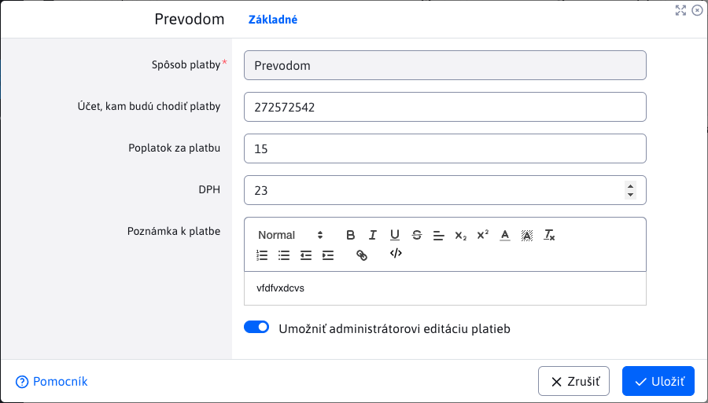
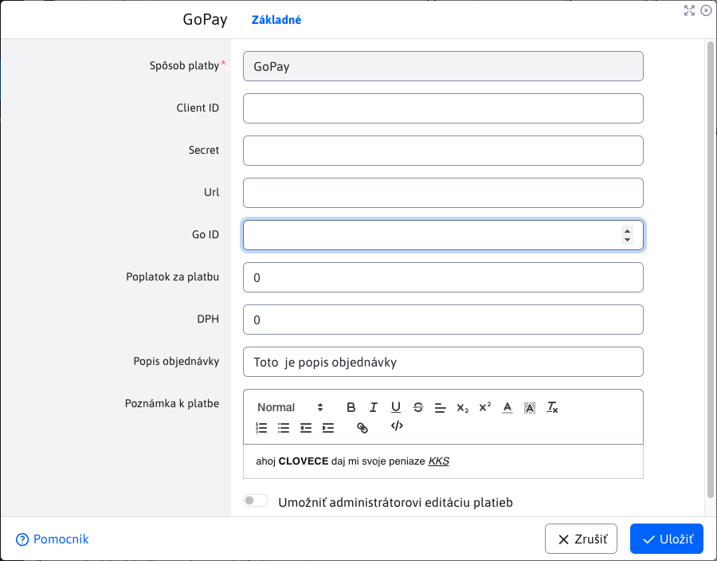

# Spôsoby platby

Aplikácia Spôsoby platby umožňuje nakonfigurovať dostupné spôsoby platieb. Základnými stĺpcami tabuľky je iba názov platby a stav, či je daná platba nakonfigurovaná.


## Vytváranie / duplikovanie spôsobu platby

Vytváranie nových spôsobov platieb (alebo ich duplikovanie) nie je možné cez používateľské rozhranie, je možné iba naprogramovaním ```BackeEnd``` funkcionality. Bližšie informácie [pre programátora](../../../../custom-apps/apps/eshop/payment-methods/README.md).

## Úprava/konfigurácia spôsobu platby

Táto aplikácia je špeciálna v tom, že editor každej platby môže vyzerať úplne inak, nakoľko každá platobná metóda môže vyžadovať iné vstupné hodnoty (ich počet, typ, formát ...). Napríklad pri platbe typu **Prevodom**, vyzerá editor takto:



zatiaľ čo pri platbe typu [GoPay](https://www.gopay.com), vyzerá editor takto:



## Mazanie spôsobu platby

Mazanie nie je možné, v pravom slova zmysle. Samotný spôsob platby sa v tabuľke bude **vždy zobrazovať**, a to aj po jeho vymazaní. Akciou vymazania sa iba odstráni nastavená konfigurácia (hodnoty z editora). Môžete si to všimnúť na hodnote stĺpca stav. Ak bol spôsob platby **nakonfigurovaný**, po vymazaní sa zmení jeho stav na  **nie je nakonfigurovaný**.