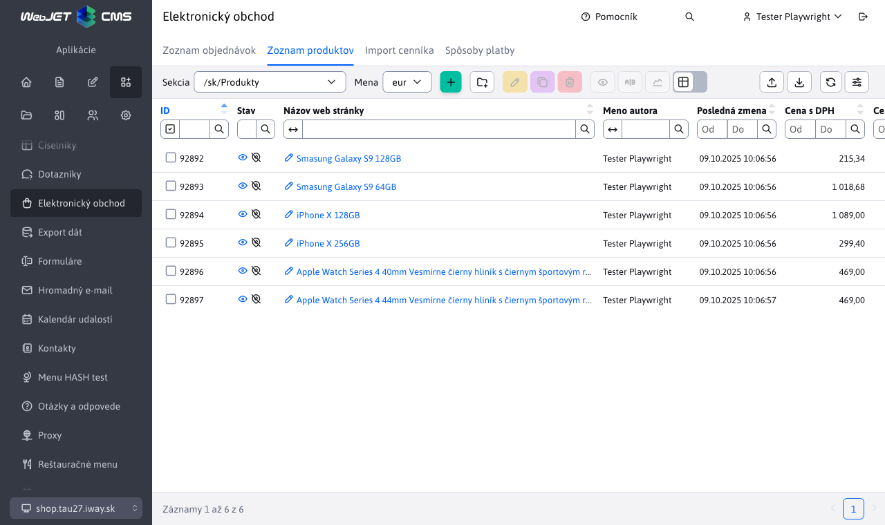
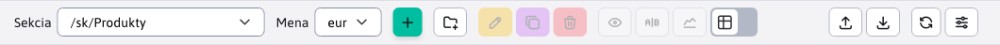
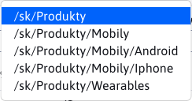
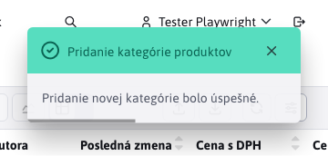

# Zoznam produktov

Aplikácia Zoznam produktov poskytuje prehľad a správu dostupných produktov pre elektronický obchod.

Zobrazené produkty sú filtrované podľa zvolenej **kategórie produktov**.  Takáto kategória produktov je reprezentovaná priečinkom. V ľavom hornom rohu aplikácie sa nachádza filter kategórie  čím sa vlastne od-filtrujú dáta pre daný priečinok ale aj všetky pod-priečinky.

Dostupne priečinky reprezentujúce kategórie sú usporiadané do tzv. stromu, kde pod-priečinky sú vždy po príslušným rodičovským priečinkom.

Hodnoty vo výberovom poli sekcie v hlavičke sa generujú:

- automaticky - ak je konf. premenná `basketAdminGroupIds` nastavená na prázdnu hodnotu získa sa zoznam ID priečinkov s novinkami vyhľadávaním výrazu `%!INCLUDE(/components/eshop/%", "%!INCLUDE(/components/basket/%", "%product-list.jsp%", "%products.jsp%"` v telách stránok.
- podľa konf. premennej `basketAdminGroupIds`, kde je možné zadať čiarkou oddelený zoznam ID priečinkov, napr. `17,23*,72`, pričom ak ID priečinka končí na znak `*` načítajú sa pri výbere aj produkty (web stránky) z pod priečinkov.

## Pridanie novej kategórie produktov

Pridaním novej kategórie sa vytvorí pod-priečinok, ktorý bude umiestnený pod práve zvolený priečinok (kategóriu).

Príklad.
Ak máme práve zvolený priečinok  a vytvoríme nový s názvom **Android**, tak nám vznikne nový priečinok na adrese  

Nový priečinok pridáme tlačidlom <button class="btn btn-sm btn-outline-secondary" type="button"><i class="ti ti-folder-plus"></i></button>. Po jeho stlačení sa zobrazí okno pre pridanie priečinka

Okno obsahuje aj informáciu o tom, pod aký priečinok sa tento nový vytvorí. Po (ne)vyplnení poľa v okne a potvrdenia tlačidlom <button class="btn btn-primary" type="button">Potvrdiť</button> môžu nastať štyri situácie:

- ak názov novej kategórie nebude zadaný, vytvorenie sa nepodarí a zobrazená bude hláška

- ak názov novej kategórie nebude unikátny (unikátny pre daný priečinok), vytvorenie sa nepodarí a zobrazená bude hláška

- ak nastane iná chyba, zobrazená bude hláška

- ak všetko prebehne úspešne

## Správa produktov

Produkty sú reprezentované stránkami, ktoré môžete pridávať pod konkrétne kategórie. Nadradený priečinok sa v stránke automatický pred-nastaví podľa aktuálne zvolenej kategórie (ale je možné ho zmeniť). Nad produktami (stránkami) je možné robiť všetky operácie ako vytvoriť/upraviť/klonovať/importovať ...

## Dôležité nastavenia

### Karta **Perex**

V karte **Perex** je dôležité nastavenie:

- hodnoty **Obrázok**. Tento obrázok sa zobrazí v elektronickom obchode ako náhľad produktu.

- hodnoty **Značky**. Pomocou týchto značiek sa v elektronickom obchode produkty dajú ľahko filtrovať.

### Karta Atribúty

V karte atribúty využijeme výber skupiny telefónu na špecifikácií tovaru. Ako je to viditeľné na obrázku nižšie, pre skupinu `iPhone X` je možné nastavenie farby a pamäťovej varianty zariadenia. Tieto výberové polia sa zobrazujú v elektronickom obchode, pri detaile produktu.

Viac o atribútoch sa dočítate v časti [Atribúty stránky](../../../webpages/doc-attributes/README.md).

