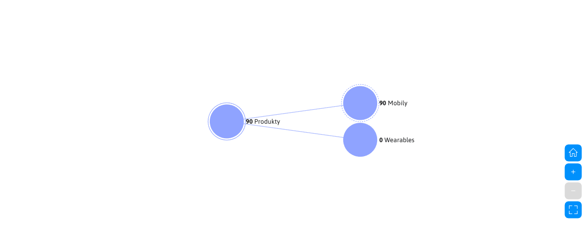

# Štatistiky

Karta **Štatistiky** poskytuje prehľad o objednávkach, tržbách a predaji produktov v elektronickom obchode. Štatistiky sa počítajú samostatne pre aktuálne zvolenú doménu.

## Filtrovanie

V hlavičke stránky môžete použiť tieto filtre:

- **Stav** - výber jedného alebo viacerých stavov objednávky. Ak nie je zvolený žiadny stav, spracujú sa všetky objednávky.
- **Mena** - mena, v ktorej sa zobrazia finančné hodnoty. Objednávky vedené v iných menách sa prepočítajú do zvolenej meny.
- **Obdobie** - dátumový rozsah vytvorenia objednávok. Môžete zadať iba dátum od alebo iba dátum do. Naposledy použitý rozsah sa uloží v prehliadači a zdieľa so štatistikou návštevnosti. Ak obdobie nie je zadané, použije sa posledných 30 dní.

Po zmene filtra sa automaticky prepočítajú všetky súhrnné ukazovatele a grafy.

## Súhrnné ukazovatele

Prvý riadok zobrazuje základné údaje o predaji:

- **Počet faktúr** - počet objednávok zodpovedajúcich zvoleným filtrom.
- **Priemerná hodnota faktúry** - priemerná hodnota nestornovaných objednávok s DPH.
- **Predané produkty** - celkový počet predaných kusov produktov.
- **Priemerný počet produktov na faktúru** - priemerný počet predaných kusov v jednej nestornovanej objednávke.

Druhý riadok obsahuje finančný prehľad:

- **Celková hodnota faktúr** - súčet nestornovaných objednávok s DPH.
- **Poplatky za doručenie** - celková hodnota poplatkov za zvolené spôsoby doručenia.
- **Poplatky za platobné metódy** - celková hodnota poplatkov za použité platobné metódy.
- **Tržby bez poplatkov za doručenie a platbu** - hodnota objednávok po odpočítaní oboch typov poplatkov.

!>Finančné hodnoty, predané produkty a priemerné hodnoty nezahŕňajú stornované objednávky. Stornované objednávky zostávajú zahrnuté v počte faktúr a v grafoch rozdelenia objednávok.

## Grafy

Pod súhrnnými ukazovateľmi sú dostupné grafy:

- **Vývoj tržieb** - vývoj tržieb v čase s DPH aj bez DPH.
- **Najpredávanejšie produkty** - desať produktov s najvyšším počtom predaných kusov.
- **Stavy faktúr** - rozdelenie objednávok podľa ich aktuálneho stavu.
- **Spôsoby doručenia** - zastúpenie použitých spôsobov doručenia.
- **Platobné metódy** - zastúpenie použitých platobných metód.
- **Predaj podľa kategórií** - stromové zobrazenie predaja podľa kategórií produktov.

## Predaj podľa kategórií

Strom kategórií začína koreňovým uzlom **Produkty** a zobrazuje iba kategórie, v ktorých sú evidované produkty elektronického obchodu. Systémové priečinky a položky spôsobov dopravy sa v strome nezobrazujú.

Hodnota uzla predstavuje počet predaných kusov v kategórii vrátane jej podkategórií. Hodnota a názov kategórie sa zobrazujú vedľa kruhového uzla, aby zostali dobre čitateľné. Kategórie bez predaja v zvolenom období zostávajú v strome zobrazené s hodnotou `0`. Ak sa produkty nachádzajú priamo v nadradenej kategórii, zobrazia sa v samostatnom uzle **Priamo v kategórii**.

Kliknutím na uzol môžete rozbaliť alebo zbaliť jeho podkategórie. Ovládacie prvky grafu umožňujú návrat na základné zobrazenie, priblíženie, oddialenie a maximalizovanie grafu na celú obrazovku. Dvojprstové posúvanie na touchpade posúva stránku; graf sa približuje iba tlačidlami alebo gestom pinch-to-zoom.

Pri veľkom počte kategórií sa zobrazí kompaktný strom s jednou rozbalenou úrovňou a menšími horizontálnymi rozostupmi. Priblížením sa zväčšia rozostupy medzi uzlami, pričom text zostane čitateľný; ďalšie časti stromu zobrazíte posunutím grafu alebo kliknutím na konkrétnu kategóriu.

