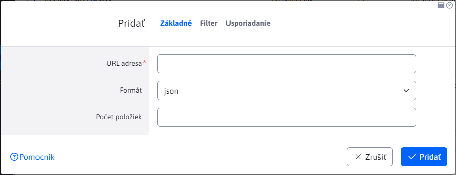

# Export dát

Aplikácia Export dát, umožňuje vytvoriť export noviniek/web stránok z WebJET CMS v rôznych formátoch JSON alebo XML/RSS. Export je možné použiť v externých web/mobilných aplikáciách.


Pri vytváraní/duplikovaní nového exportu je potrebné vyplniť povinné pole "URL adresa", ktoré definuje adresu, na ktorej bude export dostupný.

Ostatné polia sú podobné ako pri vkladaní zoznamu noviniek do web stránky. Nastavujú filtrovanie a usporiadanie zoznamu exportovaných dát.



Dáta je možné exportovať vo formátoch:

- JSON
- XML (formát pre RSS čítačku)
- `ud-ofngovcz` - export vo formáte pre `Úradní desku` v [OpenData ČR](https://ofn.gov.cz/úřední-desky/2021-07-20/) JSON formáte. Pri použití je potrebné definovať prekladové kľúče v CZ jazyku `components.ud-ofngovcz.url` s URL adresou stránky a `components.ud-ofngovcz.ico` s IČO mesta. Hodnota pre pole Agenda sa berie zo značky (perex skupiny), prílohy z médií stránky.

Ukážka exportu vo formáte json:

```json
[
    {
        "numberItems": 10,
        "total": 6,
        "urlAddress": "/export-dat/json/"
    },
    {
        "authorEmail": "web.spam@interway.sk",
        "authorId": 1,
        "authorName": "WebJET Administrátor",
        "available": true,
        "cacheable": false,
        "data": "HTML KOD",
        "dateCreated": 1612432841000,
        "disableAfterEnd": false,
        "docId": 21,
        "docLink": "/sk/novinky/web-stranka.html",
        "eventDate": 0,
        "eventDateString": "",
        "eventTimeString": "",
        "externalLink": "",
        "fieldA": "",
        "fieldB": "",
        "fieldC": "",
        "fieldD": "",
        "fieldE": "",
        "fieldF": "",
        "fieldG": "",
        "fieldH": "",
        "fieldI": "",
        "fieldJ": "",
        "fieldK": "",
        "fieldL": "",
        "fieldM": "",
        "fieldN": "",
        "fieldO": "",
        "fieldP": "",
        "fieldQ": "",
        "fieldR": "",
        "fieldS": "",
        "fieldT": "",
        "fileName": "/SK/Novinky",
        "footerDocId": -1,
        "forumCount": 0,
        "groupId": 24,
        "headerDocId": -1,
        "historyActual": false,
        "historyApprovedBy": 0,
        "historyId": 0,
        "htmlData": "",
        "htmlHead": "",
        "logonPageDocId": 0,
        "menuDocId": -1,
        "navbar": "Web stránka",
        "passwordProtected": "",
        "perexGroup": [
            "3",
            "1"
        ],
        "perexImage": "",
        "perexPlace": "",
        "publicable": false,
        "publishEnd": 0,
        "publishEndString": "",
        "publishEndTimeString": "",
        "publishStart": 1588512660000,
        "publishStartString": "03.05.2020",
        "publishStartStringExtra": "",
        "publishStartTimeString": "15:31",
        "requireSsl": false,
        "rightMenuDocId": -1,
        "searchable": true,
        "showInMenu": true,
        "sortPriority": 80,
        "syncDefaultForGroupId": "",
        "syncId": 0,
        "syncRemotePath": "",
        "syncStatus": 1,
        "tempId": 4,
        "tempName": "",
        "title": "Web stránka",
        "viewsTotal": 0,
        "virtualPath": "/sk/novinky/web-stranka.html"
    },
    {
        "authorEmail": "web.spam@interway.sk",
        "authorId": 1,
        "authorName": "WebJET Administrátor",
        "available": true,
        "cacheable": false,
        ...
    }
]
```

Ukážka exportu vo formáte XML (formát pre RSS čítačku):

```xml
<?xml version="1.0" encoding="UTF-8"?>
<rss xmlns:atom="http://www.w3.org/2005/Atom" version="2.0">
   <channel>
      <title>RSS Feed</title>
      <link>http://domena.sk/</link>
      <description />
      <language>sk</language>
      <pubDate>Tue, 16 Nov 2021 16:08:37 GMT</pubDate>
      <generator>WebJET Content Management</generator>
      <ttl>60</ttl>
      <urlAddress>/export-dat/xml/</urlAddress>
      <numberItems>10</numberItems>
      <image>
         <title>RSS Feed</title>
         <url>http://domena.sk/images/logo.gif</url>
         <link>http://domena.sk/</link>
      </image>
      <atom:link href="http://domena.sk/export-dat/xml/" rel="self" type="application/rss+xml" />
      <item>
         <guid>/sk/novinky/web-stranka.html</guid>
         <title><![CDATA[Web stránka]]></title>
         <link>http://domena.sk/sk/novinky/web-stranka.html</link>
         <description />
         <author>web.spam@interway.sk(WebJET Administrátor)</author>
         <pubDate>Sun, 03 May 2020 13:31:00 GMT</pubDate>
      </item>
      <item>
         ...
      </item>
   </channel>
</rss>
```

## Vlastný formát exportu

Ak potrebujete dáta exportovať v inom formáte stačí vytvoriť súbor `/components/INSTALL_NAME/export/meno.jsp` kde `INSTALL_NAME` je meno vašej inštalácie (konf. premenná `installName`). Odporúčame vychádzať z existujúcich JSP súborov a len upraviť potrebné hodnoty kľúčov.

Vytvorený súbor sa automaticky ponúkne ako možnosť typu exportu.

Pre JSP súbory, ktoré v názve obsahujú `rss` alebo `xml` (alebo ak URL adresa exportu končí na) sa nastaví HTTP hlavička `Content-Type` na `text/xml`, pre ostatné prípady sa nastaví `application/json`. V prípade potreby ale môžete v JSP súbore nastaviť hneď na začiatku špecifickú hodnotu volaním:

```java
sk.iway.iwcm.Encoding.setResponseEnc(request, response, "application/ld+json");
```