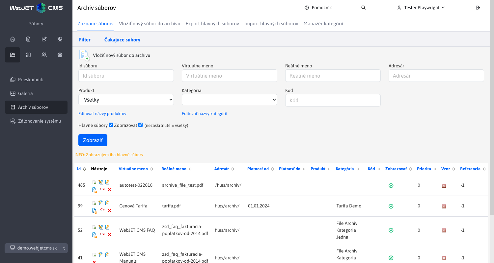
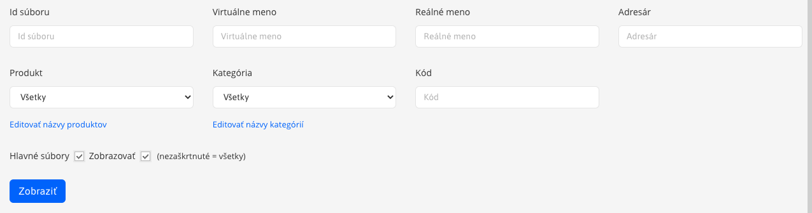
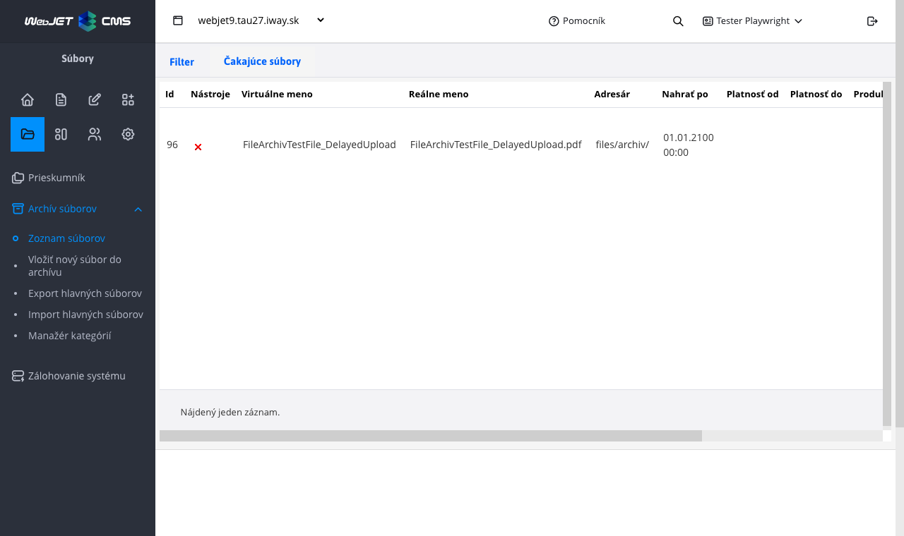
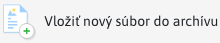
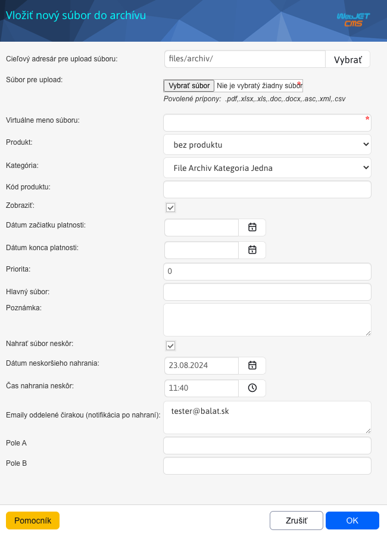
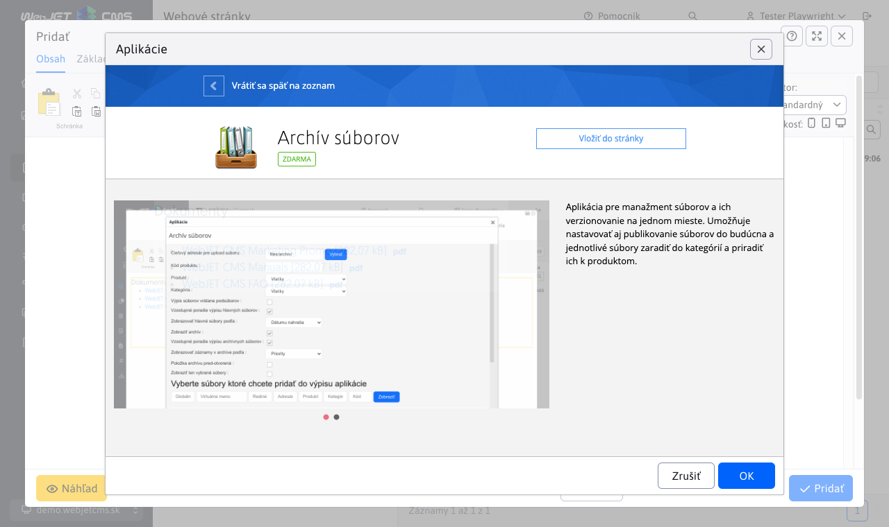
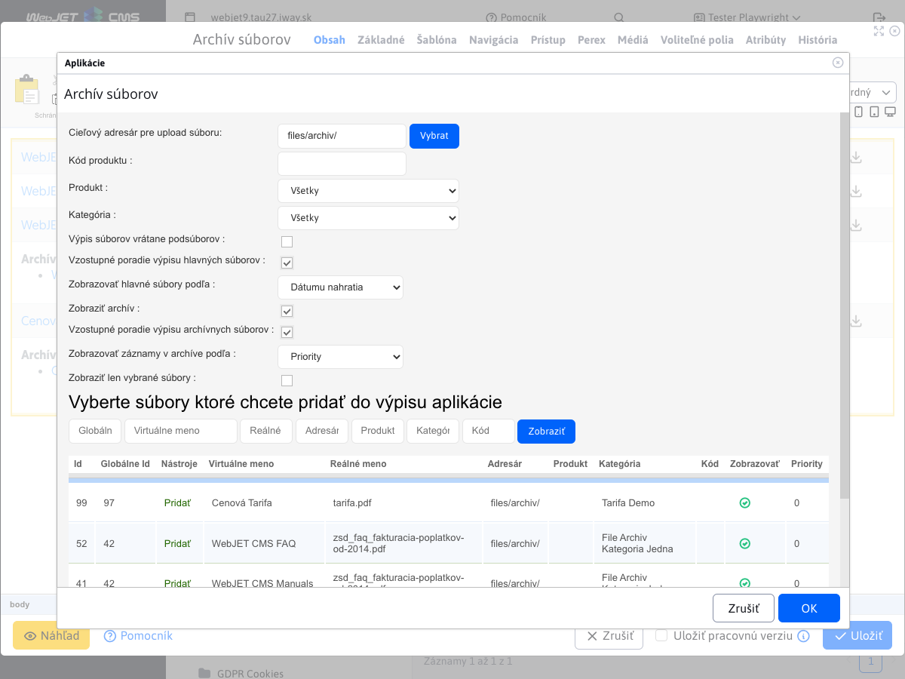

# Archív súborov

Aplikácia pre manažment súborov a ich verzií na jednom mieste. Umožňuje nastavovať aj publikovanie súborov do budúcna a jednotlivé súbory zaradiť do kategórií a priradiť ich k produktom.

## Zoznam súborov v archíve

V zobrazenom zozname vidíme všetky súbory, ktoré boli vložené do archívu súborov v aktuálne zvolenej doméne.

### Filtrovanie súborov

Cez filter môžete od-filtrovať zobrazené súbory na základe:

- **id súboru** - Jedinečné id súboru
- **Virtuálne meno** - Meno, ktoré sa zobrazí pri výpise súborov na stránke
- **Reálne meno** - Reálne meno súboru aj s príponou ( napr. Zmuva.pdf )
- **Adresár** - Adresár, v ktorom sa nachádza súbor
- **Produkt, Kategória, Kód** - Informácie ktoré ste si nastavili pri vkladaní súboru
- **Hlavné súbory** – zobrazené len hlavné súbory bez ich starších verzií
- **Zobrazovať** – zobrazené súbory, ktoré majú zobrazenie povolené

Filtrovať môžete pomocou viacerých podmienok naraz. Napr. produkt „ovocie“ kategória „jablko“ kód „2015“. Zobrazí sa vám zoznam súborov, ktoré budú spĺňať všetky tieto tri podmienky filtru (alebo sa nenájde žiaden vyhovujúci súbor).

### Akcie nad súbormi

Cez zoznam súborov môžeme nad vloženými súbormi vykonávať rôzne funkcie ako editáciu, premenovať, vymazať, či vkladanie aktuálnejšej verzie súboru, alebo vrátenie poslednej zmeny.
Funkcie nájdeme v stĺpci nástroje pri zázname súboru v archíve súborov:

- , **Nahrať novú verziu**, v prípade, že chcete nahrať novú (aktuálnu) verziu už nahraného súboru, tento nástroj vám to umožňuje. Po kliknutí sa Vám otvorí štandardné okno s nastaveniami vlastností súboru, ktoré však už budú pred-vyplnené podľa starého súboru, ktorý chcete aktualizovať. Tieto pred-vyplnené polia neodporúčame meniť, nakoľko by mali byť zhodné s vlastnosťami starého súboru. (kvôli filtrovanému výpisu na stránke, keďže výpis súborov umožňuje zobraziť na stránke aj staršie verzie súboru, nie len aktuálne)
- , **Editovať súbor** , v prípade, že chcete zmeniť nejaké nastavenia súboru, prípadne zistiť aké má súbor vlastnosti, tento nástroj vám k tomu poslúži.
- , **Premenovať súbor** : Nástroj umožňuje premenovať názov súboru
- , **Zobraziť zoznam verzií**, tento nástroj sa zobrazí až keď je vložená aspoň jedna verzia, Zobrazí všetky archívne verzie súboru
- , **Vrátenie poslednej zmeny späť**, tento nástroj sa zobrazí až keď je vložená aspoň jedna verzia
- , **Odstrániť súbor**, Natrvalo odstráni súbor z archívu

### Karta Čakajúce súbory

V karte **Čakajúce súbory** sa zobrazujú súbory, ktorým bolo pri vkladaní nastavené neskoršie nahratie.

## Vloženie nového súboru do archívu

Ak chcete vložiť nový súbor do archívu, môžete tak urobiť kliknutím na ikonu, ktorá sa nachádza nad zoznamom súborov

V dialógovom okne vyberiete súbor, ktorý chcete nahrať kliknutím na tlačidlo **Vybrať súbor**. Ďalej je potrebné vyplniť minimálne povinné pole **Virtuálne meno súboru**, zvyšné polia sú nepovinné:

- **Cieľový adresár pre upload súboru** - vyberte adresár, do ktorého chcete súbor nahrať (neskôr Vám to poslúži pri filtrovaní zobrazenia súborov na stránke)
- **Súbor pre upload** - vyberte súbor, ktorý chcete nahrať do archívu
- **Virtuálne meno súboru** - zadajte meno súboru, ktoré sa bude na stránke zobrazovať (ako odkaz na súbor)
- **Produkt** - zadajte ľubovoľný názov produktu (neskôr Vám to poslúži pri filtrovaní zobrazenia súborov na stránke)
- **Kategória** - zadajte ľubovoľný názov kategórie (neskôr Vám to poslúži pri filtrovaní zobrazenia súborov na stránke)
- **Kód produktu** - zadajte ľubovoľný názov kódu produktu (neskôr Vám to poslúži pri filtrovaní zobrazenia súborov na stránke)
- **Zobraziť** - nastavenie pre zobrazenie súboru na stránke (ak nechcete súbor na stránke zobraziť, odškrtnite toto nastavenie)
- **Dátum začiatku platnosti** - nastavenie dátumu začiatku platnosti súboru
- **Dátum konca platnosti** - nastavenie dátumu konca platnosti súboru
- **Priorita** - pomocou priority viete ľubovoľne nastaviť poradie zobrazenia súborov na stránke
- **Hlavný súbor** - ak nahrávaný súbor nechcete použiť ako hlavný, len ako vzor (vzor iného hlavného súboru) zadajte do vstupu **Hlavný súbor**, ktorému bude Vami aktuálne nahrávaný súbor vzorom (tento súbor sa potom na stránke vo výpise súborov zobrazí spolu s hlavným súborom, ktorého odkaz ste vyplnili). Pre získanie odkazu hlavného súboru si nájdite v zozname daný súbor a kliknite v nástrojoch na **Editovať** (  ) čím sa Vám otvorí okno s nastavenými vlastnosťami súboru. Z neho si skopírujte **Link pre odkaz** a vložte ho do vstupu **Odkaz na hlavný súbor**.
- **Poznámka** - poznámka sa zobrazí na stránke pri odkaze na súbor
- **Nahrať súbor neskôr** - v prípade potreby nahrania súboru do archívu v presný čas a dátum je možné nastaviť nahranie súboru automaticky v budúcnosti. Výberom možnosti sa Vám zobrazia ukryté polia
  - **Dátum neskoršieho nahrania** - vyberte deň, v ktorom chcete súbor nahrať
  - **Čas neskoršieho nahrania** - vyberte čas, v ktorom chcete súbor nahrať
  - **Emaily oddelené čiarkou** - zadajte emaily oddelené čiarkou, na ktoré chcete zaslať notifikáciu o úspešnom/neúspešnom nahraní súboru do archívu

Po úspešnom odoslaní môžu nastať nasledovné stavy:

- Súbor sa úspešne nahrá a zobrazí sa Vám vo výpise nahraných súborov
- Súbor sa úspešne nahrá a zobrazí sa Vám vo výpise **čakajúce súbory** - tento stav nastane vtedy, ak vo vlastnostiach zaškrtnete a nastavíte **Nahrať súbor neskôr**
- Zobrazí sa Vám upozornenie, že sa už v archíve nachádza súbor z rovnakým obsahom ako ten, ktorý nahrávate. (Modul porovnáva reálny obsah súboru, nie názov). V tomto prípade máte dve možnosti:
  - **Zmazať súbor** - aplikácia Vám zobrazil odkaz na súbor, ktorý sa už v archíve nachádza a má rovnaký obsah ako súbor, ktorý ste chceli nahrať. Tým pádom viete tento odkaz použiť na stránke a nemusíte súbor nahrávať duplicitne. V takom prípade ten súbor môžete zmazať.
  - **Ponechať súbor** - ak chcete aj napriek tomu súbor do archívu nahrať a mať ho tam duplicitne, kliknite na **Ponechať súbor**

## Vloženie súboru z archívu do web stránky a nastavenia aplikácie

Do stránky [vložte aplikáciu](../../webpages/working-in-editor/README.md#vloženie-aplikácie) Archív Súborov.

Pri kliknutí na tlačidlo "Vložiť do stránky" sa aplikácia vloží do stránky a otvoria sa nastavenia. Tieto nastavenia slúžia ako filter pri výpise súborov na stránke.

Dialógové okno nastavení sa skladá z troch sekcií:

  1. sekcia pre filtrovanie výpisu súborov na stránku, sú to nasledovné atribúty:
     - **Cieľový adresár pre upload súboru** - vyberte priečinok, z ktorého chcete zobraziť súbory
     - **Kód produktu** - zadajte kód (ako filter), ktorý chcete zobraziť
     - **Produkt** - zadajte produkt (ako filter), ktorý chcete zobraziť
     - **Kategória** - zadajte kategóriu (ako filter), ktorú chcete zobraziť
     - **Výpis súborov vrátane pod súborov** - ak zaškrtnete túto možnosť, na stránke sa Vám zobrazia aj súbory, ktoré sa nachádzajú vo vnorených pod-priečinkov daného cieľového adresára, ktorý ste si nastavili.
     - **Vzostupné poradie výpisu hlavných súborov** - hlavné súbory budú na stránke zoradené vzostupne
     - **Zobrazovať hlavné súbory podľa** - zoradenie hlavných súborov v archíve podľa:
       - Priority - priority, ktorú si sami nastavujete pri nahrávaní nového súboru
       - Dátum nahratia - časovej referencie pridania súboru do archívu
       - Virtuálny názov súboru - abecedného poradia názvov súborov
     - **Zobraziť archív** - pri zaškrtnutí sa vám na stránke zobrazia aj archívy hlavného súboru
     - **Vzostupné poradie výpisu archívnych súborov** - archívne súbory budú na stránke zoradené vzostupne
     - **Zobrazovať záznamy v archíve podľa** - zoradenie súborov v archíve podľa:
       - Referencie - zoradí sa podľa ID záznamu
       - Priority - priority, ktorú si sami nastavujete pri nahrávaní nového súboru
       - Poradia - poradia nahratia súboru
       - Dátum nahratia - časovej referencie pridania súboru do archívu
       - Virtuálny názov súboru - abecedného poradia názvov súborov
     - **Položka archívu pred-otvorená** - poradovým číslom určíte, ktorý z vlákien súborov má byť pred otvorený.
     - **Zobraziť len vybrané súbory** -  k súborom viete manuálne pridať aj súbory, ktoré filter nespĺňajú, no aj napriek tomu ich chcete k danému výpisu zobraziť
  2. Vyberte súbory ktoré chcete pridať do výpisu aplikácie. Súbory možno filtrovať podľa globálneho id, virtuálneho mena, reálneho mena, adresára, produktu, kategórie, kódu.
  3. Výsledok/tabuľka z pomocného vyhľadávania. V tejto sekcii sú očakávané súbory, kliknutím na Pridať je možné pridať súbor do zoznamu vybraných súborov (ak sa majú zobrazovať len vybrané súbory).

## Zobrazenie aplikácie

Výsledný vzhľad aplikácie po pridaní do stránky. Názvy jednotlivých súbor sú odkazy na stiahnutie daných súborov.

